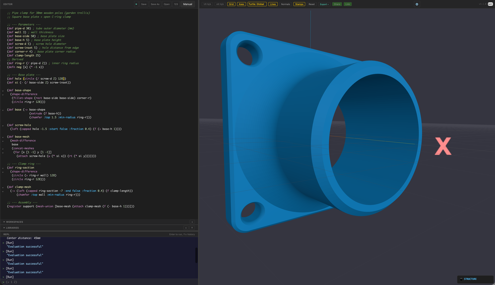

# Ridley

A programmable 3D CAD environment built on turtle graphics and ClojureScript. Describe parts as code, see them as meshes, export them as STL.

**[Try it in your browser](https://vipenzo.github.io/Ridley/)**: no installation required.



## Overview

Ridley is a CAD-as-code tool. The model is a ClojureScript program that, when evaluated, produces the scene. The editor lives next to a 3D viewport: write code on the left, see geometry on the right, iterate with a live REPL.

The defining choice is **turtle graphics**. Every operation happens relative to a moving frame of reference (a "turtle") with a position and a heading. You move forward, turn, draw a path, sweep a profile along it. This is the same metaphor Logo introduced in the 1960s for teaching geometry to children, applied here as a tool for serious mechanical design. The result is code that composes naturally: a part designed in steps, each one local and modifiable, instead of a tree of absolute coordinates.

A few characteristics that distinguish Ridley from other CAD-as-code tools:

- **General purpose language**: Clojure as full programming language, not a restricted DSL. Write functions, build personal libraries, share them as code.
- **Two geometric representations**: meshes (universal, fast booleans via Manifold WASM) and signed distance functions (analytic, smooth blends, available in desktop via libfive).
- **Live interaction modes**: tweak (real-time sliders for numeric literals), pilot (position and resize a mesh with the arrow keys, mapped to turtle moves), edit-bezier (draw curves by dragging control points and tension), face picking from the viewport. All produce code as output, preserving the textual model.
- **Multimodal AI integration**: code generation, mesh description, iterative refinement loop with vision feedback.
- **Voice and WebXR**: alternative input channels designed for headset-first workflows.

For the full picture, see [docs/Architecture.md](docs/Architecture.md) (Italian; English translation planned).

## Install

**Browser** (nothing to install): [vipenzo.github.io/ridley](https://vipenzo.github.io/ridley/)

**Desktop app (macOS)**, which adds SDF modeling, on-disk libraries, GIF export, and native file dialogs:

```bash
brew install --cask vipenzo/ridley/ridley
```

If Homebrew asks about tap trust: `brew trust --cask vipenzo/ridley/ridley`. Alternatively, download the DMG from the [latest release](https://github.com/vipenzo/ridley/releases/latest); in that case macOS will warn on first launch (the app isn't notarized): allow it from System Settings → Privacy & Security ("Open Anyway"). The brew route takes care of this for you.

## Running from source

```bash
npm install
npx shadow-cljs watch app
# Open http://localhost:9000
```

## A taste of the language

The interface has two panels: the **Editor** for definitions and a **REPL** for interactive commands. Both evaluate the same code; the editor rebuilds the whole scene on Run, the REPL accumulates incremental commands.

Each block below is self-contained: copy it, paste it into the editor, and click the green ▶ to run. Shapes appear in the viewport as you `register` them.

### Movement and primitives

```clojure
(f 30)            ; move forward along heading
(th 90)           ; turn horizontal (yaw)
(tv 45)           ; turn vertical (pitch)
(f 30)

(register A (box 20))          ; cube at current pose
(rt 30)
(register B (sphere 15))       ; sphere
(rt 30)
(register C (cyl 10 30))       ; cylinder
```

Each primitive inherits the turtle's current pose. Rotate first, then place a box, and the box appears rotated.

### Sweeping profiles

```clojure
;; extrude a 2D profile along a turtle path
(register tube (extrude (circle 10) (f 30) (th 45) (f 20)))

(rt 60)
;; loft a profile that twists along the way
(register twist (loft (twisted (circle 15) :angle 180) (f 40)))

(rt 60)
;; loft with a tapered, fluted profile
(register flute
  (loft (fluted (tapered (circle 20) :to 0.6) :flutes 12 :depth 2)
        (f 50)))
```

### Boolean operations

```clojure
(def a (box 20))
(f 10)
(def b (sphere 15))
(register carved (mesh-difference a b))
```

### Named scene objects

```clojure
;; register a mesh under a name; it becomes visible in the viewport
(register base (extrude (rect 40 40) (f 5)))

;; build something from named pieces
(register assembly
  (mesh-union
    base
    (attach (cyl 5 30) base)))
```

### Things that move

```clojure
;; two meshes, each looping at its own speed
(register slow (loft (twisted (rect 24 24) :angle 120) (f 45)))
(rt 70)
(register fast (box 18))

(anim! :a 4.0 :slow :loop (span 1.0 :linear (tr 360)))
(anim! :b 2.0 :fast :loop (span 1.0 :linear (tr 360)))
(play!)
```

## Examples

The [`examples/`](examples/) directory contains 20+ complete models. A few highlights:

| File | What it shows |
|------|---------------|
| `cerniera.clj` | Parametric pipe clamp with a living hinge — a real, printable functional part |
| `meshing-gears.clj` | Two spur gears that mesh and counter-rotate, animated with `anim!` |
| `multiboard.clj` | A full parametric Multiboard tile set (the most ambitious example) |
| `twisted-vase.clj` | Vase with procedural twist and fluting |
| `sdf-vase.clj` | A shelled, grid-cut vase built with signed distance functions (desktop) |
| `recursive-tree.clj` | Recursive branching structure |

## Documentation

- [docs/Architecture.md](docs/Architecture.md): comprehensive architectural overview of the project (Italian; English translation planned).
- The interactive manual inside the application (click "Manual" in the toolbar) covers the full language with bilingual (EN/IT) guides, reading paths for different backgrounds, and runnable examples.

## Project status

Ridley is developed primarily by a single author with extensive AI assistance for implementation. Architecture and design decisions remain author-driven; AI is used as an implementation accelerator, not as a designer. This model is documented openly in [docs/Architecture.md](docs/Architecture.md).

The project is in active development as of June 2026. Feature scope is broad and most subsystems are stable; the test suite is green (298 tests / 847 assertions as of 3.1). Some areas remain explicitly works in progress: voice and WebXR integration are paused pending design work, and AI integration efficacy has known limits. The architecture document discusses these openly in its technical debt chapter.

Issues and pull requests are welcome but expect slow turnaround. Substantial contributions are best preceded by a discussion in an issue.

## Dependencies

- [ClojureScript](https://clojurescript.org/) + [shadow-cljs](https://shadow-cljs.github.io/docs/UsersGuide.html)
- [SCI](https://github.com/babashka/sci): Small Clojure Interpreter, evaluates user code at runtime
- [Three.js](https://threejs.org/): 3D rendering
- [Manifold](https://github.com/elalish/manifold): mesh boolean operations (WASM)
- [Clipper2](https://github.com/nicedoc/clipper2-js): 2D path booleans
- [CodeMirror 6](https://codemirror.net/): code editor
- [PeerJS](https://peerjs.com/): WebRTC for desktop-headset sync
- [opentype.js](https://opentype.js.org/): font parsing for 3D text
- [libfive](https://libfive.com/): signed distance functions (desktop only)

## Development

```bash
npx shadow-cljs watch app     # dev server with hot reload, port 9000
npx shadow-cljs release app   # production build
npx shadow-cljs compile test  # run test suite (compiles and autoruns)
```

The desktop variant uses [Tauri](https://tauri.app/) and requires a Rust toolchain plus CMake (for libfive). See `desktop/README.md` for build instructions.

## License

MIT