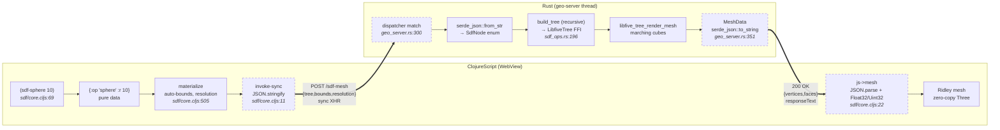
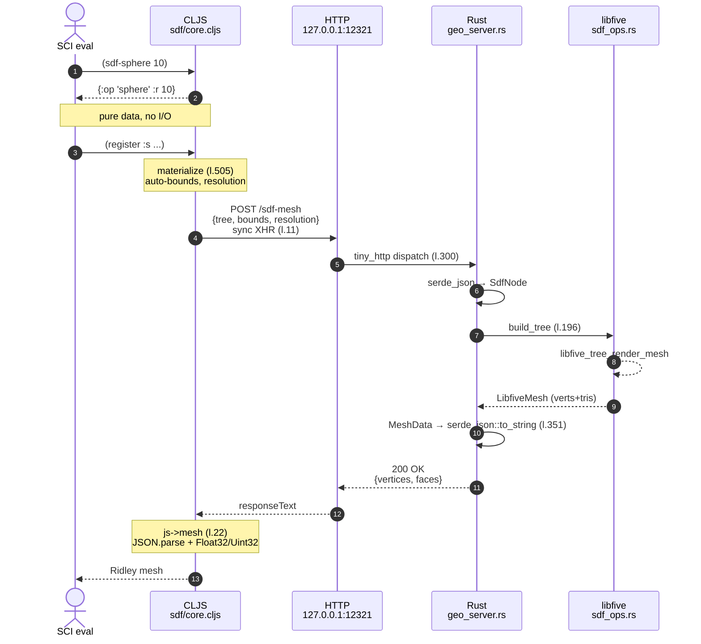

# Cap. 9 fase 2: confine webapp/desktop, dettaglio

Risposte basate sulla lettura del codice al 2026-04-25, includendo le modifiche non committate (visibili in `git diff HEAD`). Citazioni `file:linea`. Italiano con accenti veri, no em-dash.

---

## A. Il trasporto sincrono come perno architetturale

### A1. Alternative considerate e perché sono state rifiutate

L'audit completo è in [transport-audit.md](dev-docs/transport-audit.md). Sintesi delle alternative valutate (sezione 3 dell'audit) e dei motivi del rifiuto.

**a. Tauri `invoke` (IPC nativo, async)**. È la via raccomandata da Tauri per Rust ↔ JS. Documentazione preferisce `InvokeResponseBody::Raw(Vec<u8>)` per binary/large payload. Ipotesi non misurata: 1.5-3x più veloce di HTTP+JSON.

Rifiutata perché:
1. Sempre **async** (ritorna sempre Promise lato JS), e SCI esegue l'utente sincronamente.
2. Adattare il DSL a un modello async significa o rompere il contratto (le primitive `mesh-union`, `sdf-ensure-mesh` smettono di essere normali funzioni e diventano "qualcosa con `.then`"), o mascherare l'async dietro Worker+SharedArrayBuffer (vedi sotto), o introdurre callback continuation passing dentro le macro DSL.

In pratica, **rompere la sincronia avrebbe propagato cambi a tutto il livello macro** (`extrude`, `loft`, `register`, `attach`, `path`), che oggi sono thin wrapper su funzioni sincrone. Costo stimato dal transport-audit: 3-5 giorni con regression rischiose.

**b. `fetch()` async dentro SCI**. Stessa storia: sempre async. In più transport-audit sezione 2 mostra che fetch + arraybuffer in WKWebView/Chrome impiega ~170-300 ms per body grandi, mentre sync XHR ne impiega ~60-90 ms per la stessa risposta JSON. Quindi non solo non risolve la sincronia ma **degrada anche la latenza percepita**.

Verifica empirica esattamente con `/sdf-mesh-bin` (transport-audit sezione 2):
- Sync XHR + JSON `/sdf-mesh`: 61 ms mediana (baseline)
- Async XHR + binary ArrayBuffer `/sdf-mesh-bin`: 302 ms mediana
- Async fetch + arrayBuffer `/sdf-mesh-bin`: 172 ms mediana
- Async XHR + text `/sdf-mesh`: 371 ms mediana

Il binario è 3-5x più lento del JSON nel path attuale. Due cause: Chrome forza async per `responseType=arraybuffer`, e `application/octet-stream` su sync XHR fa scattare uno UTF-8 scan del body in ricezione che costa ~250 ms su 1.5 MB.

**c. SharedArrayBuffer + Worker + Atomics.wait**. Schema: un Worker fa fetch async, copia in SAB, il main thread fa `Atomics.wait` per bloccarsi. Trasforma async in pseudo-sync.

Rifiutata perché:
1. **Non condivisione frontend-backend**. Maintainer Tauri lo dice esplicitamente in [#6269](https://github.com/tauri-apps/tauri/discussions/6269): "The SharedArrayBuffer implementation does not allow communication between frontend (js/wasm) and backend (rust) but only between different frontend contexts." Il processo Rust non condivide memoria con la WebView. Quindi serve comunque un primo trasporto (uno dei canali async) e poi una copia in SAB. È un trasporto in più, non meno.
2. **Vincoli COOP/COEP**. SAB richiede `Cross-Origin-Opener-Policy: same-origin` + `Cross-Origin-Embedder-Policy: require-corp` su tutte le risorse cross-origin. Ridley carica Manifold WASM da `cdn.jsdelivr.net` ([public/index.html:9](public/index.html#L9)) e PeerJS da `unpkg.com` ([index.html:13](public/index.html#L13)): entrambe richiederebbero `crossorigin` con CORP corretti, e i CDN potrebbero non emetterli in modo affidabile.
3. **WKWebView**. SAB è disponibile da Safari/WKWebView 16.3 (macOS Ventura), ma niente esempi pubblici di SAB-as-sync-IPC in Tauri 2.

Costo stimato dal transport-audit: 2-3 giorni più debug COEP. Conclusione: è la via "architetturalmente pulita" sulla carta ma il rapporto rischio/beneficio attualmente non si paga. Non è preclusa per sempre. Tornerà in considerazione se uno dei vincoli cambia: CDN dependencies sostituite da bundle locale (fa cadere il problema COEP), oppure Tauri 3 introduce condivisione SAB con il backend (ipotetico).

**d. Custom URI scheme (`tauri://` o `ridley://`)**. Tauri permette `register_uri_scheme_protocol(name, handler)` con `handler: fn(Request) -> Response<Vec<u8>>`. Frontend chiama `fetch("ridley://...")`.

Rifiutata perché:
1. Sempre async (`fetch`).
2. Stesso vincolo: per renderlo sync serve SAB.
3. Vantaggio teorico (saltare lo HTTP stack di Chromium) non misurato in benchmark; il transport-audit lo stima 1.5-3x più veloce ma senza prove dirette su Tauri 2 + WKWebView.

**e. Sync XHR con trucco `overrideMimeType("text/plain; charset=x-user-defined")`**. Permette di leggere bytes binari come stringhe latin-1, decodificando manualmente. Aggira il blocco "responseType=arraybuffer + sync".

Rifiutata perché empiricamente lento: 312 ms mediana, peggio di sync XHR + JSON (61 ms). Chrome fa comunque uno scan UTF-8 sulla risposta `application/octet-stream`.

**f. Endpoint binari HTTP `/union-bin`, `/sdf-mesh-bin`, ecc.** Generalizzazione del pattern `/sdf-mesh-bin` agli altri endpoint. Server-side trivial, client-side wrapper.

Rifiutata per gli stessi motivi della "b": più lento del JSON. **Nota**: l'endpoint `/sdf-mesh-bin` esiste ancora in [geo_server.rs:306-346](desktop/src-tauri/src/geo_server.rs#L306-L346) ma **nessuno lo chiama**. Vedi F2.

**Opzioni scartate per ragioni non strettamente tecniche**: nessuna in modo esplicito. Il vincolo dominante è puramente tecnico (sincronia del DSL). Una possibile ragione "non tecnica" che non figura nei doc ma che pesa: **mantenere il bundle CLJS unico**. Una migrazione async richiederebbe spezzare il contratto sync solo in desktop (dove è sostituibile via Tauri IPC), creando per la prima volta una divergenza di codice CLJS tra webapp e desktop. Questo violerebbe l'invariante centrale del progetto (cap. 4 panoramica) e l'audit lo chiama implicitamente: "all options B vanno nella direzione async".

### A2. XHR sincrono, dettagli pratici

**Timeout configurato**: nessuno nel codice corrente. `xhr.timeout` non funziona per sync XHR (la specifica WHATWG Fetch lo proibisce, e Chrome/Safari ignorano il setter). [sdf/core.cljs:11-20](src/ridley/sdf/core.cljs#L11-L20), [storage.cljs:21-32](src/ridley/library/storage.cljs#L21-L32) e altri callsite non impostano nessun timeout.

C'era un commit `87545bd Add eval cancel support and HTTP timeouts` (2026-04-17) ma riguardava il **JVM sidecar** (lato Java setSocketTimeout/setConnectTimeout). Il JVM è stato rimosso 6 giorni dopo (`f5e3fdd`, 2026-04-23). I timeout HTTP sono andati con esso. Il geo-server Rust corrente ([geo_server.rs:171-361](desktop/src-tauri/src/geo_server.rs#L171-L361)) usa `tiny_http::Server` senza configurazioni di timeout.

**Conseguenze pratiche**: se libfive entra in marching cubes che impiega 30 secondi su una mesh enorme, l'UI è bloccata per 30 secondi. Niente cancel, niente progress, niente way out salvo killare il processo Tauri. L'unico safety net è il warning "voxel-count > 5e8" stampato in `ensure-mesh` ([sdf/core.cljs:524](src/ridley/sdf/core.cljs#L524)) prima di mandare la richiesta, ma è solo un println.

**WKWebView e sync XHR**: lo accetta senza warning visibili nei DevTools Tauri. Storia: il commit `3a07b7b Fix library panel for Tauri: custom modal dialogs, XHR compat, edit highlight` (2026-04-22) ha dovuto sistemare un problema diverso, **`responseType=arraybuffer` con sync XHR non supportato in Safari**: il fix è stato passare a `responseText` per le letture file. La sync XHR di per sé funziona regolarmente in WKWebView, anche se è "deprecated for main-thread use" nelle specifiche.

**Latenza tipica `/sdf-mesh`** (numeri da transport-audit, ambiente Chrome connesso a shadow-cljs ma rappresentativi):

| Modello | # facce output | Body req | Body resp | Mediana totale |
|---|---:|---:|---:|---:|
| `(sdf-sphere 10)` (default res) | ~2-5k | ~50 byte | ~150-300 KB | 15-40 ms (stima, non misurato) |
| `(sdf-intersection (sdf-gyroid 8 1.2) (sdf-sphere 12))` res 1.2 | 83 400 | piccolo | 4.04 MB JSON | 61 ms (mediana, n=10) |
| `(sphere-mesh 180 140)` 50k facce single-clone | 50 040 | 2.4 MB | 2.4 MB | 86 ms (era 204 ms in altre sessioni) |
| 300k+ facce SDF (gyroid bounds 20+) | 300k+ | piccolo | ~10-15 MB | 400-1500 ms (transport-audit sez. 4 scenario C) |

Il collo di bottiglia per body grandi non è la rete (localhost a 0.6 ms `/ping`) ma la **serializzazione/deserializzazione JSON da entrambe le parti**, ~50% lato Rust e ~40% lato CLJS. L'audit lo decompone in dettaglio.

### A3. Esempio paradigmatico per il diagramma del capitolo

Suggerisco la pipeline **SDF**: una sola funzione CLJS che produce JSON, una sola Rust che lo parsa e ritorna mesh, e il dispatcher centrale.

| Nodo | File | Riga | Cosa fa |
|---|---|---|---|
| Costruzione del nodo SDF | [sdf/core.cljs:69](src/ridley/sdf/core.cljs#L69) `sdf-sphere` | 69 | Ritorna `{:op "sphere" :r 10}`. Pure data. |
| Materializzazione (entry sincrono) | [sdf/core.cljs:505-515](src/ridley/sdf/core.cljs#L505-L515) `materialize` | 505 | Calcola bounds + resolution, costruisce `{:tree :bounds :resolution}`, chiama `invoke-sync`. |
| Trasporto sincrono | [sdf/core.cljs:11-20](src/ridley/sdf/core.cljs#L11-L20) `invoke-sync` | 11 | `XMLHttpRequest`, `async=false`, `JSON.stringify`, `JSON.parse`. È **il punto di confine** lato CLJS. |
| Confine lato Rust | [geo_server.rs:300-308](desktop/src-tauri/src/geo_server.rs#L300-L308) match `/sdf-mesh` | 300 | `serde_json::from_str::<SdfMeshRequest>` produce un albero `SdfNode`. |
| Conversione tree | [sdf_ops.rs:196-291](desktop/src-tauri/src/sdf_ops.rs#L196-L291) `build_tree` | 196 | Walk ricorsivo dell'enum `SdfNode`, costruisce un `LibfiveTree` con FFI. |
| Computazione | [sdf_ops.rs:294-333](desktop/src-tauri/src/sdf_ops.rs#L294-L333) `sdf_to_mesh` | 294 | `libfive_tree_render_mesh(tree, region, resolution)`, copia output in `MeshData`. |
| Ritorno JSON | [geo_server.rs:350-359](desktop/src-tauri/src/geo_server.rs#L350-L359) | 350 | `serde_json::to_string(&mesh)`, `tiny_http::Response::from_string`. |
| Decodifica CLJS | [sdf/core.cljs:22-58](src/ridley/sdf/core.cljs#L22-L58) `js->mesh` | 22 | `JSON.parse` poi `Float32Array`/`Uint32Array` per zero-copy verso Three. |

Per il diagramma propongo (versione Mermaid):



Variante sequenziale (Mermaid `sequenceDiagram`) se nel capitolo vuoi mettere in primo piano la temporalità del salto:



Versione ASCII di fallback (utile se il renderer della tua pipeline non supporta Mermaid):

```
ClojureScript (WebView)                         Rust (geo-server thread)
─────────────────────────                      ──────────────────────────
(sdf-sphere 10)
  → {:op "sphere" :r 10}

materialize
  bounds, resolution
  invoke-sync
    XMLHttpRequest sync ────POST /sdf-mesh────►  serde_json::from_str
                            JSON: {tree,            → SdfNode (enum)
                                   bounds,        build_tree (recursive)
                                   resolution}      → LibfiveTree (FFI)
                                                  libfive_tree_render_mesh
                                                    → LibfiveMesh (vert+tri)
                                                  collect into MeshData
                                                  serde_json::to_string
    JSON.parse  ◄────────────────── HTTP 200 ─── Response::from_string(json)
    Float32Array, Uint32Array
    → Ridley mesh
```

Punto di forza pedagogico: **un unico salto di confine, due funzioni di trasporto** (`invoke-sync` lato CLJS, il dispatcher di [geo_server.rs:300](desktop/src-tauri/src/geo_server.rs#L300) lato Rust). Tutto quello che c'è prima e dopo è dominio puro (data costruction, FFI, mesh decoding).

---

## B. Il wire format

### B1. Schema JSON dei nodi SDF

**Nota sull'esempio nella domanda**: `(sdf-move [5 0 0] (sdf-box 5 5 5))` non corrisponde alla firma di [`sdf-move`](src/ridley/sdf/core.cljs#L143-L144), che è `(sdf-move node dx dy dz)`. Userò `(sdf-move (sdf-box 5 5 5) 5 0 0)` come riformulazione.

#### Esempio reale: `(sdf-union (sdf-sphere 10) (sdf-move (sdf-box 5 5 5) 5 0 0))`

Il valore prodotto in CLJS dopo i costruttori (pure data, ricostruito leggendo [sdf/core.cljs:69-94](src/ridley/sdf/core.cljs#L69-L94)):

```clojure
{:op "union"
 :a {:op "sphere" :r 10}
 :b {:op "move"
     :a {:op "box" :sx 5 :sy 5 :sz 5}
     :dx 5 :dy 0 :dz 0}}
```

Quando `register` lo intercetta, chiama `sdf-ensure-mesh` ([sdf/core.cljs:517-539](src/ridley/sdf/core.cljs#L517-L539)) che:

1. Calcola `auto-bounds`: sphere `[[-12 12] [-12 12] [-12 12]]` (1.2x raggio); box-moved `[[2 8] [-3 3] [-3 3]]` (sx*0.6=3, poi traslato di 5 su X); union = bounding box dei due = `[[-12 12] [-12 12] [-12 12]]`.
2. Calcola `resolution-for-bounds` con `*sdf-resolution* = 15`: spans `[24 24 24]`, volume `13824`, base-vpu `65/24 ≈ 2.71`. Nessuna feature thin (no shell, offset, scale). Risultato: `~2.71 voxels/unit`.
3. Costruisce `{:tree node :bounds bounds :resolution res}` e fa `JSON.stringify`.

Payload reale spedito (`POST /sdf-mesh`, Content-Type: application/json):

```json
{
  "tree": {
    "op": "union",
    "a": { "op": "sphere", "r": 10 },
    "b": {
      "op": "move",
      "a": { "op": "box", "sx": 5, "sy": 5, "sz": 5 },
      "dx": 5, "dy": 0, "dz": 0
    }
  },
  "bounds": [[-12, 12], [-12, 12], [-12, 12]],
  "resolution": 2.7083333333333335
}
```

Nota di interesse: la convenzione `sdf-box [a b c]` inverte l'ordine in `:sx :sy :sz` ([sdf/core.cljs:73-74](src/ridley/sdf/core.cljs#L73-L74)): `(sdf-box a b c) → {:sx c :sy a :sz b}`. Questo è coerente con la convenzione `box` mesh "a→Y(right), b→Z(up), c→X(heading)". Un cubo `(sdf-box 5 5 5)` come nell'esempio non lo manifesta, ma per asimmetrici è una sorpresa frequente.

Risposta lato Rust (Content-Type: application/json):

```json
{
  "vertices": [[1.234, 5.678, -2.345], ...],
  "faces":    [[0, 1, 2], [3, 4, 5], ...]
}
```

Per questo input specifico, ordine di grandezza ~3-6k facce, ~150-300 KB di body JSON.

#### Schema completo dei nodi SDF

Tutto è in [sdf_ops.rs:144-186](desktop/src-tauri/src/sdf_ops.rs#L144-L186), `enum SdfNode` con `#[serde(tag = "op")]` (rappresentazione JSON: campo `op` discriminante + chiavi siblings).

| `op` | Chiavi attese | Builder Rust | Riga |
|---|---|---|---|
| `"sphere"` | `r: f64` | `sphere(tc(r), tv0())` | [sdf_ops.rs:199](desktop/src-tauri/src/sdf_ops.rs#L199) |
| `"box"` | `sx, sy, sz: f64` | `box_exact(tv(-hx,-hy,-hz), tv(hx,hy,hz))` | [sdf_ops.rs:202](desktop/src-tauri/src/sdf_ops.rs#L202) |
| `"rounded-box"` | `sx, sy, sz, r: f64` | `rounded_box(...)` (r è frazione 0-1) | [sdf_ops.rs:208](desktop/src-tauri/src/sdf_ops.rs#L208) |
| `"cyl"` | `r, h: f64` | `cylinder_z` traslato di `-h/2` su Z | [sdf_ops.rs:217](desktop/src-tauri/src/sdf_ops.rs#L217) |
| `"union"` | `a, b: SdfNode` | `_union(build_tree(a), build_tree(b))` | [sdf_ops.rs:222](desktop/src-tauri/src/sdf_ops.rs#L222) |
| `"difference"` | `a, b` | `difference(...)` | [sdf_ops.rs:223](desktop/src-tauri/src/sdf_ops.rs#L223) |
| `"intersection"` | `a, b` | `intersection(...)` | [sdf_ops.rs:224](desktop/src-tauri/src/sdf_ops.rs#L224) |
| `"blend"` | `a, b: SdfNode, k: f64` | `blend_expt_unit(..., tc(k))` | [sdf_ops.rs:225](desktop/src-tauri/src/sdf_ops.rs#L225) |
| `"shell"` | `a, thickness: f64` | `shell(..., tc(thickness))` | [sdf_ops.rs:228](desktop/src-tauri/src/sdf_ops.rs#L228) |
| `"offset"` | `a, amount: f64` | `offset(..., tc(amount))` | [sdf_ops.rs:231](desktop/src-tauri/src/sdf_ops.rs#L231) |
| `"morph"` | `a, b, t: f64` | `morph(..., tc(t))` | [sdf_ops.rs:234](desktop/src-tauri/src/sdf_ops.rs#L234) |
| `"move"` | `a, dx, dy, dz: f64` | `move_(..., tv(dx,dy,dz))` | [sdf_ops.rs:237](desktop/src-tauri/src/sdf_ops.rs#L237) |
| `"rotate"` | `a, axis: "x" \| "y" \| "z", angle: f64` (deg) | `rotate_x \| _y \| _z` con angolo in radianti | [sdf_ops.rs:240](desktop/src-tauri/src/sdf_ops.rs#L240) |
| `"scale"` | `a, sx, sy, sz: f64` | `scale_xyz(..., tv(sx,sy,sz), tv0())` | [sdf_ops.rs:249](desktop/src-tauri/src/sdf_ops.rs#L249) |
| `"var"` | `name: "x" \| "y" \| "z"` (default = const 0) | `libfive_tree_x/y/z` | [sdf_ops.rs:253](desktop/src-tauri/src/sdf_ops.rs#L253) |
| `"const"` | `value: f64` | `tc(value)` | [sdf_ops.rs:261](desktop/src-tauri/src/sdf_ops.rs#L261) |
| `"unary"` | `fn_name: string, a: SdfNode` | `libfive_tree_unary(opcode, ...)` | [sdf_ops.rs:262](desktop/src-tauri/src/sdf_ops.rs#L262) |
| `"binary"` | `fn_name: string, a, b: SdfNode` | `libfive_tree_binary(opcode, ...)` | [sdf_ops.rs:267](desktop/src-tauri/src/sdf_ops.rs#L267) |
| `"revolve"` | `a: SdfNode` | remap `x → sqrt(x²+y²)`, `y → z`, `z → 0` | [sdf_ops.rs:272](desktop/src-tauri/src/sdf_ops.rs#L272) |

Opcodes ammessi per `unary` ([sdf_ops.rs:108-124](desktop/src-tauri/src/sdf_ops.rs#L108-L124)): `square sqrt neg sin cos tan asin acos atan exp abs log`.

Opcodes per `binary` ([sdf_ops.rs:126-139](desktop/src-tauri/src/sdf_ops.rs#L126-L139)): `add mul min max sub div atan2 pow mod`.

Convenzioni notevoli:

- **rotate** usa gradi in JSON, convertiti in radianti in Rust ([sdf_ops.rs:241](desktop/src-tauri/src/sdf_ops.rs#L241)).
- **rounded-box** ha `r` in JSON come **valore assoluto** (mm), ma libfive vuole frazione 0-1 di `min_half_side`. La conversione è in [sdf_ops.rs:212-214](desktop/src-tauri/src/sdf_ops.rs#L212-L214). Implica che `r > min_side/2` viene clampato silenziosamente.
- **`move` diversa da `rotate`/`scale`**: dx, dy, dz sono separati. Mai `[dx dy dz]` come array.
- **`var`** con `name` non in `{"x" "y" "z"}` ritorna `tc(0.0)` ([sdf_ops.rs:258](desktop/src-tauri/src/sdf_ops.rs#L258)). Silente. Ho notato che il compile-expr CLJS può solo emettere x/y/z come var (vedi [sdf/core.cljs:204-206](src/ridley/sdf/core.cljs#L204-L206)), quindi nel path normale non si arriva a quel default. Ma è un fallback fragile.
- **`revolve` enum è dead**. Il CLJS `sdf-revolve` ([sdf/core.cljs:174-182](src/ridley/sdf/core.cljs#L174-L182)) **non emette `{:op "revolve"}`**. Fa la sostituzione `x → sqrt(x²+y²)`, `y → z` lato CLJS via `substitute-vars`, e produce un albero senza il nodo revolve. Quindi il match Rust per `Revolve` non viene mai colpito nel path attuale. Storia: commit `8680b9e sdf-revolve: use OP_SQUARE for interval-correct rho computation` e poi `3a23b4f sdf-revolve: variable substitution in Clojure instead of libfive remap` (2026-04-15) ha spostato la logica da Rust a CLJS, lasciando l'enum Rust come dead code. Da pulire.

#### Specifica scritta?

No, non c'è una spec separata. La fonte di verità è il codice: il `SdfNode` enum di [sdf_ops.rs](desktop/src-tauri/src/sdf_ops.rs#L142-L186) e i costruttori CLJS in [sdf/core.cljs:69-149](src/ridley/sdf/core.cljs#L69-L149). Il manuale utente [Spec.md](dev-docs/Spec.md) documenta l'API DSL ma non il wire format.

### B2. Validazione path su `/write-file` e `/read-file`

**Nessuna validazione**. Confermato da grep: `Validate|validate|canonicalize|normalize|allowed|permitted|safe` ritorna zero matches in `desktop/src-tauri/src/`. Il codice di [`handle_write_file`](desktop/src-tauri/src/geo_server.rs#L147-L169) prende il path dall'header `X-File-Path`, fa `std::path::Path::new(&path).parent()` per `create_dir_all`, e poi `std::fs::write(&path, &bytes)`.

Implicazione di sicurezza: **il geo-server è un primitivo arbitrary-write filesystem**. Qualsiasi codice che girasse nella WebView (e che potesse fare XHR a 12321) potrebbe scrivere ovunque l'utente abbia permessi di scrittura. Non c'è confinamento a `~/.ridley`. CORS è `*` ([geo_server.rs:177](desktop/src-tauri/src/geo_server.rs#L177)) ma il binding è `127.0.0.1` non `0.0.0.0`, quindi solo lo stesso host può raggiungerlo.

È **una scelta deliberata**? La storia non lo dice esplicitamente. Sospetto che sia "non priorità ancora", non "scelta architetturale": il caso d'uso diretto è scrivere progetti utente in `~/Documenti/...` via dialog nativo (`/pick-save-path` ritorna un path scelto dall'utente, poi `/write-file` ci scrive). Confinare a `~/.ridley` rompe questo. Una validazione corretta sarebbe: `pick-save-path` ritorna un path, poi `write-file` accetta solo path che hanno passato `pick-save-path` recentemente (whitelist temporanea con TTL). Non implementato.

Va segnalato come **debito di sicurezza** per cap. 14, soprattutto se l'app dovesse mai distribuirsi via App Store.

**Trasmissione bytes**:

- Read: response body raw, header `Content-Type: application/octet-stream` ([geo_server.rs:229](desktop/src-tauri/src/geo_server.rs#L229)). Lato CLJS legge come `responseText` (storico, vedi commit 3a07b7b: arraybuffer non funziona con sync XHR in WKWebView).
- Write: request body raw bytes, header `Content-Type: application/octet-stream` ([export/stl.cljs:252-261](src/ridley/export/stl.cljs#L252-L261)). Niente base64, niente multipart. Per file di testo (librerie .clj) usa `Content-Type: text/plain` e lo string viene letto come UTF-8.

---

## C. Bundling e distribuzione

### C1. Stato bundling per piattaforma

#### macOS

**Funziona, non firmato, non notarizzato.** CI in [.github/workflows/desktop-build.yml](/.github/workflows/desktop-build.yml). La build:

1. `actions/checkout@v4 with submodules: true` (anche se libfive non è submodule, è clonato esplicitamente al passo successivo).
2. Setup Node 20, Rust stable, CMake via Homebrew.
3. Clona `https://github.com/libfive/libfive.git` `--depth 1` in `desktop/src-tauri/vendor/libfive` (HEAD di main, **non un tag pinned**).
4. `npm ci` e `shadow-cljs release app` con `VERSION` da `GITHUB_REF_NAME`.
5. `cargo install tauri-cli --version "^2"` poi `cargo tauri build` con `TAURI_SIGNING_PRIVATE_KEY: ""` (esplicitamente vuoto).
6. `bash bundle-dylibs.sh` per copiare le dylib.
7. `hdiutil create` per produrre `Ridley-${TAG}-macOS.dmg`.
8. `gh release upload` se è triggered da release.

**Non firmato** perché manca la chiave Apple Developer ID. Conseguenze utente: al primo doppio click, macOS Gatekeeper mostra "cannot be opened because it is from an unidentified developer". Bisogna dire all'utente di Ctrl+click → Open, o `xattr -cr Ridley.app`. Non c'è notarization, quindi nemmeno un workaround "registra come trusted" funziona.

**Non notarizzato**: nessun passo di `xcrun notarytool`. Per un'app fuori dall'App Store distribuita su macOS recenti la notarization è altamente raccomandata; senza, l'esperienza "prima apertura" è ostile.

#### Linux e Windows

**Nessun build target funzionante.** Niente CI workflow per Linux o Windows. Il codice ha una unica `#[cfg(target_os = "macos")]` in [build.rs:9](desktop/src-tauri/build.rs#L9) (rpath per Frameworks/) e [build.rs:60-65](desktop/src-tauri/build.rs#L60-L65) (link c++, rpath per dev). Il bundling script [bundle-dylibs.sh](desktop/bundle-dylibs.sh) presuppone macOS (`.app`, `.dylib`, `Frameworks/`).

Linux teoricamente buildabile (cargo + tauri supportano Linux con WebKitGTK), ma:
- libfive andrebbe linkato con rpath Linux specifico
- Bundle non c'è, ci si dovrebbe affidare a `tauri::bundle::AppImage` o `.deb`/`.rpm`
- Niente CI lo verifica.

Windows: Tauri 2 supporta Windows con WebView2. Stesse considerazioni. `libfive` su Windows richiede Visual Studio toolchain per CMake (più complesso del Homebrew CMake su macOS).

**In pratica Ridley desktop è macOS-only oggi.** Il README e gli script sono coerenti con questo.

#### Procedura di release documentata

`CLAUDE.md` documenta solo il flusso webapp:
> 1. Create the GitHub release with `gh release create`
> 2. GitHub Actions will automatically build and deploy to GitHub Pages on release publish

Il workflow `desktop-build.yml` triggera anch'esso su `release.published` e fa upload del `.dmg` come asset della release. Quindi il flusso pratico macOS è: tag → release → CI builda dmg → asset attaccato. Non è documentato esplicitamente per l'utente come download path. Manca un README/docs che dica "ecco come si scarica la versione desktop". Vale la pena segnalarlo per il cap. 9 come UX gap.

### C2. Altri residui di iterazioni precedenti

Compilo una lista esauriente. Marco con (B) blocking, (S) safety, (C) cleanup-only.

1. **(C)** [bundle-dylibs.sh:18-27](desktop/bundle-dylibs.sh#L18-L27) cerca `libmanifold.3.dylib` e `libmanifoldc.3.dylib` da `manifold3d-sys-*/out/lib/`. Cargo non ha più `manifold3d`, quel cargo build artifact non esiste. Stampa "Warning: ... not found" ma non fallisce. Da rimuovere.

2. **(C)** CSP di [tauri.conf.json:13](desktop/src-tauri/tauri.conf.json#L13) include `http://127.0.0.1:12322` in `connect-src`. Era il porto del JVM sidecar. Nessuno ascolta più su 12322. Rimuovere.

3. **(C)** [desktop/dev.sh](desktop/dev.sh) e [desktop/build.sh](desktop/build.sh) sono wrapper (3 righe ciascuno) per `npm run dev` / `npm run release`. Non sono richiamati da `tauri.conf.json` (niente `beforeDevCommand`/`beforeBuildCommand` configurati). main.rs spawn'a `npm run dev` direttamente. Sono orfani. Erano usati da una versione precedente di tauri.conf che li dichiarava come hook. Rimuovere o ricollegare.

4. **(C)** [geo_server.rs:306-346](desktop/src-tauri/src/geo_server.rs#L306-L346) implementa `/sdf-mesh-bin` (canale binario per SDF). Nessun chiamante CLJS (grep `/sdf-mesh-bin`: zero matches in `src/`). Era stato preparato come ottimizzazione, ma transport-audit ha mostrato che è più lento del JSON in Chrome/WKWebView. Codice morto.

5. **(C)** [sdf_ops.rs:184-186](desktop/src-tauri/src/sdf_ops.rs#L184-L186) `enum SdfNode::Revolve { a }` non viene mai costruito dal frontend. Il `sdf-revolve` CLJS fa la sostituzione di variabili in Clojure ([sdf/core.cljs:174-182](src/ridley/sdf/core.cljs#L174-L182)). Il match arm in [sdf_ops.rs:272-288](desktop/src-tauri/src/sdf_ops.rs#L272-L288) è dead code.

6. **(C)** [main.rs](desktop/src-tauri/src/main.rs) (modifiche pendenti, non committate): l'ultimo invoke handler (`fn ping`) viene rimosso. Il diff non committato lo elimina insieme al `.invoke_handler(generate_handler![ping])`. Una volta committato, l'app non avrà più nessun Tauri command. Vale a dire: `withGlobalTauri: true` in [tauri.conf.json:10](desktop/src-tauri/tauri.conf.json#L10) inietta `window.__TAURI__.core.invoke` ma non c'è nulla da invocare. Bandiera vestigial dopo il commit.

7. **(S)** Nessuna validazione path in `/write-file`, `/read-file`, `/delete-file`. Vedi B2.

8. **(S)** Nessun timeout sulle XHR sincrone. Un libfive lento blocca l'UI indefinitamente.

9. **(C)** Nessuna guardia "SDF richiede desktop" nel webapp. `(sdf-sphere 10)` costruisce il dato puro; il fallimento avviene tardi, alla materializzazione, con un `js/Error` opaco invece di un messaggio "questa funzionalità richiede Ridley Desktop".

10. **(C)** [settings.cljs:40](src/ridley/settings.cljs#L40) usa `localStorage` unconditionally. In desktop le settings stanno in localStorage della WKWebView, non sul filesystem dove stanno le librerie. Asimmetria.

11. **(C)** [geo_server.rs:108-110](desktop/src-tauri/src/geo_server.rs#L108-L110) `handle_read_dir` chiama `fs::create_dir_all(&req.path)` prima di leggere. Effetto collaterale sorprendente: leggere una directory inesistente la **crea**. Ragionevole nel caso d'uso (`~/.ridley/libraries/` al primo avvio), ma comportamento da segnalare/spostare in un endpoint dedicato `mkdir-p`.

12. **(C)** [desktop-build.yml](.github/workflows/desktop-build.yml) clona libfive da `main` senza commit pin. Build non riproducibile: una breaking change upstream rompe la release. Da pinnare a un tag.

13. **(C)** Il commento out-of-date in `Cargo.toml:21-22` (visto fixato in commit `8ff98af`) era "libfive and the tauri crate are heavy"; la rev del comment ha solo aggiornato il testo, ma il `[profile.dev.package."*"] opt-level = 3` ha senso per via di libfive che senza opt-level=3 ha simbolicazione brutalmente lenta in debug. È una sottile sedimentazione: la decisione era nata per Manifold + libfive, oggi vale solo per libfive ma resta corretta.

---

## D. WKWebView: cosa cambia rispetto al browser standard

### D1. Differenze pratiche emerse in Ridley

**a. `js/prompt`, `js/confirm`, `js/alert`** sono bloccati silenziosamente in WKWebView. Riferimento: commit [3a07b7b](https://github.com/...) "Fix library panel for Tauri: custom modal dialogs, XHR compat, edit highlight" (2026-04-22) e il commento esplicito a [library/panel.cljs:54](src/ridley/library/panel.cljs#L54): "Modal Dialogs (WKWebView blocks prompt/confirm/alert)". Workaround: `modal-prompt!` ([library/panel.cljs:71-103](src/ridley/library/panel.cljs#L71-L103)) costruisce HTML overlay con input + 2 bottoni, callback su risultato.

**b. `window.showSaveFilePicker`** (File System Access API) non esiste in WKWebView (è Chromium-only). Riferimento: commit `22117fc Fix Save button in Tauri WKWebView` (2026-04-24). Il bottone "Save" del progetto era silenzioso in desktop. Workaround: tutto il path "save" in desktop ora passa per `/pick-save-path` Rust ([core.cljs:543-551](src/ridley/core.cljs#L543-L551), `save-blob-with-picker`).

**c. `<a download>` con click()** non sempre triggera il download in WKWebView. Lo stesso commit `22117fc` lo segnala: "the `<a download>` fallback is not handled by WKWebView, so clicking Save silently did nothing". L'unico path desktop affidabile è il dialog nativo.

**d. Sync XHR con `responseType=arraybuffer`** non supportato (di per sé è proibito da Fetch spec, ma alcuni browser lo accettavano in passato). Riferimento: commit 3a07b7b: "fs-read-text: use responseText instead of arraybuffer responseType". I file binari sono letti come testo latin-1 e poi decodificati. Per file UTF-8 funziona; per binari c'è un piccolo overhead di conversione.

**e. WebXR**: non testato in WKWebView nel codice attuale. Il codice [viewport/xr.cljs](src/ridley/viewport/xr.cljs) presume che `navigator.xr` esista. WKWebView su macOS non lo espone (Vision Pro a parte). Quindi i bottoni VR/AR ([core.cljs:2435-2442](src/ridley/core.cljs#L2435-L2442)) probabilmente non appaiono o non funzionano in desktop. Da verificare.

**f. Web Speech API**: il codice usa `webkitSpeechRecognition` come fallback ([voice/speech.cljs:20-24](src/ridley/voice/speech.cljs#L20-L24)). Safari/WKWebView lo espone su macOS Sonoma+. Dovrebbe funzionare ma non c'è un test esplicito.

**g. Performance**: WKWebView su macOS è generalmente un pelo più lento di Chrome per JS engine (JavaScriptCore vs V8), ma l'audit Manifold mostra che i collo di bottiglia di Ridley sono altrove (CSG WASM). Nessuna performance issue specifica documentata.

#### CSP della WebView

Da [tauri.conf.json:13](desktop/src-tauri/tauri.conf.json#L13):

```
default-src   'self' 'unsafe-inline' 'unsafe-eval' data: blob:
script-src    'self' 'unsafe-inline' 'unsafe-eval'
              https://cdn.jsdelivr.net    (manifold-3d ESM)
              https://unpkg.com           (peerjs)
connect-src   'self' ipc: http://ipc.localhost
              http://127.0.0.1:12321      (geo-server)
              http://127.0.0.1:12322      (vestigial JVM)
              https: wss: ws:             (LLM API, peer signaling)
img-src       'self' data: blob: asset: https://asset.localhost
style-src     'self' 'unsafe-inline'
font-src      'self' data:
worker-src    'self' blob:
```

**Cosa permette**: caricamento Manifold WASM e PeerJS da CDN; XHR a localhost geo-server e ovunque su HTTPS (per LLM provider remoti come Anthropic/OpenAI/Ollama); WebSocket WS/WSS (per PeerJS signaling); Worker da blob (Web Worker se mai usato; oggi non usato).

**Cosa non permette di interesse**:
- `script-src` esclude qualunque CDN diverso da jsdelivr.net e unpkg.com.
- `font-src` non include Google Fonts (Ridley carica fonts locali).
- `media-src` non c'è esplicito, ricade su `default-src 'self'`.

`'unsafe-inline'` e `'unsafe-eval'` sono presenti per ragioni di SCI (eval di codice utente) e CodeMirror (style inline). Una CSP più stretta richiederebbe un grosso refactor.

### D2. Permessi di sistema Tauri

**Capabilities dichiarate**: `core:default` ([capabilities/default.json](desktop/src-tauri/capabilities/default.json)), che è il set minimo Tauri 2 (window management, basic IPC). Niente `fs:`, `shell:`, `dialog:`, `notification:`, `clipboard:`. Il `rfd::FileDialog` usato in [`handle_pick_save_path`](desktop/src-tauri/src/geo_server.rs#L28-L76) **bypassa il sistema permessi Tauri**: gira nel thread del geo-server, non come comando Tauri.

**Permessi macOS richiesti runtime dall'OS** (non da Tauri):

- **Gatekeeper**: prima apertura "unidentified developer" (vedi C1).
- **File system**: nessun prompt esplicito; rfd usa il save dialog nativo `NSSavePanel` che è whitelistato.
- **Microphone**: se l'utente attiva voice (Web Speech API), WKWebView mostra prompt nativo macOS al primo accesso.
- **Local Network**: il geo-server ascolta solo su `127.0.0.1`, **non triggera il prompt "local network access"** introdotto in macOS Sequoia 15. Se ascoltasse su `0.0.0.0` lo farebbe.

Niente è dichiarato in `Info.plist` custom: l'`NSSavePanel` di rfd usa l'entitlement standard. Per aggiungere capacità (es. notifiche, Apple Events) servirebbe un Info.plist customizzato in `tauri.conf.json::macOS`.

---

## E. File I/O: dettagli

### E1. Layout filesystem

#### macOS (sistema testato)

```
~/.ridley/
└── libraries/
    ├── _index.json        # Array ordinato di nomi librerie
    ├── _meta.json         # Map name→{created,modified}
    ├── _active.json       # Array ordinato di nomi attivi
    ├── puppet.clj         # Una libreria
    ├── gears.clj
    └── ...
```

Path costruito in [storage.cljs:19-32](src/ridley/library/storage.cljs#L19-L32): `lib-dir` chiama `/home-dir` per ottenere `$HOME` e concatena `/.ridley/libraries`. Cache in `lib-dir-cache` atom.

#### Linux

Non testato. Il codice usa `$HOME` ([geo_server.rs:14](desktop/src-tauri/src/geo_server.rs#L14)) che è disponibile su Linux. Layout sarebbe `~/.ridley/libraries/` identico. Convenzione XDG ignorata (sarebbe `~/.local/share/ridley/`).

#### Windows

[geo_server.rs:14](desktop/src-tauri/src/geo_server.rs#L14) tenta `$HOME` poi `$USERPROFILE`. Layout sarebbe `%USERPROFILE%\.ridley\libraries\`. Niente `%APPDATA%`. Anche qui non rigorosamente conforme (Windows si aspetterebbe `%APPDATA%\Ridley\libraries`).

#### Schema dei file metadata

**`<lib-name>.clj`** ([storage.cljs:144-151](src/ridley/library/storage.cljs#L144-L151)):

```clojure
;; Ridley Library: my-lib
;; Requires: utils, math

(defn my-helper [x] (+ x 1))
;; ... contenuto della libreria
```

L'header è parsato da [`parse-lib-header`](src/ridley/library/storage.cljs#L126-L142) che estrae `name`, `requires` (split su virgola), e `source` (il resto del file).

**`_index.json`** ([storage.cljs:84](src/ridley/library/storage.cljs#L84)):

```json
["puppet", "gears", "weave"]
```

Vector di stringhe, ordine di scoperta. Non c'è schema versionato.

**`_meta.json`** ([storage.cljs:191-196](src/ridley/library/storage.cljs#L191-L196)):

```json
{
  "puppet": {"created": "2026-04-12T15:23:01.234Z", "modified": "2026-04-25T08:14:55.901Z"},
  "gears":  {"created": "2026-04-15T10:00:00.000Z", "modified": "2026-04-15T10:00:00.000Z"}
}
```

Mappa name→{created,modified}, ISO 8601. Nota: le **chiavi sono keyword serializzate** (in CLJS è `(keyword name)` poi clj→js, ma JSON stringifica una keyword come la sua stringa senza `:`). Quindi è semanticamente una map name→...

**`_active.json`** ([storage.cljs:86](src/ridley/library/storage.cljs#L86)):

```json
["puppet", "gears"]
```

Vector di nomi nell'ordine di carico (rilevante per topo-sort dei `:requires`).

#### Migration path da localStorage a filesystem

**Non esiste.** Se un utente apre prima la webapp (libreria salvata in `localStorage` con chiave `ridley:lib:puppet`) e poi apre il desktop (legge da `~/.ridley/libraries/`), **non vede le librerie del browser**. I due mondi sono disgiunti.

Verifica: [storage.cljs](src/ridley/library/storage.cljs) ha solo `if (env/desktop?) ... ...` su ogni operazione, nessun ramo che legga da localStorage in desktop come fallback. Anche in import/export.

L'unico path manuale: nella webapp `(export-library "puppet")` ritorna la stringa `.clj` con header, l'utente la incolla in un file, la mette in `~/.ridley/libraries/`, ne aggiorna `_index.json` a mano, la libreria è disponibile in desktop. Workflow non documentato.

Da segnalare per cap. 14: una migration `localStorage → filesystem` al primo avvio del desktop (con conferma utente) sarebbe poche righe. Una migration `filesystem → localStorage` per l'altra direzione è impossibile (browser non vede `~/.ridley/`), ma sarebbe meno urgente.

### E2. Settings: stato della migrazione

**Non migrato. Nessun tracking issue, nessun TODO esplicito nel codice**. [settings.cljs:42-46](src/ridley/settings.cljs#L42-L46):

```clojure
(def ^:private storage-key "ridley-settings")

(defn save-settings! []
  (let [data (pr-str @settings)]
    (.setItem js/localStorage storage-key data)))
```

Niente `if (env/desktop?)`. Le settings (chiavi LLM, provider, modello, audio-feedback) vivono in `localStorage` indipendentemente.

**Ipotesi sulla motivazione**: le settings sono per-installation, non per-progetto, e localStorage è già per-installation per definizione. Il filesystem desktop andrebbe in `~/.ridley/settings.edn` o simile, ma l'utente che apre l'app desktop in fresh install vorrebbe ritrovare le sue API key inserite nel browser? La domanda non è sciolta. Probabilmente l'inerzia è "funziona, non è prioritario, non c'è una richiesta utente". Da chiarire con te per il capitolo.

Implicazione concreta: chi apre per la prima volta Ridley Desktop deve **reinserire la chiave API LLM** anche se l'aveva già messa in browser. Frizione di onboarding.

Una conseguenza meno ovvia: in [`prompt_store.cljs`](src/ridley/ai/prompt_store.cljs) (custom prompts) usa anch'esso localStorage. Stesso destino: prompt salvati in browser non sono visibili in desktop.

---

## F. Storia e debito

### F1. Cronologia commit-by-commit

Solo SHA brevi + data + messaggio. Filtro su quello che riguarda il confine webapp/desktop.

| SHA | Data | Messaggio |
|---|---|---|
| `6aba8f1` | 2026-03-28 | Add Tauri v2 desktop shell wrapping the web app |
| `b43d3f9` | 2026-03-28 | Add native Manifold CSG via Tauri IPC backend |
| `4a88424` | (poco dopo) | Fix Manifold dylib bundling for macOS .app |
| `6bea7b1` | 2026-03-28 | Replace async IPC with synchronous local HTTP server for native Manifold |
| `89549df` | 2026-03-29 (circa) | Add Clojure JVM sidecar for server-side DSL evaluation |
| `f72d7b5` | 2026-03-30 | Add SDF operations via libfive with implicit meshing |
| `ba0a9b4` | (poco dopo) | Fix Tauri dev setup: static frontendDist, spawn frontend from Rust |
| `a9c49f0` | 2026-04 | Use native macOS save dialog for REPL export command |
| `87545bd` | 2026-04-17 | Add eval cancel support and HTTP timeouts (sul JVM, ora rimosso) |
| `c76fdc8` | 2026-04-22 | Add SDF support to SCI (no JVM required) |
| `dc92da1` | 2026-04-22 | Port JVM-only mesh utils to CLJS and migrate library storage to filesystem |
| `3a07b7b` | 2026-04-22 | Fix library panel for Tauri: custom modal dialogs, XHR compat, edit highlight |
| `5411f41` | 2026-04-22 | Fix geo_server /write-file to create parent directories |
| `f5e3fdd` | 2026-04-23 | Remove JVM sidecar completely: delete code, spawn, CI, docs |
| `f990f70` | 2026-04-24 | Remove native Manifold backend (HTTP geo-server endpoints) |
| `8ff98af` | 2026-04-24 | Update Cargo.toml profile comment after native Manifold removal |
| `22117fc` | 2026-04-24 | Fix Save button in Tauri WKWebView |
| (uncommitted) | 2026-04-25 | Add `src/ridley/env.cljs`, switch storage.cljs from `/ping` to `RIDLEY_ENV`, remove last `tauri::command ping` from main.rs, inject INIT_SCRIPT |

Note di interpretazione:

- **6aba8f1 → 6bea7b1 nello stesso giorno**: l'IPC async è stato sostituito da HTTP sync nel giro di ore. Vincenzo ha capito subito che il contratto sync era importante.
- **b43d3f9 (native Manifold) → f990f70 (rimozione)**: ~27 giorni di vita. Il backend nativo è stato sperimentato, misurato, e dismesso quando i benchmark hanno mostrato che WASM era 2-6x più veloce.
- **89549df (JVM in) → f5e3fdd (JVM out)**: ~25 giorni. Il JVM era stato introdotto per portare il DSL lato server (eval JVM-side, ipotetico server CAD remoto). È stato rimosso quando SCI ha dimostrato di reggere tutto il DSL in browser.
- **c76fdc8 e f5e3fdd**: SDF è stato portato a SCI il giorno prima della rimozione del JVM. Per un giorno c'erano due implementazioni SDF in coesistenza.
- **env.cljs uncommitted**: la sostituzione di `/ping` detection con `RIDLEY_ENV` è in corso adesso. È il risultato del cap. 9 fase 1 di ieri o del lavoro di pulizia in corso? Vale la pena committare prima di scrivere il capitolo, così rimane nello storico.

### F2. Debito tecnico ulteriore

Oltre a quello già listato in C2, ho notato:

**a. Asimmetria error handling**. In webapp, `(sdf-sphere 10)` poi `(register :s ...)` propaga un `js/Error` "Failed to fetch" o equivalente, opaco. In desktop con server avviato funziona; con server crashato dà l'errore dell'XHR di basso livello. Non c'è un modulo di "user-friendly errors" che traduca questi in "il server geometrico non è raggiungibile, prova a riavviare l'app".

**b. Race condition geo-server vs primo render**. `geo_server::start()` è chiamato prima della `tauri::Builder` ([main.rs:62](desktop/src-tauri/src/main.rs#L62)) ma è asincrono (thread::spawn). Se il primo `evaluate-definitions` dell'utente partisse prima che il `Server::http(...)::bind` riuscisse, le XHR fallirebbero. In pratica il timing è dominato dal caricamento del bundle CLJS (decine di ms), che è sempre più lento del bind di tiny_http (ms), quindi non è osservato. Ma è una race vera, non documentata.

**c. Sedimentazione di `desktop-mode-cache` -> `RIDLEY_ENV`**. La detection è passata da:
   - (vecchia) sync XHR a `/ping` con cache atom (architettura "interroga il server")
   - (corrente) `window.RIDLEY_ENV` iniettato da Tauri (architettura "il host dichiara cosa è")
   
   Il vecchio cache atom è stato cancellato nel diff non committato di [storage.cljs](src/ridley/library/storage.cljs) ma il pattern (probe del server come signal) era logicamente più robusto: funzionava anche se uno avesse lanciato il geo-server stand-alone con un browser puntato a `localhost:9000`. Adesso quel "geo-server stand-alone in dev" non viene riconosciuto come desktop. Caso d'uso che probabilmente non interessa, ma vale la pena saperlo.

**d. Index.html monolitico**. Tutto il setup CDN e DOM scaffold sta in [public/index.html](public/index.html). Quando è desktop, lo stesso file è caricato dalla WebView via `frontendDist`. Niente sostituzione in dev/prod tipo "in desktop carica Manifold da file locale invece che da CDN". Conseguenza: **la prima apertura di Ridley desktop richiede connessione internet** per scaricare `manifold-3d` e `peerjs` dal CDN. Se lavori offline alla prima esecuzione, Manifold WASM non si inizializza e tutta la pipeline CSG rompe. Pre-bundle dei JS sarebbe possibile ma non fatto.

**e. CSP `script-src` con `'unsafe-eval'`**. Necessaria per SCI (eval di codice utente). Ma significa che la CSP è già rilassata, e questa rilassatezza si propaga a qualunque iniezione di script dentro la WebView. Trade-off accettabile per Ridley (l'utente è in pieno controllo del codice eseguito), ma da menzionare per cap. 14 in caso di review di sicurezza.

**f. Bug-class WKWebView non test-coperto**. Niente test E2E che esercita la WebView Tauri. I bug come `js/prompt blocked` e `<a download> ignored` sono stati scoperti manualmente in fase di smoke test. Il `ridley.api` Node library target esiste ([shadow-cljs.edn:27](shadow-cljs.edn#L27)) per validare browser-independence ma non testa la WebView. Una regressione tipo "dopo un upgrade Tauri 2.x.y le modal HTML smettono di chiudersi" sarebbe scoperta solo a mano.

**g. In `bundle-dylibs.sh`** il glob `*-*` per le directory di build (`manifold3d-sys-*`, `ridley-desktop-*`) prende il primo match con `head -1`. Se ci sono più build directory (multi-target o vecchie), prende a caso. Fragile.

---

## G. Tre cose ancora

### G.1 Il geo-server non è una Tauri command, è un server HTTP nel processo Tauri

Architetturalmente è un dettaglio che cambia molto. La via Tauri-idiomatica sarebbe:

```rust
#[tauri::command]
fn sdf_to_mesh(req: SdfMeshRequest) -> Result<MeshData, String> { ... }
// e via invoke_handler
```

con permessi declarati in capabilities, scope filesystem, validation automatica, ecc.

Invece [geo_server.rs](desktop/src-tauri/src/geo_server.rs) fa `thread::spawn` di un loop `tiny_http`, totalmente fuori dal modello Tauri. Il geo-server **funzionerebbe identico se Tauri non ci fosse**: si potrebbe staccare, metterlo in un binario standalone, e Ridley webapp con CORS aperto lo userebbe ugualmente.

Conseguenze:
- Le permissioni Tauri (capabilities) non si applicano alle operations del geo-server. Il bypass del sistema permessi è totale.
- Update di Tauri (2.x → 3.x ipotetico) toccano solo la webview shell, non il backend. Migrazione più semplice.
- Il geo-server può essere riutilizzato in scenari non-Tauri: app Electron, browser standalone con flag `--disable-web-security`, REPL Clojure JVM se si volesse.

Questo è una **scelta architetturale che vale la pena raccontare**. È l'opposto della "tight Tauri integration" che ci si aspetterebbe da un'app Tauri. La motivazione è la sincronia (vedi A1), ma l'effetto collaterale è un'architettura più portatile e meno bloccata su Tauri.

### G.2 La WebView e il CSP non isolano Ridley dal web

L'utente non lo nota, ma il bundle CLJS desktop ha un `connect-src https:` aperto e un `script-src` che permette CDN. Se mai si introducessero loader di terze parti (oggi solo CDN whitelistati: jsdelivr e unpkg), il modello di sicurezza desktop sarebbe **uguale a quello del browser**: l'utente si fida del codice perché è nostro, non perché la WebView è isolata.

Implicazione per il futuro: se Ridley in desktop dovesse implementare plugin scaricabili (es. shape libraries da repository terze), il sandbox è zero. Il geo-server potrebbe scrivere ovunque, l'`unsafe-eval` permette di iniettare codice dinamico, l'`unsafe-inline` permette XSS interno se l'editor renderizza HTML utente.

Per cap. 14 dovremmo mettere a fuoco: il modello di sicurezza Ridley è "trust the code you write" (corretto in CAD personale) e non scala a "trust libraries downloaded from internet". Se dovessi fare il marketplace, va ridisegnato.

### G.3 La CDN dependency è un single point of failure invisibile

[index.html:9-13](public/index.html#L9-L13) carica Manifold v3.0.0 e PeerJS 1.5.4 da CDN. In webapp è normale e accettabile. In desktop **rompe l'idea di "app installata"**:

1. Senza connessione internet, prima esecuzione: Manifold WASM non si carica, tutto il CSG fallisce. L'app si avvia ma è inutile.
2. Se jsdelivr o unpkg vanno giù temporaneamente, la stessa cosa.
3. Se Manifold rilascia v3.0.0 corrotto su CDN (release sbagliata), Ridley ne risente immediatamente sulla prossima fresh open. Niente lock al SHA.
4. Conformità privacy/regulation: ogni avvio fa fetch verso `cdn.jsdelivr.net` (Cloudflare). Telemetry implicita.

Soluzioni: bundle locale (npm install + serve da `public/vendor/`), o Tauri asset-loading via `tauri://` scheme. Costo trivial-moderate. Vincolo esistente: in webapp deployata su GitHub Pages probabilmente vorrei ancora il CDN per cache hit cross-site, mentre in desktop vorrei il locale. Il bundle CLJS è uno solo; servirebbe una conditional `<script>` o un loader CLJS-side che decide via `RIDLEY_ENV`. Non fatto.

---

Con questo dovresti avere il materiale per il capitolo. Segnami se vuoi che approfondisca un punto specifico o che prepari i numeri per qualche micro-benchmark mancante.
