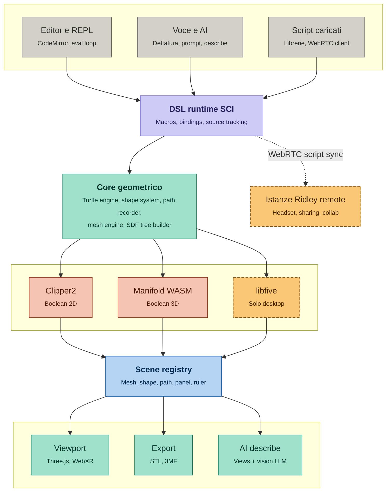
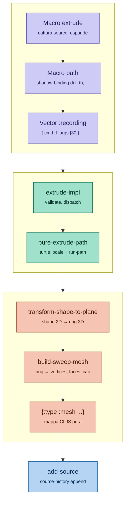
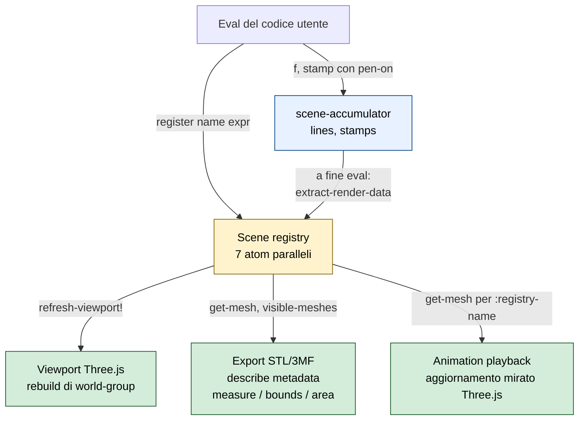
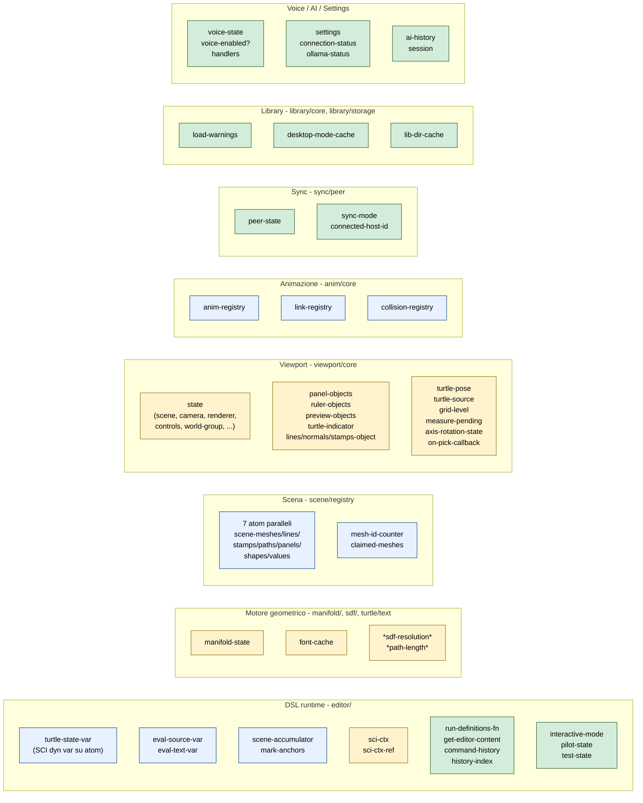
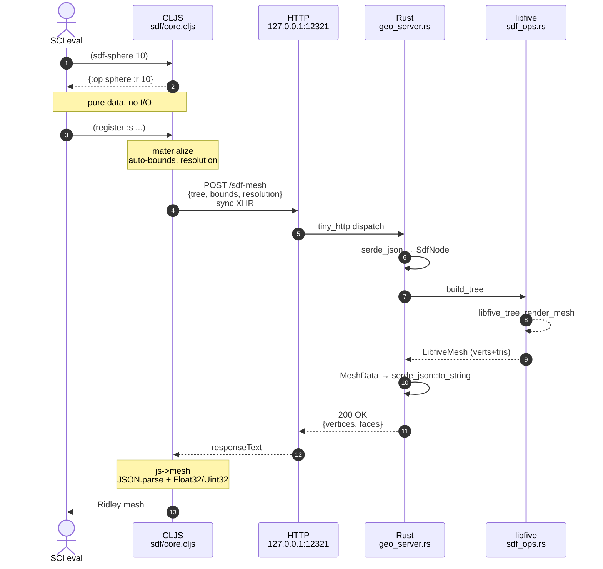
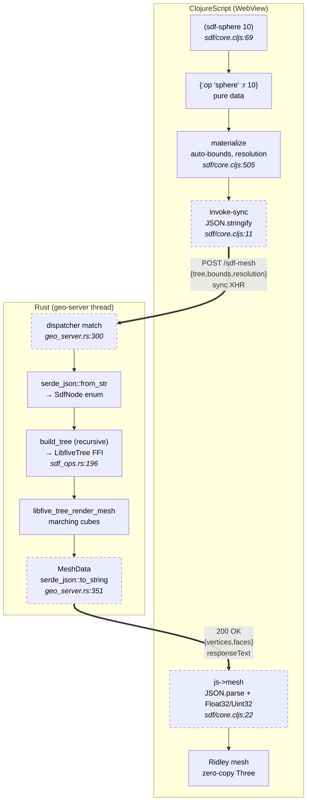

# Architecture

## Indice

### Parte I - Orientamento

1. Cos'è Ridley
2. Decisioni fondative
3. Stack tecnologico

### Parte II - Architettura

4. Panoramica
5. Runtime DSL
6. Motore geometrico
7. Scena
8. Stato condiviso
9. Confine webapp/desktop
10. Canale WebRTC
11. Sottosistemi ausiliari

### Parte III - Riferimento

12. Test
13. Convenzioni di codice *(da scrivere)*
14. Pattern architetturali ricorrenti
15. Debito tecnico noto
16. Decisioni architetturali

---

## 1. Cos'è Ridley

Ridley è uno strumento di modellazione 3D parametrica. L'utente descrive geometria come codice ClojureScript, lo valuta in un editor browser, e vede il risultato in un viewport 3D affianco. Il codice è la fonte di verità del modello: ogni mesh nasce dalla valutazione del sorgente, ogni modifica al sorgente produce una nuova valutazione, e il modello completo si ricostruisce sempre a partire dal testo. È un CAD-as-code, nella tradizione di OpenSCAD, CadQuery, JSCAD, ma con scelte architetturali distinte che il capitolo 2 documenta.

Il progetto è pubblico e open source, sviluppato nell'arco del 2026 come esperimento aperto su due piani: la modellazione parametrica con un linguaggio general purpose (ClojureScript invece di un DSL ristretto), e la collaborazione fra autore umano e modelli LLM nell'evoluzione di un sistema software complesso. La distribuzione è duplice: una versione webapp che gira interamente nel browser, accessibile via GitHub Pages, e una versione desktop costruita con Tauri che aggiunge capability native (libfive per le SDF, filesystem nativo per le librerie utente). Il capitolo 9 documenta la divisione fra le due versioni.

L'utente target è chi ha familiarità con il codice e vuole controllo programmatico sui propri modelli geometrici. Tipici casi d'uso sono progetti per stampa 3D parametrica, riproduzioni di parti meccaniche modificabili, esperimenti generativi. Non è un CAD per modellazione interattiva via mouse, e non è un competitor di Blender, Fusion 360, SolidWorks: è uno strumento testuale che vive in un altro paradigma. Una superficie alternativa di interazione tramite voce esiste come canale di edit secondario (sezione 11.5), pensata principalmente per WebXR e per accessibilità motoria.

Questo documento descrive l'architettura di Ridley nel suo stato attuale. La Parte I (capitoli 1-3) introduce il progetto. La Parte II (capitoli 4-11) lo descrive sottosistema per sottosistema. La Parte III (capitoli 12-16) raccoglie le sezioni di riferimento: test, convenzioni di codice, pattern architetturali ricorrenti, debito tecnico noto, principi di decisione. Non è un manuale d'uso (per quello esiste il manuale interattivo dentro l'applicazione), non è una roadmap (per quello esiste `Roadmap.md` separato), non è una storia del progetto (anche se a volte la storia spiega le scelte attuali, e quando questo è il caso il documento la racconta). È una descrizione strutturale di Ridley a aprile 2026, scritta perché chi entra nel progetto possa orientarsi senza dover leggere prima il codice.

---

## 2. Decisioni fondative

Ridley prende alcune scelte architetturali che lo allontanano dalle soluzioni CAD comunemente adottate nel settore. Queste scelte non sono indipendenti: si sostengono a vicenda, e questo capitolo le presenta come un sistema coerente piu' che come un elenco di caratteristiche.

### 2.1 ClojureScript come linguaggio utente

Ridley espone all'utente un linguaggio di programmazione general purpose: **Clojure**, nella variante **ClojureScript** che compila verso JavaScript. Questo distingue Ridley dalla maggior parte dei CAD text-based, che adottano linguaggi proprietari progettati ad hoc per descrivere geometrie (OpenSCAD, CadQuery espongono varianti ristrette di linguaggi esistenti o DSL specifici).

La scelta di un linguaggio general purpose ha una conseguenza immediata sul tipo di utenza a cui Ridley si rivolge: chi usa Ridley scrive del vero codice. Puo' definire funzioni, modulare il progetto in librerie, usare variabili locali, condizionali, ricorsione. Puo' costruire astrazioni personali sopra le primitive offerte da Ridley e condividerle con altri. Questa liberta' ha un costo di ingresso - bisogna imparare Clojure, o almeno il sottoinsieme necessario - ma apre un soffitto molto alto: progetti complessi non si scontrano contro i limiti di un DSL ristretto.

Clojure in particolare offre tre proprieta' che risultano preziose per un CAD:

- **Omoiconicita'**. Il codice Clojure e' un dato Clojure. Macro, *reflection*, manipolazione del codice sono naturali nel linguaggio. Questo permette a Ridley di definire le proprie primitive (`register`, `attach`, `path`, ...) come macro che operano strutturalmente sul codice utente, abilitando pattern come source tracking e record-and-replay descritti nel capitolo 5.
- **Immutabilita' di default**. Le strutture dati Clojure sono persistenti e immutabili. In un CAD dove un valore geometrico puo' essere trasformato, clonato, ricomposto, riutilizzato in contesti diversi, l'assenza di mutazione accidentale semplifica il ragionamento e riduce una categoria di bug comune.
- **Funzioni come dati**. In Clojure passare una funzione come parametro e' idiomatico. Ridley sfrutta questa proprieta' in modo essenziale: le `shape-fn` che trasformano dinamicamente un profilo durante un loft, le callback registrate per rompere dipendenze circolari, le funzioni di easing dell'animation system sono tutti casi in cui la funzione diventa il parametro naturale.

ClojureScript eredita queste proprieta' e aggiunge quella che per Ridley e' determinante: **gira nel browser**. Non serve una JVM, non serve installare un runtime, non serve un processo di build sul lato utente. Ridley e' un'applicazione web: si apre una pagina, si comincia a lavorare. Questo vincolo ha modellato il resto del progetto piu' di qualunque altra scelta.

### 2.2 Paradigma testuale

Il modello in Ridley e' **testo**: un programma ClojureScript che, eseguito, produce la scena. L'editor di testo e' il luogo primario di lavoro; il viewport 3D e' una finestra accessoria che mostra il risultato dell'ultima esecuzione.

Questa scelta pone Ridley nella tradizione di OpenSCAD, CadQuery, ImplicitCAD, JSCAD. L'alternativa e' l'approccio a manipolazione diretta alla Blender, Fusion 360, SolidWorks, dove l'utente agisce direttamente sul modello 3D con il mouse. Ogni approccio ha i suoi punti di forza; Ridley sceglie il testo per ragioni sia pratiche sia culturali.

Sul piano pratico: il codice e' **versionabile**, **diff-abile**, **riusabile** in modi che un file binario di Blender o STEP non consentono. Un progetto Ridley si mette su git, si fa pull request su una modifica, si scompone in moduli. Per la stampa 3D, dove lo stesso modello viene spesso adattato (scala, fit, tolleranze del materiale), avere il modello come codice e' un vantaggio.

C'e' un vantaggio piu' sottile, ma altrettanto concreto: il codice **e' la history**. In Fusion 360, SolidWorks e sistemi analoghi, la history delle operazioni di modellazione e' una struttura interna del sistema, visibile e modificabile tramite un'interfaccia dedicata che spesso diventa il punto di frizione principale del workflow: intervenire su un'operazione "early in the tree" e' delicato, puo' invalidare operazioni successive, richiede strumenti specializzati per navigare e modificare l'albero. In Ridley la history non esiste come entita' separata dal codice: modificare il codice e' modificare la history. Un'operazione "early" e' semplicemente una riga piu' in alto nel file; modificarla e rivalutare ricostruisce tutto il resto.

Un terzo vantaggio e' la **parametrizzazione implicita**. In CAD tradizionali, definire un set di valori riusabili (spessori nominali, tolleranze di produzione, dimensioni standard di un componente) richiede spesso strutture dedicate: tabelle Excel collegate al modello, sistemi di "configuration", variabili utente con UI specifiche. Tutti richiedono apprendimento e manutenzione. In Ridley, un set di valori riusabili e' semplicemente un `def`:

```clojure
(def wall-thickness 2.4)
(def mounting-hole 3.2)
(def tolerance 0.2)
```

Queste definizioni possono essere raccolte in cima al file, o in una libreria condivisa fra progetti. Non ci sono binding speciali, sistemi di propagazione, sync da mantenere: e' codice ordinario, strutturato come qualunque programmatore farebbe.

Sul piano culturale: il testo e' esplicito sulle scelte progettuali. Leggere codice Ridley di qualcun altro e' come leggere una ricetta: vedi perche' una mesh ha quelle dimensioni, quale logica le ha generate, dove sono i parametri ragionevolmente modificabili. In un modello a manipolazione diretta, quell'intento e' perso nella geometria finale.

Il paradigma testuale di Ridley va inteso come **due affermazioni distinte**, non una sola. La prima afferma che **il codice e' la fonte di verita' del modello**: il documento Ridley e' il programma ClojureScript, non un file binario opaco né una struttura interna gestita dall'applicazione. Tutto cio' che esiste nel modello e' nel codice, leggibile da qualunque editor, versionabile con git, scambiabile come testo. Questa affermazione e' un'invariante del progetto: tutto Ridley si appoggia su di essa, dalla replica WebRTC che spedisce il sorgente invece della mesh (capitolo 10) al sistema di librerie che salva codice come `.clj` (sezione 11.3.2). Ridley non rinuncera' a questa affermazione.

La seconda afferma che **scrivere codice e' l'esperienza utente del progetto**. Questa affermazione e' meno netta della prima, ed e' gia' parzialmente smontata nello stato corrente del progetto. Le macro `tweak` e `pilot` (sezioni 11.2.2 e 11.2.3) sono modalita' di edit non testuale: l'utente muove slider o guida una turtle con la tastiera, e Ridley produce o modifica codice come effetto. Il viewport picking e il sistema di anchor `mark` (sezione 6.7) permettono di selezionare facce e punti dal viewport invece che riferirli per coordinate. L'integrazione AI (sezione 11.4), nei limiti di efficacia documentati in 15.4.5, traduce intenti naturali in codice. Tutte queste superfici **producono codice**, e quindi rispettano la prima affermazione. Ma allargano la seconda: l'utente che le usa non sta scrivendo codice nel senso letterale, sta interagendo con un'altra superficie che lo produce per lui.

La distinzione e' importante per il futuro del progetto. Nuove superfici di edit non testuale - palette di blocchi pre-confezionati, wizard parametrici, modalita' di assemblaggio dichiarativo via picking di facce, eventualmente edit visuale in WebXR - sono coerenti con il paradigma testuale di Ridley a patto che producano codice come output. Una superficie che editasse il modello senza passare per il codice (per esempio una manipolazione diretta della mesh come in Blender) sarebbe invece un'eccezione alla prima affermazione, non alla seconda, e non sarebbe Ridley. Il capitolo 16 promuove questa distinzione a principio di decisione, e il capitolo 15 raccoglie come direzione di lavoro l'allargamento delle superfici di edit non testuali per utenti meno esperti di programmazione.

### 2.3 Geometria della tartaruga

La costruzione geometrica in Ridley e' soggettiva, non assoluta. Esiste sempre una **turtle**: un puntatore nello spazio con una posizione e un orientamento, da cui partono le operazioni di disegno. Muovere in avanti, ruotare di un certo angolo, tracciare un arco: sono tutte operazioni relative alla turtle corrente, non a un sistema di riferimento globale.

Questa idea arriva dal linguaggio Logo di Seymour Papert, che la introdusse come metafora pedagogica per rendere la geometria accessibile ai bambini. Ridley la riprende come **strumento professionale**, sostenendo che il vantaggio pedagogico di Logo - pensare da dentro la figura, non da fuori - e' altrettanto valido quando si progetta una parte meccanica.

Un esempio concreto: disegnare una staffa a L con un foro in prossimita' di ogni estremita'. Con coordinate assolute, si calcola la posizione di ogni foro sommando le lunghezze dei tratti; una modifica alla lunghezza del primo tratto richiede di ricalcolare tutto. Con la turtle, si disegna il primo tratto, ci si ferma a un offset dalla fine, si fa il foro, si prosegue: la staffa e i fori sono descritti come sequenza di istruzioni locali, ciascuna dipendente solo dalla precedente.

La turtle non esclude il riferimento globale: Ridley espone anche coordinate assolute e permette di collocare elementi a posizioni fisse. Ma il default e' relativo. E molte primitive di Ridley (le shape 2D, le mesh primitive come `box`, `sphere`, le estrusioni) sono create **orientate alla turtle**: un box chiamato dopo una rotazione appare ruotato, perche' nasce nel frame di riferimento corrente. Questo ha conseguenze dirette su come l'utente puo' comporre primitive, documentate nei capitoli sul motore geometrico.

### 2.4 Attachment: turtle e oggetti esistenti

Il paradigma turtle si estende naturalmente agli oggetti gia' creati. Ridley offre due primitive di attachment che collegano la turtle a una mesh o una SDF esistente.

**`attach`** aggancia la turtle alla **creation pose** di un oggetto: la posizione e l'orientamento della turtle nel momento in cui l'oggetto e' stato creato, memorizzati come parte dei metadati della mesh. Da li', i comandi turtle successivi non disegnano: **muovono rigidamente l'oggetto**. Un `(f 10)` sposta la mesh di 10 unita' avanti lungo il suo asse locale; una rotazione la ruota attorno al suo punto di origine. Attaccare e muovere e' il modo idiomatico di riposizionare un oggetto in Ridley - piu' naturale di calcolare traslazioni assolute, e robusto alle modifiche parametriche dell'oggetto stesso.

**`attach-face`** aggancia la turtle a una faccia di una mesh. Qui i comandi turtle **deformano** l'oggetto: `(f 5)` non sposta la mesh, estrude la faccia di 5 unita' lungo la sua normale. La semantica del turtle si ridefinisce localmente in modo coerente con la superficie agganciata: "forward" diventa "verso l'esterno lungo la normale", e l'utente puo' continuare a pensare in termini di movimento soggettivo anche quando sta scolpendo una mesh.

Entrambe le forme di attachment sono estensioni del paradigma turtle oltre la creazione: rendono il turtle applicabile alla manipolazione e alla deformazione di oggetti gia' in scena. Il capitolo 6 descrive il meccanismo; qui conta la coerenza concettuale: la turtle e' la primitiva di interazione, e si riusa dovunque abbia senso.

### 2.5 Editor integrato

Ridley ha un editor di testo interno: **CodeMirror** embedded nella stessa pagina web che contiene il viewport. L'utente scrive codice nell'editor e vede il risultato nel viewport senza mai uscire dall'applicazione, senza salvare file, senza commutare finestre.

Un'alternativa sarebbe stata delegare l'editing a un IDE esterno (VS Code, Emacs, IntelliJ) e far interagire Ridley con il codice via file system o LSP. Molti progetti CAD text-based
- CadQuery ad esempio - seguono questa via. La scelta di integrare l'editor ha conseguenze:

- **Soglia di ingresso piu' bassa**. Chi apre Ridley per la prima volta non deve installare o configurare nulla. Il sistema e' autocontenuto.
- **Feedback loop piu' stretto**. Un'evaluation con Ctrl+Enter aggiorna il viewport in frazioni di secondo. L'editor conosce la sessione di valutazione corrente e la storia di modifiche; il viewport conosce il codice che ha generato ogni mesh. Questa integrazione bidirezionale abilita feature come tweak, alt-click, e source-tracked history (capitolo 5).
- **Accessibilita' piu' controllabile**. Ridley puo' progettare l'interazione da zero per uno screen reader, invece di doversi adattare a quello che un IDE esterno offre (Accessibility.md documenta questo aspetto).
- **Un costo in produttivita' per utenti esperti**. Chi e' abituato a un editor professionale potrebbe preferire le proprie scorciatoie, plugin, temi. CodeMirror e' configurabile ma non raggiunge la ricchezza di un IDE maturo. Il compromesso e' accettato: Ridley privilegia l'integrazione sul comfort dell'utente esperto.

### 2.6 Due rappresentazioni geometriche

Ridley mantiene due rappresentazioni coesistenti della geometria: **mesh** (triangoli, superfici esplicite) e **SDF** (signed distance function, superfici implicite). Le due rappresentazioni hanno punti di forza complementari.

Le mesh sono **universali**: tutti i motori di rendering, di slicing, di analisi strutturale le accettano. Le operazioni booleane fra mesh sono ben studiate ed efficienti per i casi comuni. La maggior parte delle primitive Ridley sono nate come mesh.

Le SDF sono **analitiche**: una primitiva SDF e' una funzione matematica, non una discretizzazione. Questo permette operazioni che sulle mesh richiederebbero trattamenti speciali: blend smussati fra due solidi (non una transizione a spigolo vivo), gyroid e altre triply periodic surface, offset e shell di spessore matematicamente esatto. Il costo e' la **materializzazione**: prima o poi una SDF deve diventare una mesh (per il rendering, per l'export), e questa conversione ha un costo computazionale.

Ridley tratta le due rappresentazioni come cittadine di pari diritto nel DSL: l'utente dispone di primitive specifiche per ciascun mondo (`mesh-union` vs. `sdf-union`) e sceglie quando conviene l'una o l'altra. La conversione da SDF a mesh avviene implicitamente quando una SDF viene registrata nella scena, perche' il viewport e l'export operano su mesh. La conversione inversa, da mesh a SDF, non e' supportata: una mesh arbitraria non ha una forma analitica equivalente. Il capitolo 6 documenta le due pipeline.

La disponibilita' di SDF in Ridley dipende dall'ambiente di esecuzione: la libreria usata, libfive, non e' stata portata a WebAssembly, e quindi il supporto SDF e' presente solo in ambiente desktop. Il capitolo 9 discute questa divisione e le sue conseguenze.

### 2.7 Il legame tra le decisioni

Le scelte descritte sopra non sono indipendenti. Il paradigma testuale presuppone un linguaggio abbastanza espressivo da non stare stretto all'utente, e ClojureScript fornisce questa espressivita'. L'editor integrato rende il paradigma testuale praticabile nel lavoro quotidiano - un feedback loop lento lo renderebbe frustrante. La turtle rende il codice compatto e modificabile; senza un riferimento soggettivo, ogni programma dovrebbe calcolare esplicitamente coordinate assolute, con conseguente verbosita'. L'attachment estende la turtle oltre la creazione, preservando la stessa grammatica nelle fasi di composizione e modifica. Le due rappresentazioni geometriche non cambiano questa struttura: aggiungono strumenti senza alterare il linguaggio.

Modificare una di queste scelte richiederebbe di riconsiderare le altre. Per questo il capitolo le presenta come un sistema.

---

## 3. Stack tecnologico

Ridley è costruito su un insieme di tecnologie scelte per supportare il modello descritto nel capitolo 2: codice ClojureScript valutato a runtime nel browser, geometria mesh-based con backend WASM, rendering Three.js, distribuzione duplice browser/desktop. Questo capitolo enumera i pezzi con il loro ruolo. I capitoli successivi descrivono come si combinano.

**Linguaggio e build.** ClojureScript come linguaggio sia dell'applicazione sia del codice utente (sezione 2.1). Il build system è shadow-cljs, che produce il bundle webapp e i bundle ausiliari (test). npm gestisce le dipendenze JavaScript native (CodeMirror, Three.js, PeerJS, qrcode). Il repository ha un singolo `package.json` per entrambi gli ambienti (browser e Node-test).

**Runtime DSL.** SCI (Small Clojure Interpreter) è l'interprete che valuta il codice utente. Il codice dell'applicazione è ClojureScript compilato come al solito; il codice utente (script principale, REPL, librerie) è invece interpretato a runtime dentro SCI con un context dedicato che espone i binding del DSL (oltre 425 simboli, sezione 5.2). Il capitolo 5 documenta perché il DSL utente è interpretato e non compilato.

**Editor e UI.** CodeMirror 6 è l'editor di testo nel pannello principale e nella REPL, configurato con tema scuro custom, evidenziazione Lezer per Clojure, autocompletamento, line numbers togglabili, e una `StateEffect` per l'AI focus indicator (sezione 11.1). Il resto della UI (pannelli laterali, modali, toolbar, status bar) è DOM puro manipolato da ClojureScript, senza framework reattivi tipo React o Reagent.

**Motore geometrico.** Tre librerie esterne, ognuna con il suo dominio. **Manifold** (caricata come WASM module via CDN) gestisce le boolean 3D (`union`, `difference`, `intersection`, `hull`); è il backend di tutte le mesh booleane di Ridley sia in webapp che in desktop. **Clipper2** (in versione JavaScript) gestisce le boolean 2D su path; è usata dalle macro che operano su shape 2D prima dell'estrusione. **libfive** è la libreria SDF, integrata via FFI Rust nel binario Tauri; è disponibile solo in versione desktop, e produce mesh da espressioni implicite tramite marching cubes. Per il dettaglio del confine fra webapp e desktop, capitolo 9.

**Rendering.** Three.js è il motore di rendering 3D, configurato con due luci, ortho/perspective camera switchable, raycaster per il picking, e un set di Object3D mantenuti in sync con lo scene-registry di Ridley (capitolo 7). WebXR è il layer per visori VR/AR, integrato nel viewport (sezione 11.8) ma con attualmente uno scaffolding incompleto: il controllo del viewport in XR funziona, l'edit del codice in XR è il problema di design aperto raccolto in 15.4.2. Web Audio API gestisce un feedback audio opzionale al termine di ogni eval (un ping/buzz configurabile da settings).

**Networking.** PeerJS (libreria WebRTC con signaling pubblico) gestisce le sessioni desktop-headset e il sharing del sorgente fra istanze di Ridley (capitolo 10). Non c'è un signaling server custom: il progetto usa il PeerJS Cloud pubblico, che è uno dei limiti documentati in 15.4.

**Persistenza.** In webapp tutto vive in `localStorage`: lo script principale, le librerie utente come JSON, le settings AI, la history AI, i prompt store. In desktop la cartella `~/.ridley/libraries/` ospita le librerie utente come file `.clj` di testo (sezione 11.3.2), mentre il resto resta in `localStorage` anche in desktop (settings, history AI, prompt store). Il dual-backend dello storage librerie è uno dei pattern ricorrenti documentati in capitolo 14.

**Desktop.** Tauri è il framework che impacchetta la webapp dentro una WebView nativa (WKWebView su macOS) e affianca un sidecar Rust che espone capability native (filesystem, libfive). Il sidecar comunica con la WebView via XHR sincroni a `127.0.0.1:12321`, soluzione descritta in dettaglio nei capitoli 9 e 10. La parte Rust è composta da tre file (`main.rs`, `geo_server.rs`, `sdf_ops.rs`) e implementa un piccolo server HTTP, l'interprete del wire format SDF, e i binding FFI a libfive.

**Integrazione AI.** Cinque provider LLM sono raggiungibili via HTTP: Anthropic (Claude), OpenAI (GPT), Groq, Ollama (locale), Google (Gemini). Il dispatch fra provider è in tre file separati (sezione 11.4 e voce di debito 15.2.2). I provider cloud richiedono API key personali dell'utente (configurate da settings, persistite in localStorage). Ollama richiede un'istanza locale o di rete del server Ollama, raggiungibile via URL configurabile.

**Test.** `cljs.test` come framework, `:node-test` come target di esecuzione (eseguito da Node, autorun all'invocazione di `npm test`). Nessun test in Rust o JavaScript nativo. La pipeline CI è un singolo workflow GitHub Actions (`test.yml`), invocato a ogni push e pull request. Il capitolo 12 documenta lo stato della copertura.

**Documentazione.** Il manuale interattivo dentro l'applicazione (sezione 11.6) è bilingue italiano/inglese, scritto come stringhe i18n in moduli ClojureScript dedicati, con esempi DSL eseguibili nell'editor. Il documento di architettura (questo file) è prosa Markdown con diagrammi Mermaid. La spec del DSL (`Spec.md`) e la documentazione di sviluppo (`dev-docs/`) sono Markdown puro, in italiano.

---

## 4. Panoramica

Ridley ha la forma di una pipeline verticale, dall'alto verso il basso: testo che entra, geometria che esce. A sinistra l'input dell'utente (editor, voce, script caricati da libreria o ricevuti via rete), a destra un canale che tratta lo script come dato trasportabile ad altre istanze del sistema in esecuzione altrove.



### Il percorso verticale

Ogni codice Ridley, da qualunque sorgente arrivi, converge nel **DSL runtime**: un interprete SCI (Small Clojure Interpreter) che espone le primitive del linguaggio come binding al codice utente. Il DSL runtime e il suo ciclo di valutazione sono il soggetto del capitolo 5.

Il codice, una volta valutato, agisce sul **core geometrico**. Questo livello contiene i sottosistemi che producono geometria: il turtle engine (stato e movimento), il sistema delle shape 2D, il path recorder (che cattura sequenze di comandi per riuso), il mesh engine (extrude, loft, revolve, primitive solide) e il costruttore di alberi SDF. I tre capitoli successivi (6, 7, 8) esaminano rispettivamente il motore geometrico, la scena, e lo stato condiviso che lega tutti questi pezzi.

Il core geometrico delega il lavoro pesante a tre librerie esterne. **Clipper2** risolve boolean e offset in due dimensioni, intervenendo quando le shape devono essere combinate prima di una operazione 3D. **Manifold** (in versione WebAssembly in-process) risolve boolean e operazioni topologiche sulle mesh 3D. **libfive** valuta gli alberi SDF quando il sistema deve materializzarli in mesh; e' disponibile solo in ambiente desktop (capitolo 9). Il colore ambra e il bordo tratteggiato di libfive nel diagramma segnalano questa condizionalita', stessa convenzione usata per le istanze remote in basso a destra.

I prodotti del core geometrico confluiscono nella **scene registry**, il nodo centrale del sistema. La scene registry e' il singolo luogo dove "le cose" che l'utente ha creato vivono: mesh, shape 2D, path, pannelli di testo, righelli, gruppi. E' al tempo stesso il punto in cui convergono tutte le pipeline di creazione e il punto da cui partono tutte le pipeline di output. Il capitolo 7 e' dedicato esclusivamente a come la scena e' strutturata e mantenuta.

Dalla scena si diramano gli output. Il **viewport** Three.js renderizza in tempo reale la geometria visibile; supporta WebXR per la visualizzazione stereoscopica su headset. L'**export** produce file STL e 3MF per la stampa 3D. L'**AI describe** genera viste ortografiche della scena e le sottopone a un modello vision che restituisce una descrizione testuale: funzione di accessibilita' descritta nel dettaglio in Accessibility.md.

### L'eccezione orizzontale: WebRTC

Una freccia nel diagramma non segue il percorso verticale: e' il canale WebRTC che collega il DSL runtime a istanze di Ridley remote.

Il canale scavalca il core geometrico e la scena: quello che viaggia e' lo script, non la geometria. Ogni istanza remota e' un Ridley completo in esecuzione, che riceve il codice dal DSL runtime dell'host e lo valuta in locale ricostruendo la propria scena. Questa scelta ha conseguenze visibili anche all'utente finale: sincronizzare una modifica fra host e client significa trasmettere qualche centinaio di byte di testo, non megabyte di mesh. Il capitolo 10 discute in dettaglio come il canale e' realizzato e quali sono i suoi limiti attuali (il flusso e' unidirezionale dall'host ai client).

### Cosa non e' in questo diagramma

La panoramica sopra omette diversi sottosistemi. In particolare non compaiono l'animation system, i pannelli di testo 3D (`panel`), il sistema di librerie utente, la voice interface, il pilot mode e il tweak mode. Non si tratta di dimenticanze: sono tutti sottosistemi che si innestano su questa struttura principale (tipicamente sul DSL runtime o sulla scena) senza alterarne la forma. Li discute il capitolo 11, come sottosistemi ausiliari.

---

## 5. Runtime DSL

Il runtime DSL di Ridley e' il livello che trasforma codice Clojure scritto dall'utente in chiamate alle primitive geometriche del sistema. Non e' un compilatore ne' un motore di esecuzione proprietario: e' un interprete Clojure completo, configurato per esporre soltanto quello che ha senso esporre.

### 5.1 SCI come interprete in-browser

L'interprete si chiama **SCI** (Small Clojure Interpreter), ed e' scritto in ClojureScript. Come Ridley stesso. Questa simmetria non e' accidentale: SCI gira nello stesso ambiente del codice che interpreta, senza processo esterno, senza compilazione anticipata. L'utente preme Run, il suo codice viene letto come stringa, passato a `sci/eval-string`, valutato.

Un'alternativa sarebbe stata compilare il codice utente via ClojureScript stesso e caricarlo nel browser a runtime. SCI evita questa complessita' accettandone un'altra: interpretare invece di compilare ha un costo di performance, marginale per codice che chiama funzioni geometriche pesanti (dove il tempo vero e' nella geometria) ma sensibile per codice computazionalmente denso scritto dall'utente. Nella pratica di Ridley questo costo non e' mai emerso come problema: l'utente scrive relativamente poche righe di codice DSL, le primitive che chiama fanno il lavoro.

Il context SCI di Ridley e' configurato in modo **minimale e deliberatamente chiuso**. All'inizializzazione riceve due cose: un elenco di binding - il mapping da simbolo utente a funzione CLJS - e le librerie attive dell'utente. Non riceve una whitelist di classi JavaScript, non abilita il require dinamico, non espone l'interop JS standard di ClojureScript. L'utente Ridley non puo' scrivere `(js/fetch "...")` o accedere a `.-innerHTML` di un nodo DOM, come avrebbe potuto fare in un ClojureScript compilato normalmente.

Questa chiusura non e' una limitazione di SCI, e' una scelta di Ridley. SCI permetterebbe di esporre interop JS arbitraria; Ridley non la espone. Dove serve un accesso al browser (per caricare un font, per aprire un file dialog, per campionare un SVG nel DOM), Ridley lo costruisce come binding DSL esplicito, cosi' che il codice utente veda una funzione pura e il canale verso il browser stia nascosto dietro di essa. Il paragrafo 5.6 documenta quali capability di browser Ridley espone e quali tiene dentro il codice dell'applicazione.

Le librerie utente sono l'unico canale di estensione aperto. Una libreria Ridley e' codice Clojure che definisce funzioni, caricato dal sistema di librerie (capitolo 11) e passato a SCI come namespace aggiuntivo. Le macro di Ridley (piu' tutto quello che sta in `base-bindings`) restano pero' la base: una libreria non puo' ridefinire il linguaggio, puo' costruire sopra di esso.

### 5.2 Il binding system

I binding vivono in `src/ridley/editor/bindings.cljs` come una singola mappa piatta da simbolo Clojure a valore. Circa 425 entry nella versione attuale, organizzate in sezioni commentate: turtle implicite e pure, path recorder, shape 2D, primitive 3D, extrude/loft/revolve, shape-fn, boolean 3D, scene registry, panel, animation, picking, pilot/tweak, SDF, import/export, e cosi' via.

Le macro sono separate dalle funzioni. Vivono in `src/ridley/editor/macros.cljs` come stringa di codice (42 `defmacro` circa) che il sistema valuta nel context SCI dopo l'init. Questa separazione ha un motivo pratico: le macro devono essere definite **dentro** l'interprete SCI, non compilate con ClojureScript, per poter essere espanse a runtime sul codice utente. Le funzioni di implementazione che le macro chiamano (spesso con il suffisso `-impl`: `extrude-impl`, `loft-impl`, `mesh-union-impl`, ...) sono invece normali var ClojureScript compilate, raggiungibili dai binding.

Il risultato e' che un simbolo come `extrude` nel codice utente e' una macro Ridley che, espandendosi, chiama una funzione CLJS registrata come binding. L'utente non vede questa stratificazione; per il suo codice, `extrude` e' semplicemente una cosa che funziona.

### 5.3 Il ciclo di valutazione

Ridley ha due modalita' di valutazione:

- **Run** (Cmd+Enter sul pannello Definitions): valuta l'intero contenuto dell'editor. E' il ciclo principale.
- **REPL** (Invio nel pannello REPL): valuta una singola espressione nel context costruito dall'ultimo Run.

Sono diverse in modo intenzionale. Run ricostruisce tutto da zero; REPL preserva quello che Run ha lasciato.

```mermaid
flowchart TB
    subgraph TRIGGER [" "]
        direction LR
        Keystroke["Cmd+Enter<br/>su Definitions"]
    end

    subgraph RESET [" "]
        direction TB
        ClearRegistry["registry/clear-all!<br/>anim/clear-all!<br/>viewport/clear-rulers!"]
        NewCtx["reset-ctx!<br/>(nuovo SCI context)"]
        ReloadLibs["load-active-libraries<br/>(ricarica le librerie utente)"]
        ResetTurtle["state/reset-turtle!<br/>(turtle root, print-buffer)"]
        ClearRegistry --> NewCtx --> ReloadLibs --> ResetTurtle
    end

    subgraph EVAL [" "]
        direction TB
        BindSource["sci/binding<br/>*eval-source* :definitions"]
        Parse["sci/eval-string<br/>(parse + expand + exec)"]
        Macros["Macro expansion:<br/>add-source con line/col da &form"]
        Impl["Chiamate *-impl<br/>(geometria effettiva)"]
        RegisterSide["register-mesh! / scene-accumulator<br/>(effetti laterali sulla scena)"]
        BindSource --> Parse --> Macros --> Impl --> RegisterSide
    end

    subgraph POST [" "]
        direction TB
        ExtractRender["extract-render-data<br/>(lines, stamps)"]
        RefreshViewport["registry/refresh-viewport!<br/>(reconcilia Three.js)"]
        HistoryOutput["add-script-output<br/>(print/println → REPL history)"]
        Feedback["audio/play-feedback!<br/>pilot-mode/enter! (se richiesto)"]
        ExtractRender --> RefreshViewport --> HistoryOutput --> Feedback
    end

    Keystroke --> RESET
    RESET --> EVAL
    EVAL --> POST

    classDef phase fill:#CECBF6,stroke:#534AB7,color:#26215C
    class Keystroke phase
```



Il flusso parte da un'evaluation triggered dall'utente. La fase di **reset** pulisce la scena, ricostruisce il context SCI, ricarica le librerie, riporta la turtle al suo stato iniziale. La fase di **eval** esegue il codice dentro una dynamic var `*eval-source*` impostata a `:definitions`: questo e' il marcatore che permette al source tracking di sapere da dove proviene il codice (dettagli in 5.4). Le macro catturano line/column dal form sorgente, le funzioni `-impl` fanno la geometria, i side-effect (`register-mesh!` e simili) popolano la scena. La fase **post** sincronizza Three.js con lo stato della scena, aggiorna la REPL history con l'output di print, suona un beep di feedback.

Il ciclo REPL e' piu' corto: non c'e' reset del context, non c'e' reset della turtle. L'utente digita una singola espressione, `*eval-source*` viene impostata a `:repl`, il codice viene valutato nel context preservato, il registro viene aggiornato incrementalmente. Questo e' intenzionale: l'utente puo' fare una modifica parametrica veloce da REPL senza perdere lo stato della turtle o dover rivalutare tutto il pannello Definitions.

**Cosa sopravvive al reset del Run.** La turtle nel pannello Definitions si resetta a ogni Run, ma le dynamic var `*eval-source*` e `*eval-text*` sono istanziate in `state.cljs` e non vengono ricreate. Sopravvivono anche le callback registrate dal viewport, i listener di tastiera, lo stato della sessione WebRTC se attiva. Il reset tocca il DSL e la scena, non l'applicazione.

**Errori.** Se una valutazione lancia un'eccezione, il messaggio viene visualizzato nell'area status in fondo all'editor, il beep di feedback suona "errore" invece di "successo", e la scena resta nello stato in cui era prima dell'ultima evaluation riuscita. Le macro SCI che falliscono in expansion (es. arity mismatch nel codice utente) producono un errore SCI che lo stesso meccanismo intercetta.

### 5.4 Source tracking

Una delle caratteristiche piu' sottili e piu' utili del runtime DSL e' la **tracciabilita'** fra mesh in scena e codice sorgente che le ha generate. Quando clicchi con Alt+Click una mesh nel viewport, nella status bar appare una catena di link che puntano alle righe del codice responsabili di quella mesh. Quando usi `tweak`, Ridley sa quale espressione sta tweak-ando. Quando hai dubbi su quale mesh sia quale, `(source-of :nome)` dalla REPL te lo dice.

Il meccanismo che rende possibile tutto questo e' **puro macro expansion con metadata**, non tracing a runtime.

Ogni macro DSL che produce geometria cattura `(meta &form)` al momento dell'espansione, leggendo le annotazioni `:line` e `:column` che il reader SCI inserisce automaticamente. Un esempio paradigmatico:

```clojure
(defmacro extrude [shape & movements]
  (let [{:keys [line column]} (meta &form)]
    `(-> (extrude-impl ~shape (path ~@movements))
         (add-source {:op :extrude :line ~line :col ~column
                      :source *eval-source*}))))
```

La macro si espande in una chiamata a `extrude-impl` seguita da `add-source`, che appende una entry alla mesh:

```clojure
{:op :extrude, :line 42, :col 5, :source :definitions}
```

Per operazioni che combinano piu' mesh (union, difference, warp), la entry include anche un riferimento compatto agli operandi. Per mesh che vengono `register`-ate, la entry registra anche il nome scelto. Man mano che una mesh attraversa una pipeline di operazioni, `:source-history` accumula entry in ordine; alla fine, la mesh porta con se' la sua intera storia produttiva.

Le funzioni di implementazione (`extrude-impl`, `loft-impl`, `mesh-union-impl`) sono pure: non sanno niente del codice sorgente, non hanno parametri di tracking, non accedono a dynamic var. Il source tracking vive interamente nel layer macro.

**Limiti del meccanismo.** La tracciabilita' e' precisa per codice scritto direttamente nell'editor. Diventa meno precisa in alcuni casi:

- **Codice dentro `defn`**: le entry puntano alla riga dove la macro appare nel corpo della funzione, non al sito di invocazione. Una `(defn cubo [] (box 10))` invocata tre volte produce tre mesh con la stessa `:line` nella history.
- **Codice in librerie utente**: le macro catturano i numeri di riga relativi al **testo della libreria**, non al documento Definitions. `:source-history` non porta un campo che distingua le due origini.
- **REPL**: `:line` e' relativa al comando REPL, non al documento principale. La status bar del picking distingue i due casi: link cliccabili solo per `:definitions`.
- **Funzioni chiamate direttamente sugli `-impl`**: se l'utente bypassa la macro e chiama `(mesh-union-impl a b)`, nessuna entry viene aggiunta. In pratica non succede mai, ma architetturalmente e' possibile.

Queste degradazioni sono accettabili perche' il caso normale (utente che scrive codice nell'editor e valuta con Run) funziona pienamente. I limiti emergono in scenari avanzati.

### 5.5 Quattro pattern di macro

Il pattern "macro che cattura source e delega a `-impl` puro" e' il piu' comune, ma non l'unico. Rileggendo l'insieme delle 42 macro di Ridley, emergono quattro pattern distinti.

**Macro-wrapped impl.** Il caso tipico: `extrude`, `box`, `sphere`, `mesh-union`. La macro cattura `&form`, aggancia `add-source`, delega il lavoro geometrico a una funzione pura. E' il pattern documentato nella sezione precedente.

**Shadow-and-record.** Macro come `path`, `shape`, `turtle` aprono uno **scope dinamico** in cui le primitive contenute vengono registrate invece di eseguite immediatamente. Dentro un `(path (f 10) (th 90) (f 5))`, le chiamate `f` e `th` non muovono la turtle globale: scrivono in un accumulatore locale che la macro poi trasforma in una path completa. Il pattern permette di costruire oggetti strutturati come sequenze di istruzioni, senza che l'utente debba mai chiamare una "build" esplicita.

**Dispatch-heavy.** Macro come `loft` e `register` contengono logica sostanziale di riconoscimento di forme: `loft` accetta argomenti posizionali che possono essere numeri, shape, keyword, funzioni, e sceglie il comportamento giusto in base alla forma del suo input. `register` discrimina tra mesh, shape, path, value, panel e chiama il registratore appropriato. In questi casi la macro non e' un thin wrapper, fa vera dispatcher logic al momento dell'expansion.

**Runtime AST expansion.** `anim!` e alcune macro correlate espandono in codice che a runtime costruisce ulteriore struttura. Non e' il classico pattern "macro → impl pura": il risultato dell'expansion e' codice che continua a produrre codice. E' il pattern piu' complesso ma necessario per costruire strutture dati dinamiche come le timeline di animazione, dove il grafo e' parametrizzato in modi che non si possono risolvere a expansion time.

Un capitolo di Ridley non puo' essere una lezione su come si scrivono macro Clojure; basta notare che i quattro pattern convivono, servono a problemi diversi, e chi naviga il codice fara' meno fatica se li riconosce.

### 5.6 Capability browser esposte al DSL

Il DSL di Ridley non espone l'intera superficie del browser. La scelta di chiusura descritta in 5.1 e' intenzionale: l'utente accede al browser solo attraverso canali che Ridley ha costruito esplicitamente.

Le capability **esposte** al DSL, con un binding che il codice utente puo' chiamare direttamente:

- **Import SVG** (`svg`, `svg-shape`, `svg-shapes`): carica una stringa SVG, crea un `<div>` nascosto nel DOM, campiona path e poligoni usando le API SVG del browser. Per l'utente e' una funzione che prende una stringa e restituisce una shape.
- **Caricamento font** (`load-font!`, `text-shape`): via `opentype.js`, per generare testo 3D estrudibile.
- **Export file** (`save-stl`, `save-3mf`, `save-mesh`, `save-image`, `save-views`, `export`): costruiscono un Blob e scelgono il canale di salvataggio in base all'ambiente (geo-server in desktop, `showSaveFilePicker` in Chromium, download link altrove). L'export 3MF preserva i colori per-mesh tramite il blocco `<basematerials>` standard (vedi `src/ridley/export/threemf.cljs`): ogni mesh registrata diventa un `<object>` separato con `name` e `pid`/`pindex` che puntano al colore corrispondente, in modo che gli slicer (Bambu Studio, OrcaSlicer, PrusaSlicer) riconoscano le parti come componenti multimateriali assegnabili a slot AMS distinti.
- **Render e cattura viewport** (`render-view`, `render-slice`, `render-all-views`): rendering offscreen via `WebGLRenderTarget` per generare immagini della scena da angolazioni specifiche. Usato dalla feature AI describe e dall'export.
- **AI describe** (`describe`, `ai-ask`, `end-describe`, `cancel-ai`, `ai-status`): apre una sessione con un provider LLM.
- **Picking readers** (`selected`, `selected-mesh`, `selected-face`, `source-of`, `origin-of`, `last-op`): lettura in sola lettura dello stato del viewport picking, cosi' che uno script possa chiedere "cosa ha selezionato l'utente?".
- **Tweak e Pilot trigger** (`tweak-start!`, `tweak-start-registered!`, `pilot-request!`): invocano le due modalita' interattive documentate in 2.2.
- **Viewport highlight e visibilita'** (`flash-face`, `highlight-face`, `show-turtle`, `hide-turtle`, `show-lines`, `fit-camera`, ecc.): controlli estetici sul viewport Three.js.
- **Beep di feedback** (`audio-feedback?`, `set-audio-feedback!`): toggle del segnale acustico su eval, via Web Audio API.
- **Env detection** (`env`, `desktop?`): come documentato in 2.1, permette al codice utente di adattarsi all'ambiente.
- **Run programmatico** (`run-definitions!`): richiama il tasto Run via callback. Nato per l'accessibilita' screen reader, dove il triggerare "Run" da codice e' utile.
- **Console bypass** (`log`): scrive direttamente in `js/console.log`. Canale separato da `print`/`println` che vanno nella REPL history dell'editor.
- **Decode STL** (`decode-mesh`): per materializzare mesh STL codificate base64 dentro una libreria.

Le capability **non esposte** al DSL, visibili solo attraverso l'interfaccia utente di Ridley:

- **Voice dictation** (Web Speech API). Pilotata da tastiera/UI; non ci sono binding DSL per avviare/fermare la dettatura.
- **WebRTC sync** (PeerJS). Host e client si gestiscono dall'UI; il codice utente non puo' invocare l'avvio di una sessione.
- **WebXR** (VR/AR). Accesso dai bottoni viewport; nessun binding DSL.

Questa distinzione non e' un limite tecnico: qualunque di questi sottosistemi potrebbe in futuro ricevere un binding DSL se emergesse un caso d'uso. Oggi la scelta riflette che voice, sync e XR sono modalita' di interazione con l'applicazione, non strumenti di costruzione geometrica. I binding esposti in 5.6 sono invece costrutti che servono a descrivere un modello.

---

## 6. Motore geometrico

Il motore geometrico e' lo strato che produce le rappresentazioni 3D che la scena conserva e che il viewport renderizza. Sta sotto al runtime DSL del capitolo 5, sopra alle librerie esterne (Clipper2, Manifold, libfive) che fanno il lavoro di calcolo intensivo.

Il capitolo 4 ha gia' nominato i suoi cinque sottosistemi: turtle engine, shape system 2D, path recorder, mesh engine, SDF tree builder. Questo capitolo descrive cosa sono, come si parlano, e una scelta architetturale che li lega tutti, l'idea che la geometria sia un **dato puro**, non un riferimento opaco a un oggetto WASM.

Cosa il motore geometrico **non** fa: non gestisce la registrazione delle mesh nella scena (lo fa il capitolo 7), non si occupa del rendering (Three.js, capitolo 7), non sincronizza stato fra istanze remote (WebRTC, capitolo 10). Il suo output sono mesh pure, shape pure, alberi SDF puri: dati Clojure che altri sottosistemi consumano.

### 6.1 La mesh come dato puro

Una mesh in Ridley e' una mappa Clojure:

```clojure
{:type :mesh
 :vertices [[x y z] ...]
 :faces [[i j k] ...]
 :creation-pose {:position [...] :heading [...] :up [...]}
 :primitive :box | :sphere | :cylinder | :extrude | :loft | ...
 :face-groups {...}        ; opzionale
 :material {...}           ; opzionale
 ::raw-arrays {...}}        ; opzionale, zero-copy verso Three.js
```

Non e' un wrapper di un oggetto Manifold, non e' un puntatore a una struttura nativa, non e' una classe con metodi. E' una mappa di vector di vector, copiabile, diffabile, serializzabile, ispezionabile dalla REPL. Una mesh Ridley si stampa, si confronta con `=`, si mette in un atom, si ispeziona campo per campo dalla REPL, si serializza in EDN per persistenza locale o per essere incorporata in una libreria utente.

Questa scelta ha conseguenze. La piu' immediata e' il costo delle operazioni booleane: Manifold lavora su oggetti `Manifold` nativi costruiti dalla sua libreria WASM, non su mappe Clojure. Quando l'utente chiama `mesh-union`, le due mesh operande devono essere **convertite a oggetti Manifold**, l'operazione viene eseguita, il risultato viene **riconvertito** in mappa Ridley. Tre boolean in fila sulla stessa mesh ricostruiscono tre volte il suo oggetto Manifold. La mesh non porta con se' una versione "compilata" cacheable: quel costo viene accettato.

Una sottigliezza che vale la pena chiarire, perche' la mappa mesh contiene un campo `::raw-arrays` che potrebbe far pensare il contrario: i typed-array `Float32Array`/`Uint32Array` depositati li' dalle operazioni Manifold sono una **cache di sola uscita**. Servono al rendering Three.js, all'export STL/3MF, al sampler dei bounding box: tutti consumatori che vogliono i dati gia' in formato denso. Il path inverso, mesh-Ridley verso oggetto Manifold, non li consulta. Ogni boolean parte sempre da `:vertices` e `:faces` (PersistentVector di vector) e ricostruisce da capo i typed-array prima di passarli al costruttore nativo.

Lo si accetta perche' il modello che l'utente costruisce deve essere **dato**. Una mesh deve poter essere ispezionata dalla REPL, manipolata da una funzione utente che ne legge i vertici, incorporata in una libreria via `decode-mesh` da un payload STL codificato. Tutte queste operazioni richiedono che la mesh sia una struttura Clojure ordinaria, non un riferimento a memoria WASM. La sezione 2.2 sulle ragioni del paradigma testuale ha descritto l'idea generale; la mesh come mappa pura ne e' l'espressione concreta a livello geometrico.

Il campo `:creation-pose` registra la posa della turtle al momento in cui la mesh e' stata creata. Vive nella mappa, non viene ricalcolato. Serve a `attach`: una mesh agganciata viene riposizionata partendo dalla posa che aveva all'origine, e da li' la turtle si muove su di essa.

La conversione a oggetto Manifold, quando serve, sta in `src/ridley/manifold/core.cljs`. La pipeline e': la mappa Ridley diventa una struttura `#js {:numProp 3 :vertProperties Float32Array :triVerts Uint32Array}` (`ridley-mesh->manifold-mesh`), che diventa un oggetto `Manifold` nativo (`mesh->manifold`). Dopo l'operazione, il path inverso (`manifold->mesh`, `manifold-mesh->ridley-mesh`) riestrae vertici e indici e ricostruisce la mappa.

### 6.2 Turtle engine

Lo stato della turtle e' una mappa Clojure con una ventina di campi, definita da `make-turtle` in `src/ridley/turtle/core.cljs`. La mappa raggruppa logicamente:

- **Posa**: `:position`, `:heading`, `:up`. Il terzo asse "right" non viene memorizzato, si calcola al volo come prodotto vettore.
- **Modo penna**: `:pen-mode` ∈ `{:off :on :shape :loft}`, che cambia come la turtle reagisce a un comando di movimento.
- **Geometria accumulata**: `:geometry`, `:meshes`, `:stamps`. Le primitive registrano qui i loro effetti laterali.
- **Sweep state e loft state**: `:stamped-shape`, `:sweep-rings`, `:loft-orientations`, `:pending-rotation`. Validi solo dentro alcune modalita'.
- **Anchors**: `:anchors`, mappa popolata dal comando `mark`.
- **Attachment**: `:attached`, presente solo dentro `attach` o `attach-face`, segnala che ogni movimento della turtle trasforma anche una mesh associata.
- **Configurazione**: `:resolution`, `:joint-mode`, `:material`, `:preserve-up`, `:reference-up`.

E' una struttura "grossa": tiene insieme posa, modo, accumulatori e configurazione. La purezza si conserva perche' la mappa viene sostituita per intero a ogni operazione. Le primitive turtle non mutano in place, ricalcolano: `swap!` sull'atom che contiene la turtle, applicando una funzione che riceve la mappa vecchia e ne restituisce una nuova.

**Le primitive di movimento sono indipendenti.** `f` muove lungo heading, `th` ruota heading attorno a up, `tv` ruota heading e up attorno a right, `tr` ruota up attorno a heading. Nessuna delle quattro si esprime in termini delle altre: sono quattro funzioni distinte sullo stato. La scelta di esporre una sola traslazione (quella lungo heading) come primitiva propriamente turtle, con le altre traslazioni accessorie (`move-up`, `move-right`, `move-left`, `move-down`) trattate come spostamenti laterali ausiliari, riflette il modello: la turtle avanza nella direzione in cui guarda, e l'utente la riorienta prima di un avanzamento quando vuole muoversi diversamente. Le rotazioni hanno tre primitive perche' tre sono i gradi di liberta' rotazionali in 3D.

`arc-h` e `arc-v` sono invece **helper non atomici**: si decompongono in una sequenza di `th`/`f` (oppure `tv`/`f`) di passi piccoli, con il numero di step determinato da `:resolution` o da un parametro esplicito. Non c'e' un comando `:arc` registrato nei path: il recorder vede solo le primitive di basso livello in cui l'arco si espande.

Una sottigliezza importante: in modalita' `:shape` o `:loft`, le rotazioni `th`/`tv`/`tr` non si applicano subito alla posa. Vengono accumulate nel campo `:pending-rotation` e trasformate in una giuntura sul prossimo `f`. La differenza fra "muovere la turtle" e "muovere la turtle mentre estrudo" e' tutta qui: nel primo caso ruoti e poi avanzi, nel secondo la rotazione segna un angolo nella geometria che stai costruendo, che il sistema risolve come fillet o spigolo a seconda del `joint-mode`.

**Turtle implicita e scope locali.** Le primitive turtle non ricevono lo stato come argomento. Lo leggono da una dynamic var SCI, `*turtle-state*`, definita in `src/ridley/editor/state.cljs` come variabile dinamica il cui valore di default e' un atom contenente `(make-turtle)`. Una chiamata "implicita" come `(f 10)` legge `@@*turtle-state*`, calcola la nuova mappa, e la scrive con `swap!`.

Per aprire uno scope con una turtle locale isolata si usa la macro `(turtle ...)`. Si espande in:

```clojure
(let [parent-state# @*turtle-state*]
  (binding [*turtle-state* (atom (init-turtle ~opts parent-state#))]
    ~@body))
```

Cioe': clona i campi rilevanti del parent (posa, materiale, risoluzione), li mette in un nuovo atom, ribinda la dynamic var. I comandi turtle dentro il body operano sul nuovo atom senza saperlo. All'uscita dal `binding` lo scope cade e si torna al parent. Non c'e' uno stack esplicito di turtle: lo stack e' quello della dynamic var SCI, gestito dal meccanismo standard di `binding`.

Questo modello, gia' citato nel capitolo 5 come parte dell'analisi degli scope dinamici, qui si rivela necessario. Senza dynamic var, ogni primitiva turtle dovrebbe ricevere lo stato come parametro esplicito; il codice utente diventerebbe `(f turtle 10)` invece di `(f 10)`. La scelta di un parametro implicito reso dinamico e' quella che permette al DSL di leggersi come una sequenza di istruzioni a una tartaruga, non come una concatenazione di trasformazioni di stato.

### 6.3 Path recorder e shape system

Il pattern fondamentale che lega path, shape e attach e' lo stesso: **registra una sequenza di comandi turtle, valutali piu' tardi su uno stato**. Cambia solo lo stato che riceve i comandi.

**Path.** La macro `path` (e tutte le macro di costruzione che la usano internamente: `extrude`, `loft`, `revolve`, `attach`) apre uno scope dove i simboli `f`, `th`, `tv`, `arc-h`, ... sono shadow-bindati a versioni "recording". Ogni chiamata, oltre a muovere una turtle locale, appende una mappa `{:cmd :f :args [10]}` a un vector `:recording`. A fine scope, il vector viene avvolto in:

```clojure
{:type :path :commands [{:cmd :f :args [30]}
                         {:cmd :th :args [90]}
                         {:cmd :f :args [20]}]}
```

Il path e' **comandi, non campioni**. I waypoint con posizioni e tangenti vengono calcolati piu' tardi, quando un consumer interpreta i comandi su una turtle. Le funzioni `walk-path-poses` e `walk-path-poses-adaptive` (in `src/ridley/turtle/loft.cljs`) fanno questo lavoro: replayano i comandi su una turtle locale, campionano la posa lungo il percorso, restituiscono una sequenza di pose. Il sample rate non vive nel path, vive nel consumer.

Conseguenza pratica: lo stesso path puo' essere campionato a risoluzioni diverse da consumer diversi senza ricostruirlo. Un loft adattivo (`bloft`) campiona piu' fitto dove la curvatura e' alta; un extrude lineare fa un solo campione per waypoint. Il path non lo sa: e' una sequenza di istruzioni, e l'interprete decide come leggerla.

**Shape.** La macro `shape` segue lo stesso pattern, ma vincolato: solo `f` e `th` sono ammessi. La forma di output e' diversa, perche' un profilo 2D non e' una sequenza di istruzioni ma una chiusa di punti:

```clojure
{:type :shape
 :points [[x0 y0] [x1 y1] ...]    ; outer contour, CCW
 :centered? bool
 :holes [[[hx hy] ...] ...]}      ; opzionale, ognuno CW
```

La conversione comandi-punti la fa `path-to-shape` in `src/ridley/turtle/shape.cljs`, che traccia i punti e ne forza l'avvolgimento antiorario. Le primitive `circle-shape`, `rect-shape`, `polygon-shape`, `star-shape` producono direttamente la mappa, saltando il recorder.

La shape, come la mesh, e' un dato puro. Non contiene riferimenti a oggetti Clipper2, non e' un puntatore. La conversione a Clipper2 e' on-demand, fatta da `shape->clipper-paths` in `src/ridley/clipper/core.cljs` solo nel momento in cui un boolean 2D la richiede. Le coordinate vengono moltiplicate per un fattore `SCALE = 1000` prima di passarle a Clipper2 e divise al ritorno, perche' Clipper2 lavora su coordinate intere; il prezzo e' una fedelta' di tre cifre decimali, sufficiente per l'uso CAD.

**Attach.** Anche `attach` e `attach-face` registrano comandi turtle in un path. La differenza e' lo stato su cui i comandi vengono replayati: non una turtle vergine all'origine (path), non una turtle vincolata al piano (shape), ma una turtle **derivata dalla mesh agganciata**. `attach` parte dalla `:creation-pose` della mesh; `attach-face` parte dal centro della face selezionata, con heading orientato lungo la normale.

Il replay produce due effetti contestuali. Modifica la posa della turtle, come al solito. Ma poiche' la turtle ha il flag `:attached` impostato sullo stato, ogni movimento applica anche una trasformazione rigida alla mesh: se sposti la turtle di 10 unita', anche la mesh agganciata si sposta di 10 unita'. Per `attach-face`, ogni `f` diventa un'estrusione della faccia, non solo uno spostamento; ogni `inset` diventa un offset planare.

Il pattern unificato (cattura, comandi, replay) significa che recorder e interprete sono gli stessi codici. Cio' che cambia da caso a caso e' chi consuma il vector di comandi e con quale turtle iniziale.

### 6.4 Mesh engine

Il mesh engine e' fatto di tre strati:

- **Macro DSL** (`src/ridley/editor/macros.cljs`) che catturano source e fanno expansion.
- **Funzioni `-impl`** (`src/ridley/editor/impl.cljs`) che validano gli argomenti e dispatchano.
- **Funzioni `pure-*`** (`src/ridley/editor/operations.cljs`) e costruttori specializzati (`primitives.cljs`, `extrusion.cljs`, `loft.cljs`, `geometry/operations.cljs`) che fanno il lavoro geometrico.

Lo strato `-impl` esiste perche' una macro non puo' contenere logica di dispatch a tempo di expansion senza diventare illeggibile, e perche' le funzioni `pure-*` possono essere chiamate direttamente dalla REPL o da altre funzioni senza passare dall'expansion. Il capitolo 5 ha gia' descritto questa stratificazione in generale; il mesh engine e' il caso in cui la si vede applicata in densita'.

Per dare un'idea concreta, il flusso di `(extrude (circle 20) (f 30) (th 90) (f 20))`:



Il path che esce dalla capture e' una struttura dati. Lo strato di dispatch lo riceve insieme alla shape, valida (rifiuta comandi attach-only come `:inset`, `:scale`, `:move-to`), passa a `pure-extrude-path`. Quest'ultima istanzia una turtle locale, replaya il path raccogliendo le pose, stampa la shape ad ogni posa con `transform-shape-to-plane` (proietta i punti 2D nel piano perpendicolare a heading, con up come asse Y locale), e alimenta `build-sweep-mesh` che concatena i ring 3D in un singolo array di vertici, costruisce le facce laterali come quadrilateri spezzati in triangoli, aggiunge cap iniziale e finale.

L'output e' una mappa `:type :mesh`. Manifold non viene mai chiamato in questo flusso. La mesh esce eager dal punto di vista della geometria CLJS (vertici e facce sono calcolati e materializzati in memoria), lazy dal punto di vista di Manifold (l'oggetto nativo non viene costruito). Il primo punto di contatto con Manifold sara' un eventuale boolean successivo, applicato a questa mesh.

**Loft, loft-n, bloft, loft-between.** Le quattro varianti dispatchano da `loft-impl` e `bloft-impl` a tre funzioni pure distinte: `pure-loft-path` (shape singola lungo path), `pure-loft-two-shapes` (interpolazione fra due profili), `pure-loft-shape-fn` (profilo che varia con `t`). La differenza fondamentale e' come si cammina il path:

- `loft` usa `walk-path-poses` con sample rate fisso (default 16 step, configurabile via `loft-n`).
- `bloft` usa `walk-path-poses-adaptive`, che campiona piu' fitto dove la curvatura e' alta. Inoltre, quando rileva che due ring consecutivi si auto-intersecano (un evento tipico nei tratti di curva stretta delle bezier), costruisce un convex hull tramite Manifold (`hull-from-points` in `manifold/core.cljs`) e lo unisce al resto della mesh.

Questa e' **l'unica eccezione interna al mesh engine in cui Manifold viene invocato durante la costruzione**, fuori dalle operazioni booleane esplicite. L'eccezione e' inevitabile perche' ricostruire un convex hull a mano in CLJS sarebbe lavoro duplicato, e Manifold lo offre.

`loft-between` interpola fra due shape diverse lungo un path, costruendo ring che gradualmente si trasformano dall'una all'altra. La gestione degli angoli del path, comune a tutte le varianti, sta in `process-loft-corners`, che calcola offset di scorciatoia per profili rastremati e gestisce le giunture in base al `joint-mode`.

**Operazioni booleane.** La macro `mesh-union`, `mesh-difference`, `mesh-intersection` chiamano `union`, `difference`, `intersection` in `src/ridley/manifold/core.cljs`. Il pattern e' uniforme: ogni mesh operanda viene convertita a oggetto Manifold con `mesh->manifold`, viene chiamato il metodo nativo (`.add`, `.subtract`, `.intersect`) sull'istanza, il risultato viene "normalizzato" con `.asOriginal` per pulire facce interne, e ricostruito in mappa Ridley con `manifold-mesh->ridley-mesh`. Per union variadiche, `tree-union` riduce in O(n log n) invece che in sequenza.

Il fatto che ogni boolean ricostruisca gli oggetti Manifold dai zero e' il costo della scelta "mesh come dato puro", come gia' detto in 6.1. La conversione e' esplicita, isolata in `manifold/core.cljs`, e costruita per essere trasparente al resto del sistema.

**Warp.** Definito in `src/ridley/geometry/warp.cljs`. Pipeline:

1. Calcola i bounds del volume di influenza dal `:primitive` del volume passato (sphere, cyl, box, ...).
2. Se richiesto, subdivide le facce dentro al volume per dare risoluzione sufficiente alla deformazione.
3. Stima le normali dei vertici, con detezione di crease.
4. Per ogni vertice nel volume, chiama la funzione di deformazione dell'utente con posizione, posizione locale, distanza dal centro, normale, geometria del volume.
5. Sostituisce i vertici e restituisce la mesh modificata.

I preset (`inflate`, `dent`, `attract`, `twist`, `squash`, `roughen`) sono semplicemente funzioni di deformazione predefinite che il sistema espone come binding. La forma generale di `warp` permette all'utente di scrivere le proprie.

Restano da menzionare le operazioni piu' semplici. **Primitive solide.** `box-mesh`, `sphere-mesh`, `cyl-mesh`, `cone-mesh` in `src/ridley/geometry/primitives.cljs`. Generano vertici e facce direttamente in ClojureScript via loop trigonometrici. Non passano da Manifold neanche per la creazione: una `box` Ridley e' otto vertici e dodici facce calcolate a mano, con `:creation-pose` impostata alla posa corrente della turtle.

**Revolve.** In `src/ridley/geometry/operations.cljs`. Estrae punti dal profilo, ruota il profilo `n-rings` volte attorno all'asse, costruisce facce fra ring consecutivi, aggiunge cap se l'angolo non e' 360°. Anche revolve produce mesh CLJS pura senza toccare Manifold.

### 6.5 Shape-fn

Le shape-fn sono il meccanismo con cui un loft puo' avere un profilo che varia continuamente lungo il path. Una shape-fn e' una funzione `(fn [t] -> shape)` dove `t ∈ [0, 1]` e' la frazione percorsa. Il loft, mentre cammina il path, valuta la shape-fn ad ogni passo e usa il profilo cosi' ottenuto come anello da estrudere.

La definizione canonica e' `shape-fn` in `src/ridley/turtle/shape_fn.cljs`:

```clojure
(defn shape-fn [base transform]
  (let [evaluate (if (shape-fn? base)
                   (fn [t] (transform (base t) t))
                   (fn [t] (transform base t)))]
    (with-meta evaluate {:type :shape-fn :base base ...})))
```

Una shape-fn e' una funzione "marcata" via metadata. Si distingue da una normale funzione che restituisce shape grazie al predicato `shape-fn?`. Il `transform` di costruzione riceve `(base, t)` se la base e' una shape statica, oppure `(base-applicata-a-t, t)` se la base e' a sua volta una shape-fn: cio' permette di **comporre** shape-fn, costruendole a strati.

Le shape-fn built-in non vivono in un registry centrale. Sono funzioni esposte come binding SCI, ognuna definita come una `defn` ordinaria che usa `shape-fn` internamente. La libreria standard include `tapered`, `twisted`, `fluted`, `rugged`, `displaced`, `morphed`, `profile`, `heightmap`, `noise-displace`, `shell`, `woven-shell`, `capped`. L'utente puo' definirne altre allo stesso modo, con o senza la macro `shape-fn`.

Alcune shape-fn sono **parametrizzate da funzioni**, non solo da valori. `shell` accetta una "thickness function" che riceve `t` e restituisce lo spessore del guscio in quel punto del loft; il guscio cavo che ne risulta puo' avere pareti che si rastremano, si gonfiano, si modulano lungo il percorso. Lo stesso vale per `displaced` (che riceve una `(fn [t angle] -> radial-offset)` per spostare i vertici radialmente) e `morphed` (interpolazione guidata da una funzione utente). Architetturalmente sono **shape-fn di ordine superiore**: il loro `transform` interno chiama la funzione utente in punti scelti del calcolo, esponendo cosi' un controllo fine senza dover esporre primitive nuove. La firma della funzione parametro varia da caso a caso ed e' documentata insieme alla shape-fn che la consuma.

Una shape-fn riceve `t` ∈ [0, 1] e restituisce una shape. Non riceve la posa della turtle, non riceve l'indice del campione. Per le shape-fn che hanno bisogno di sapere la lunghezza assoluta del path (es. `capped`, che vuole esprimere la lunghezza di transizione in unita' fisiche e non in frazione di percorso), il loft espone una dynamic var `*path-length*` bindata al valore in unita' del path corrente. La shape-fn la legge, la usa nel calcolo. E' un canale laterale, non un parametro: il prezzo di mantenere `t` come unico argomento.

`capped` e' un esempio illuminante. Implementato come shape-fn, restituisce la shape inalterata negli `t` intermedi, ma vicino a `t = 0` e `t = 1` la scala o la espande verso un raggio target, cosi' che il loft tracci una transizione liscia che simula un fillet. Il fillet quindi non e' costruito come geometria post-hoc con un secondo round di mesh-edit: e' costruito **durante** il loft, modulando il profilo. Questo limita il fillet a scenari di loft lungo path, ma evita la complicazione di operare su mesh gia' triangolata.

### 6.6 SDF tree builder

Il sottosistema SDF e' confinato in un singolo file, `src/ridley/sdf/core.cljs`. Costruisce alberi di operazioni SDF come **dato puro**, e li invia a libfive per la materializzazione in mesh quando l'utente lo richiede.

Un nodo SDF e' una mappa con chiave `:op` e parametri operazione-specifici:

```clojure
{:op "sphere" :r 5}
{:op "box" :sx 10 :sy 8 :sz 6}
{:op "union" :a node-a :b node-b}
{:op "blend" :a node-a :b node-b :k 0.5}
{:op "shell" :a node :t 1.5}
```

Costruzione e composizione sono operazioni di mappa Clojure. `sdf-sphere`, `sdf-box`, `sdf-union`, `sdf-blend`, `sdf-shell`, `sdf-gyroid`, `sdf-schwarz-p` (e una decina d'altre) sono costruttori che producono questi nodi. Operare su SDF in CLJS costa quanto costruire una mappa: nessuna comunicazione esterna, nessuna valutazione matematica, nessun calcolo di campo.

La valutazione vera, quella che traduce il campo signed-distance in vertici e facce, **non avviene in CLJS**. Avviene quando l'utente chiama esplicitamente `(materialize sdf bounds resolution)` o `(sdf->mesh sdf)`, oppure quando un'operazione che richiede una mesh (un boolean misto SDF-mesh, un export STL) chiama internamente `ensure-mesh`. In quel momento il payload `{:tree node :bounds bounds :resolution res}` viene serializzato a JSON e inviato in POST a `http://127.0.0.1:12321/sdf-mesh`, dove il geo-server desktop (`desktop/src-tauri/src/sdf_ops.rs`) ricostruisce l'albero come libfive tree e chiama `libfive_tree_render_mesh`. La mesh torna come JSON, viene riconvertita in mappa Ridley standard.

La risoluzione del meshing e' governata da `*sdf-resolution*`, una dynamic var con default 15 voxel per unita'. `resolution-for-bounds` la converte in una griglia e applica un budget massimo di voxel per evitare meshing troppo costosi. Per SDF con feature sottili (piccoli dettagli rispetto alla scala generale), `min-feature-size` boosta automaticamente la risoluzione locale.

In ambiente browser il binding SDF esiste nel context SCI ma la chiamata a `materialize` fallisce a runtime, perche' il geo-server non e' raggiungibile (non c'e' un `localhost:12321` a cui rispondere). Non c'e' fallback in CLJS per la valutazione SDF: la disponibilita' del sottosistema e' interamente legata all'ambiente desktop. Il capitolo 9 documenta in dettaglio questa divisione e le sue conseguenze.

### 6.7 Stato non-puro del motore geometrico

Il motore geometrico e' costruito sopra una manciata di stati mutabili, gia' anticipati nel capitolo 5 quando si e' detto che le funzioni `-impl` sono pure ma il loro contesto non lo e'. Per chiarezza, e in preparazione del capitolo 8, li si elenca qui:

- **`*turtle-state*`** in `state.cljs`. La dynamic var che incapsula l'atom della turtle. E' lo stato non-puro principale del motore. Reset all'inizio di ogni Run.
- **`scene-accumulator`**, **`mark-anchors`** in `state.cljs`. Atom che raccolgono output visivo (segmenti pen-on, outline) e anchor accessibili globalmente. Reset a ogni Run.
- **`manifold-state`** in `manifold/core.cljs`. Atom che tiene il modulo WASM caricato. Necessario perche' il caricamento e' asincrono e ogni operazione deve verificare che Manifold sia inizializzato.
- **`font-cache`** in `text.cljs`. Atom di cache dei font caricati via opentype.js.
- **`*path-length*`**, **`*sdf-resolution*`**. Dynamic var usate come canali laterali. La prima viene bindata dal loft con la lunghezza del path corrente e letta dalle shape-fn che ne hanno bisogno. La seconda governa la risoluzione di default del meshing SDF, sovrascrivibile per chiamata.

Il path recorder, vale la pena notarlo, **non ha stato globale**. Ogni `(path ...)` o `(shape ...)` istanzia un proprio recorder lessicale e lo butta. La cattura di comandi e' un parametro implicito allo scope, non uno stato del sistema. Lo stesso vale per il replay: avviene sempre dentro una funzione che alloca la sua turtle locale, fa il lavoro, restituisce il risultato.

Questa distinzione fra "stato che persiste fra eval" (turtle, scene-accumulator) e "stato lessicale di scope" (recorder, turtle locale di replay) e' importante per la comprensione dell'intera applicazione. Il capitolo 8 ci tornera' in modo sistematico.

---

## 7. Scena

La scena è il nodo centrale dell'applicazione. È dove vivono le mesh, i pannelli, i path, le shape e gli altri valori dopo che il motore geometrico li ha prodotti, ed è la fonte da cui il viewport Three.js, l'export STL/3MF, il modulo `describe` e le API di misurazione attingono per fare il loro lavoro. Nel capitolo 4 è stata indicata come scene registry; questo capitolo descrive in dettaglio cosa contiene, come si raccorda con il viewport, e quali invarianti governano il suo ciclo di vita.

Il contenuto della scena vive in `src/ridley/scene/registry.cljs`. Questo capitolo descrive solo il lato "catalogo": come le entità sono registrate, indicizzate, lette. Il rendering Three.js vero e proprio (gestione della camera, picking, ruler interattivi, axis- constrained rotation, render loop, WebXR) è appena toccato qui in quanto consumatore della scena, e sarà approfondito nei capitoli sui sottosistemi ausiliari. Il modo in cui la macro `register` costruisce le entry è stato già coperto in 5.5.

### 7.1 Sette atom paralleli

La scena è implementata come sette atom privati distinti, uno per ogni tipo di entità che il DSL può produrre:

- `scene-meshes`, vector di entry `{:mesh ... :name kw|nil :visible bool :source-form ...?}`
- `scene-lines`, vector di segmenti `{:from [...] :to [...] :color ...?}`
- `scene-stamps`, vector di outline triangolati di profili
- `scene-paths`, vector di entry `{:path ... :name kw}`
- `scene-panels`, vector di entry `{:panel ... :name kw :visible bool}`
- `scene-shapes`, vector di entry `{:shape ... :name kw}`
- `scene-values`, mappa `{kw any}` per il lookup raw via `($ :nome)`

Accanto a questi sette vivono due strutture di servizio: `mesh-id-counter`, un contatore intero monotono che genera identificatori unici, e `claimed-meshes`, un `js/Set` nativo JavaScript che marca le mesh già registrate dalla macro `register` durante un'eval (la sua ragion d'essere è descritta in 7.4).

La scelta di sette atom paralleli è la trascrizione naturale del fatto che ognuno di questi tipi ha un ciclo di vita e un consumatore diverso: le mesh interessano viewport e export, i path solo il DSL che li riusa, i pannelli sono testo billboardato, gli shape sono profili 2D, i valori raw sono semplici lookup. Tenerli separati rende ognuno introspettabile, e mantiene le funzioni di lettura specializzate per tipo. Il prezzo che si paga, in cambio, è duplicazione strutturale: la stessa logica di "trova entry per nome" è ripetuta quattro volte, una per ogni tipo registrato per nome. La sezione 14 ci tornerà.

### 7.2 Renderable e abstract

I sette atom si dividono in due categorie concettuali. Le entità **renderable** hanno un flag `:visible` e finiscono nel viewport quando il flag è `true`: sono mesh, lines, stamps e panels. Le entità **abstract** sono pura informazione, non hanno una loro proiezione visiva, e non passano mai per il viewport: sono paths, shapes e values.

Un path registrato non si vede da nessuna parte fino a che il codice utente non chiede esplicitamente `(follow-path :nome)` per disegnarlo come tracciato della tartaruga, oppure lo passa a `extrude` perché generi una mesh. Lo stesso vale per uno shape: è un profilo 2D che esiste come dato, e diventa visibile solo quando viene estruso, ruotato o lofted in una mesh che entra in `scene-meshes`. I valori in `scene-values` sono ancora più silenti: servono solo come contenitore per il lookup `$`, e non hanno proiezione di alcun tipo se non quella che il codice utente costruisce a mano leggendoli.

La distinzione è rilevante perché definisce cosa la scena "mostra" in un certo istante. Quando il viewport chiede alla scena il suo contenuto, riceve solo le entità renderable visibili. Tutto il resto è un catalogo, non un display.

### 7.3 Identità: `:registry-id` e `:registry-name`

Ogni mesh che entra in `scene-meshes` riceve un campo `:registry-id`, un intero generato dal contatore monotono. L'ID è iniettato una sola volta, al momento dell'aggiunta, e da quel momento accompagna la mesh per tutta la durata della sessione, anche attraverso sostituzioni. Quando una `register` con un nome già esistente sostituisce la mesh in-place, l'ID viene preservato esplicitamente. Questo dà alla scena un riferimento stabile, immune ai cambiamenti di indice nel vector quando altre mesh vengono aggiunte o rimosse.

Il nome del registro vive in un campo separato. Se la mesh è stata registrata con `(register foo ...)`, l'entry contiene `:name :foo`. Le mesh anonime (quelle che il turtle produce ma che l'utente non ha vincolato a un nome) hanno `:name nil`.

C'è poi un terzo campo, `:registry-name`, che vive solo temporaneamente: non sta nelle entry di `scene-meshes`, ma viene iniettato al volo nella mesh map quando la scena costruisce il payload da consegnare al viewport. Il nome diventa così un tag che attraversa il confine verso Three.js e finisce nel campo `userData` del Mesh costruito. È il meccanismo che permette al sistema di animazione di ritrovare un Object3D specifico per applicarvi una trasformazione rigida, e al picking di restaurare la selezione dopo una ricostruzione della scena. La scena interna lavora con `:registry-id`, il viewport con `:registry-name`: i due nomi servono mondi diversi.

### 7.4 Il rapporto con lo scene-accumulator

Le linee della tartaruga in pen-mode e gli stamp dei profili 2D sono prodotti durante l'eval del codice utente, ad altissima frequenza, da decine di chiamate a `f` e a `stamp`. Vivono però in un atom dedicato, `scene-accumulator` (capitolo 6.7), che sta in `editor/state.cljs` accanto al `*turtle-state*`, non nella scena. La separazione è deliberata.

La prima ragione è di layering. Le funzioni implicite del turtle non devono conoscere la scena: il modulo turtle è deliberatamente registry-agnostic, in modo che possa essere ragionato e testato isolatamente. Se ogni `f` con pen-on dovesse fare uno `swap!` su `scene-lines`, il turtle dipenderebbe dalla scena, e il grafo dei moduli si appesantirebbe.

La seconda ragione è di lifecycle. Le linee e gli stamp sono trace di esecuzione del run corrente: il loro orizzonte temporale è una singola eval. Le entità nominate della scena, invece, devono sopravvivere ai comandi REPL successivi, perché l'utente continua a interagire con loro per nome. Tenere le due cose in atom diversi permette di avere reset rule diverse: lo scene-accumulator viene azzerato a ogni eval (anche di un singolo comando REPL), mentre i sette atom della scena vengono azzerati solo quando si rivaluta l'intero buffer delle definitions.

La terza ragione è che il driver dell'editor sceglie esplicitamente quando consolidare. Al termine dell'eval, il driver legge lo scene-accumulator, decide se sostituire (per le definitions) o accumulare (per i comandi REPL), e scrive in `scene-lines` / `scene-stamps`. Mantenere accumulator e scena distinti rende questa policy esplicita.

Le mesh, va notato, seguono un percorso diverso. Quando il codice utente scrive `(register foo (extrude ...))`, la macro `register` agisce direttamente sui sette atom della scena durante l'eval: la mesh named è nella scena prima ancora che il driver concluda la valutazione. Le mesh anonime prodotte dal turtle (quelle dove l'utente ha scritto `(extrude ...)` senza un nome) sono invece nel turtle-state, e vengono trasferite alla scena dal driver alla fine dell'eval, attraverso `set-definition-meshes!`. È qui che entra in gioco `claimed-meshes`: la macro `register`, quando registra un vector di mesh sotto un nome composto (per esempio `(register parts (for [...] (extrude ...)))` produce `:parts/0`, `:parts/1`, eccetera), marca ogni sotto-mesh nel set `claimed-meshes`. Il driver, prima di trasferire le mesh anonime del turtle, controlla questo set e salta le mesh già registrate. Senza questo meccanismo, una stessa mesh finirebbe nella scena due volte: una con il nome composto, una come anonima.

Il set `claimed-meshes` usa un `js/Set` nativo invece di un Clojure set perché fa hashing per identità di riferimento. Le mesh sono mappe immutabili, e due mappe equivalenti per valore collasserebbero in uno stesso elemento di un Clojure set: ma ai fini del controllo di doppia registrazione, è l'identità dell'oggetto che conta, non il suo contenuto.

### 7.5 `refresh-viewport!` come unico ponte

C'è una sola via per mostrare la scena nel viewport: la funzione `refresh-viewport!` della scena. Tutti gli altri canali, dal codice utente al driver dell'editor, dal sistema di animazione al sync remoto, finiscono per chiamarla. Il viewport non legge mai direttamente i sette atom: aspetta che la scena gli consegni un payload completo.

La funzione è breve. Itera `scene-meshes` filtrando le entry visibili, inietta nelle mesh nominate il campo `:registry-name`, costruisce un payload con quattro vector (`:lines`, `:stamps`, `:meshes`, `:panels`) e un flag `:reset-camera?`, e lo passa a `viewport/update-scene`. Le linee e gli stamp arrivano dai rispettivi atom senza filtri, perché la loro visibilità è controllata globalmente dal viewport stesso (tramite i toggle del flag `lines-visible` eccetera). I pannelli sono filtrati per `:visible`. Path, shape e values non sono nel payload: sono abstract.

Le chiamate a `refresh-viewport!` partono da molti punti del sistema: dopo ogni eval del buffer definitions, dopo ogni comando REPL, dopo ogni `show` o `hide`, dopo ogni transizione di stato del pilot mode o del tweak mode, dopo ogni messaggio sync ricevuto dall'host. Il flag `:reset-camera?` è quasi sempre `false`: solo i contesti che inaugurano un modello nuovo (per esempio un esempio del manuale aperto, o l'inizio di una sessione AI in batch) chiedono il reset.

Una nota importante: la macro `register` chiama `refresh-viewport!` internamente, dopo ogni registrazione. Questo è il punto: per N chiamate `register` nel buffer di un utente, il viewport viene ricostruito N+1 volte, una per ogni `register` più una alla fine dell'eval. È un costo che diventa visibile solo per scene abbastanza dense da far percepire il jitter durante il run; il capitolo 15 lo segnala.

### 7.6 Ricostruzione vs aggiornamento mirato

Quando il viewport riceve il payload, ricostruisce la scena Three.js da zero. Distrugge gli Object3D delle mesh, dei pannelli, delle linee, degli stamp; rilascia le `BufferGeometry` e i material con la dovuta cura per la memoria GPU; ricrea ogni Object3D dal mesh-data ricevuto. La gerarchia `world-group` / `highlight-group` del viewport è costruita in modo che il rebuild colpisca solo il primo: gli overlay che vivono nell'`highlight-group` (ruler, selection outline, face highlight) sopravvivono.

C'è un caso speciale che vale la pena segnalare. Le mesh prodotte da Manifold WASM o dalla materializzazione SDF arrivano alla scena già con i loro typed-array `Float32Array` e `Uint32Array` cached nel campo `::raw-arrays` (capitolo 6.1). Quando il viewport costruisce la `BufferGeometry`, sceglie un fast path zero-copy: attacca direttamente i typed-array come `BufferAttribute`, senza de-indicizzare la geometria dal vector di vector Clojure. Per le mesh che attraversano Manifold (le booleane, in primis) il rebuild del viewport è molto più rapido di quanto sarebbe se dovesse convertire da PersistentVector ogni volta.

Il rebuild totale ha però una conseguenza importante quando una mesh è sotto animazione. Il sistema di animazione, per non pagare il costo di un rebuild a 60fps, ha un proprio percorso di aggiornamento mirato: localizza il Three.js Mesh per `:registry-name` nel suo `userData`, e ne aggiorna direttamente la `position`/`quaternion` (per animazioni rigid) o la `BufferGeometry` (per animazioni procedural). Una chiamata a `refresh-viewport!` durante un'animazione attiva annulla questo lavoro, perché distrugge l'Object3D e ne ricrea uno nuovo. Il capitolo 15 ci tornerà.

### 7.7 Ruler e overlay

I ruler, le ruler interattive create con Shift+Click e quelle DSL costruite con `(ruler ...)`, non passano dalla scena. Vivono in un atom proprio del viewport, e i loro `Group` Three.js sono agganciati all'`highlight-group`. La conseguenza diretta è che sopravvivono alle chiamate a `refresh-viewport!`, perché il rebuild della scena Three.js non tocca quel sottoramo. La pulizia dei ruler è esplicita: viene fatta dal driver dell'editor all'inizio di ogni eval di definitions, oppure dall'utente con `(clear-rulers)` o premendo Esc.

I parametri originali con cui un ruler è stato creato (i nomi delle mesh, i punti, le facce di riferimento) sono conservati accanto al `Group`. Questo permette il refresh dei ruler in tweak mode: quando uno slider cambia il valore di un parametro e la mesh registrata viene sostituita, il sistema di misurazione riprende i parametri salvati, ri-risolve le mesh per nome dalla scena con `get-mesh`, ricalcola la distanza, distrugge i `Group` vecchi e ne crea di nuovi. Il "follow" della mesh che cambia è un re-resolve, non un binding.

### 7.8 La scena come fonte di verità

Tutti gli output della pipeline che non sono il viewport leggono direttamente dalla scena. L'export STL e 3MF, dato un nome o una keyword, risolve la mesh con `get-mesh` e lavora sui campi `:vertices` e `:faces` (o sul fast path `::raw-arrays` se disponibile); per un export multi-mesh, il pattern utente passa attraverso `(visible-meshes)`. Niente di tutto questo passa per Three.js.

Il modulo `describe` per l'accessibilità fa altrettanto per la parte di metadata: la lista dei nomi visibili, la mesh associata a un certo nome, l'intero catalogo da inviare al modello multimodale provengono dalla scena. La parte visiva, invece, viene generata da un percorso parallelo: il modulo di capture costruisce una scena Three.js ad hoc, separata da quella live, con palette ad alto contrasto e colori per nome, e la renderizza fuori schermo via `WebGLRenderTarget`. La capture è un consumatore ibrido: legge i dati dalla scena, ma usa il renderer del viewport per produrre immagini su una scena costruita appositamente, indipendente da quella che l'utente sta guardando. Questo dà al sistema AI il controllo su camera, materiali e risoluzione, e isola la scena di analisi dalla scena live.

Le API di misurazione (`distance`, `bounds`, `area`, e il calcolo delle distanze nei ruler) leggono anch'esse dalla scena, mai dal viewport. Three.js è un consumatore di rendering: la verità sulla geometria è nei sette atom.

### 7.9 Lifecycle

Il `clear-all!` della scena, chiamato all'inizio di ogni eval delle definitions, azzera tutti e sette gli atom. Non azzera invece il contatore degli ID (gli identificatori restano monotoni cross-eval, in modo che riferimenti runtime a una mesh per ID non si sovrappongano accidentalmente con la nuova generazione) né il set `claimed-meshes` (che ha un suo lifecycle interno alla pipeline di una singola eval, e viene svuotato a fine `set-definition-meshes!`).

L'illusione che le mesh nominate "sopravvivano" all'eval è in realtà una conseguenza del fatto che la macro `register` viene ri-eseguita: la scena viene svuotata, il codice utente riparte da capo, e le mesh con gli stessi nomi vengono ricreate. Lo stato di visibilità, invece, viene ricostruito dalla macro stessa: in assenza di un opt esplicito `:hidden`, una mesh nominata viene mostrata di default. Questo significa che una mesh che era stata nascosta manualmente con `(hide :foo)` riappare visibile dopo un re-run, a meno che non sia registrata con `:hidden`.

La sequenza completa di pulizia all'inizio di un'eval delle definitions tocca tre sottosistemi: la scena (`clear-all!`), il sistema di animazione (`anim/clear-all!`), il viewport (`clear-rulers!`). Subito dopo, il driver delega all'editor che a sua volta resetta il context SCI, il turtle-state, lo scene-accumulator e il print buffer. Solo a quel punto inizia l'eval del codice utente.

### 7.10 Il triangolo della scena

Il diagramma seguente sintetizza il rapporto fra scene-accumulator, scena e viewport durante un'eval delle definitions. I dettagli sul ciclo di valutazione sono nel capitolo 5.



Il triangolo ha la scena come vertice. Lo scene-accumulator è ingresso transient: contribuisce alle linee e agli stamp e poi viene consolidato. Il viewport è un consumatore di rendering, e non è un caso che `refresh-viewport!` sia l'unica via che porta lì: mantenere il ponte unico mantiene l'invariante per cui la scena è la fonte di verità. Gli altri consumatori (export, describe, measure, animation) leggono dalla scena con API specializzate, senza passare per Three.js.

La scena è insomma il punto di sintesi dove convergono le produzioni del motore geometrico (capitolo 6) e le decisioni prese nel runtime DSL (capitolo 5), e da cui partono tutte le proiezioni: visiva nel viewport, file negli export, descrittiva nell'AI, metrica nelle misurazioni. Il capitolo 8 riprenderà questa rete di stato globale, mostrandola insieme agli altri sottosistemi che hanno stato persistente fra eval.

---

## 8. Stato condiviso

I capitoli precedenti hanno menzionato lo stato condiviso ogni volta che era inevitabile farlo, ma sempre come dettaglio locale: il turtle-state nel motore geometrico (6.7), gli atom della registry quando si descriveva la scena (capitolo 7), il context SCI dentro il ciclo di valutazione (5.3). Questo capitolo fa la cosa opposta: prende tutti gli atom e le dynamic var che vivono al di fuori del flusso di valutazione, li mette su un'unica mappa, e ragiona sul perché di questa distribuzione.

Ridley è una applicazione interattiva che sopravvive a molte valutazioni successive del codice utente. Tra una Run e la successiva c'è uno stato che persiste: il viewport che mostra la scena precedente, le animazioni in corso, la sessione WebRTC aperta, le librerie caricate, le impostazioni LLM. C'è anche stato che vive solo durante una eval: la turtle, lo scene-accumulator, certe dynamic var di tracciamento. La distinzione fra le due categorie è il primo asse organizzativo del capitolo.

### 8.1 Stato persistente fra eval e stato lessicale di scope

Già nel capitolo 6.7 si è introdotta la distinzione fra "stato che persiste fra eval" e "stato lessicale di scope". Vale la pena ribadirla qui in forma esplicita perché governa l'intera discussione che segue.

Lo **stato persistente fra eval** vive in atom o dynamic var allocati al `defonce` o a load del modulo, e viene letto e scritto da più Run successive. Cade in tre sottocategorie:

- *Resettato a ogni Run*: turtle-state, scene-accumulator, scene registry, anim-registry. È stato che logicamente appartiene al codice utente, ma vive in atom globali per ragioni di accesso multipunto. La macro di reset è la medesima cosa che, in un linguaggio puro, sarebbe la reinizializzazione del valore in entrata.
- *Resettato a richiesta dell'utente*: peer-state (lo è da `stop-hosting`), library cache (lo è da disabilitazione di una libreria), settings (lo è da save manuale).
- *Mai resettato*: viewport state (creato in init, vive per l'intera sessione), font cache, manifold-state, history REPL, sync-mode, get-editor-content, run-definitions-fn. Sono atom-singleton di sistema.

Lo **stato lessicale di scope** è invece un atom o dynamic var che esiste solo per la durata di una porzione di codice. Il path recorder è l'esempio canonico: ogni `(path ...)` o `(shape ...)` alloca il proprio recorder, lo riempie, e lo butta. La macro `(turtle ...)` rebinda la SCI dynamic var `turtle-state-var` a un atom locale, isolando le mutazioni turtle dal resto del programma. La replay di un path su un turtle locale crea anch'essa un atom interno al `let` che lo contiene.

Lo stato lessicale non è discusso in questo capitolo. Non appare nelle mappe che seguono e non rientra nel conteggio dello stato globale di Ridley. È materia dei capitoli che descrivono i sottosistemi che lo usano (5 per il rebinding SCI, 6 per il path recorder e i replay).

### 8.2 Mappa dello stato persistente

Il diagramma seguente raggruppa l'insieme dello stato persistente per area funzionale. Non è una mappa esauriente delle dipendenze fra atom (i lettori sono sempre molti); serve a far vedere quanti atom esistono e dove vivono.



I tre colori del diagramma corrispondono ai tre regimi di lifecycle introdotti in 8.1. In azzurro lo stato resettato a ogni Run; in ambra lo stato che persiste fra Run e che tipicamente non viene mai svuotato durante una sessione (cache WASM, font, viewport Three.js); in verde lo stato che dipende da azioni esplicite dell'utente (settings, sessione WebRTC, librerie attive, modi interattivi).

Il numero totale di atom censiti è dell'ordine di cinquanta. Non è una cifra che si controlla a colpo d'occhio. Le sezioni che seguono percorrono ogni gruppo per esteso e citano gli atom più rilevanti, rimandando ai capitoli precedenti dove la discussione era già stata avviata.

### 8.3 Stato del motore geometrico

Il capitolo 6.7 ha già elencato lo stato non-puro che appartiene al motore geometrico. Si riassume qui in forma tabellare per completezza della mappa:

| Atom o dyn var | Modulo | Lifecycle |
|---|---|---|
| `*turtle-state*` | `editor/state.cljs` | reset a ogni Run |
| `scene-accumulator` | `editor/state.cljs` | reset a ogni Run |
| `mark-anchors` | `editor/state.cljs` | reset a ogni Run |
| `manifold-state` | `manifold/core.cljs` | persiste fra eval |
| `font-cache` | `turtle/text.cljs` | persiste fra eval |
| `*path-length*` | dynamic var | bindata localmente dal loft |
| `*sdf-resolution*` | dynamic var | bindata localmente dalle SDF |

Le ultime due, in senso stretto, sono *stato lessicale di scope* (8.1) e non rientrerebbero in questo capitolo. Le si elenca comunque perché vivono come dynamic var globali, e perché in una mappa dello stato è utile sapere che esistono.

### 8.4 Stato della scena

La scena, trattata in dettaglio nel capitolo 7, è la più densa concentrazione di stato persistente in Ridley. Sette atom paralleli più due ausiliari, tutti privati al modulo `scene/registry.cljs`:

| Atom | Contenuto |
|---|---|
| `scene-meshes` | vec di `{:mesh :name :visible :source-form? ...}` |
| `scene-lines` | vec di line data (segmenti pen-on) |
| `scene-stamps` | vec di stamp shape per debug |
| `scene-paths` | vec di `{:path :name :visible}` |
| `scene-panels` | vec di `{:panel :name :visible}` |
| `scene-shapes` | vec di `{:shape :name}` |
| `scene-values` | map `{kw -> any}` (raw `register-value`) |
| `mesh-id-counter` | int monotono, cresce per tutta la sessione |
| `claimed-meshes` | JS Set di mesh references |

Sono tutti resettati da `clear-all!` all'inizio di ogni Run, con una eccezione rilevante: `mesh-id-counter` non viene mai azzerato. Il contatore monotono di registry-id sopravvive ai reset perché serve a garantire l'unicità degli id anche fra Run successive. Una mesh con id 17 nella Run precedente non condividerà l'id 17 con qualcosa nella Run successiva, anche se entrambe partissero da un registry vuoto.

Il capitolo 15 raccoglie i nodi critici di questa organizzazione: lookup O(n) sui sette atom paralleli, codice duplicato fra `visible-meshes` e `visible-panels`, asimmetrie di flusso del campo `:registry-name`. Qui basta dire che la rete di stato della scena è vasta e che il fatto che sia distribuita in sette atom invece di un singolo grafo ha costi di manutenzione documentati altrove.

### 8.5 Stato del viewport

Il viewport è il sottosistema con più atom dopo la registry, ma di natura completamente diversa: la registry è dati strutturati di dominio (mesh, path, panel), il viewport è *riferimenti a oggetti Three.js*.

L'atom principale è `state` in `viewport/core.cljs`, una mappa con i puntatori chiave del rendering:

```
{:scene             ; THREE.Scene radice
 :camera            ; THREE.PerspectiveCamera
 :camera-rig        ; gruppo per WebXR
 :renderer          ; THREE.WebGLRenderer
 :controls          ; THREE.OrbitControls
 :world-group       ; gruppo che contiene la geometria utente
 :highlight-group   ; gruppo per gli highlight di selezione
 :grid              ; THREE.Object della griglia
 :axes              ; THREE.Object degli assi
 :canvas            ; HTMLCanvasElement
 :resize-observer}  ; ResizeObserver
```

`state` viene riempito una sola volta da `init` e da quel momento in poi non muta più nelle sue chiavi principali. Quello che muta sono i contenuti dei gruppi Three.js a cui punta (in particolare `world-group`, ricostruito da `refresh-viewport!`).

Accanto a `state` vive una nube di atom `defonce ^:private` che catturano stato derivato o ausiliario:

| Atom | Funzione |
|---|---|
| `current-meshes`, `current-stamps` | ultimi vec passati a `update-scene`, per export e toggle |
| `grid-visible`, `axes-visible`, `lines-visible` | toggle UI |
| `grid-level` | potenza di 10 corrente (griglia adattiva) |
| `turtle-visible`, `turtle-pose`, `turtle-source` | indicator state e sorgente del posizionamento |
| `turtle-indicator` | THREE.Group dell'indicatore turtle |
| `lines-object`, `normals-object`, `stamps-object` | cache dei Three.Object visibili |
| `panel-objects` | `{name -> {:mesh :canvas :texture}}` per i pannelli di testo |
| `axis-rotation-state` | drag gesture sugli assi |
| `preview-objects` | oggetti temporanei del test-mode |
| `ruler-objects` | misurazioni attive |
| `measure-pending` | primo punto di Shift+Click in attesa del secondo |
| `last-frame-time` | dt per il render loop |
| `saved-orbit-target` | restore dopo animazione di camera |
| `on-pick-callback` | callback su selection change |

Il pattern è uniforme: ogni feature di interazione viewport (misurazione, picking, panel di testo, ruler, animazione camera) ha uno o due atom dedicati. Nessuno di questi atom viene resettato a Run. Quando l'utente preme Cmd+Enter, il viewport mantiene il suo stato e attende che `refresh-viewport!` gli porti la nuova scena: il riempimento del world-group viene rifatto da capo, ma tutto il resto sopravvive. È quello che permette di mantenere la posa della camera, le misurazioni attive, la selezione corrente, attraverso le edit successive.

Il capitolo 15 segnala un debito specifico di questo sottosistema: `update-scene` ricostruisce il world-group totalmente, e questo annulla il fast-path che il sistema di animazione usa via `update-mesh-geometry!` per evitare rebuild costosi. La discussione vera vive lì.

### 8.6 Stato dell'animazione

Tre atom in `anim/core.cljs`, tutti resettati a Run:

| Atom | Contenuto |
|---|---|
| `anim-registry` | `{name -> animation-entry}` con `:target :duration :fps :loop :spans :frames :total-frames :span-ranges :state :current-time :base-vertices :base-faces :base-pose :type`. Il campo `:type` distingue animazioni preprocessate (le timeline classiche di `anim!`) da quelle procedurali (`anim-proc!`). |
| `link-registry` | `{child-target -> parent-target}`. Implementa il rigging gerarchico: aggiornare un parent trascina i figli. |
| `collision-registry` | `{sorted-pair-kw -> entry}`. Mappa indicizzata su una coppia ordinata di nomi target, per evitare duplicati simmetrici. |

I tre atom non sono indipendenti: `play!`, `pause!`, `stop!` agiscono su `anim-registry`, ma `tick-animations!` (chiamato dal render loop di Three.js) deve consultare anche `link-registry` per propagare le trasformazioni rigide ai figli, e `collision-registry` per rilevare contatti.

A Run, tutti e tre vengono svuotati da `clear-all!`. Le animazioni sono per definizione transient: ogni Run ricostruisce le sue, e quelle della Run precedente sono dimenticate. Eccezione: le animazioni in corso al momento del Run vengono interrotte da `stop!`, non semplicemente buttate; i Three.Object da loro controllati vengono restituiti alla loro pose base.

### 8.7 Stato della sincronizzazione

Lo stato della sessione WebRTC vive in due posti diversi:

`peer-state` in `sync/peer.cljs`. È l'atom che rappresenta fisicamente la sessione PeerJS:

```
{:peer Peer                ; oggetto PeerJS
 :connections #{}          ; set di DataConnection (host)
 :connection nil           ; DataConnection (client)
 :role :host | :client
 :status :disconnected | :waiting | :connecting | :connected | :error
 :peer-id "string"
 :on-script-received fn
 :on-repl-received fn
 :on-status-change fn
 :on-clients-change fn
 :on-client-connected fn}
```

`peer-state` viene inizializzato a load del modulo (con role e connessioni vuote), riempito da `host-session` o `join-session`, e svuotato da `stop-hosting`. Le cinque callback nelle ultime righe sono il modo con cui il modulo peer comunica con il resto dell'applicazione: il chiamante fornisce le funzioni e peer le invoca a eventi. È un'istanza del pattern callback-passing discusso in 8.10.

`sync-mode` e `connected-host-id` vivono invece in `core.cljs` e rappresentano la *vista UI* della sessione: in che modalità è l'utente (host, client, off), quale host è effettivamente connesso. La separazione è motivata: `peer-state` è il fatto tecnico (esiste una connessione PeerJS aperta?), `sync-mode` è l'intenzione utente (l'utente *vuole* essere host?). Possono divergere durante una transizione (es. `:connecting`).

Il capitolo 10 descrive il protocollo del canale; qui interessa soltanto la geometria dello stato.

### 8.8 Stato del sistema librerie

Tre atom in `library/core.cljs` e `library/storage.cljs`:

- `load-warnings`: vec di stringhe accumulate durante l'ultimo caricamento delle librerie attive. Reset a ogni `make-sci-ctx` (cioè a ogni Run, dato che il context viene ricostruito da zero ogni volta).
- `desktop-mode-cache`: boolean (o nil se non ancora determinato). Risultato di un health check `/ping` al geo-server, fatto al primo accesso. Non viene mai invalidato per la durata della sessione.
- `lib-dir-cache`: stringa con il path della directory librerie. Risolto al primo accesso e cached.

Le librerie attive non sono in un atom ma in `localStorage`: sono recuperate da `library/storage` ogni volta che viene chiamato `load-active-libraries` (cioè a ogni Run). Questo permette al pannello UI delle librerie di modificare la lista attiva, scrivere in localStorage, e vedere le modifiche applicate al Run successivo senza nessun atom intermedio. Il capitolo 11 espande il sottosistema librerie nei dettagli.

### 8.9 Stato di voce, AI, settings, modi interattivi

Un gruppo eterogeneo di atom che catturano stato di feature di contorno. Si elencano per completezza della mappa.

**Voce** (`voice/state.cljs`, `voice/core.cljs`):
- `voice-state`: stato runtime del riconoscitore (modalità, buffer audio corrente, recognizer instance).
- `voice-enabled?`: flag UI.
- `handlers`: mappa di funzioni invocate dal voice subsystem. È un'istanza di callback-passing (8.10).

**AI** (`ai/core.cljs`, `ai/auto_session.cljs`):
- `ai-history`: cronologia dei prompt e risposte recenti, per permettere al modello di mantenere contesto fra invocazioni ravvicinate.
- `session`: stato della sessione di auto-session AI (sequenze automatiche di richieste).

**Settings** (`settings.cljs`):
- `settings`: la mappa delle impostazioni LLM (provider, modello, temperatura, prompt custom, eccetera). Persistita in localStorage; caricata a init e salvata a ogni modifica.
- `connection-status`: stato della connessione al provider LLM corrente.
- `ollama-status`: stato specifico del provider Ollama (raggiungibilità, lista modelli disponibili).

**Modi interattivi**:
- `pilot-state`, `skip-next-pilot` in `editor/pilot_mode.cljs`. Mantengono il rendering del cursore di pilot e la logica per evitare doppio attach quando il pilot trasforma il sorgente.
- `test-state`, `skip-next-tweak` in `editor/test_mode.cljs`. Slider attivi, ultimo valore di ciascuno, hook per evitare loop di re-eval.
- `interactive-mode` in `editor/state.cljs`: keyword che dice se l'editor è attualmente in `:pilot`, `:tweak` o `:normal`.

Nessuno di questi atom viene resettato a Run. La sessione AI, le impostazioni LLM, lo stato di un eventuale pilot in corso, sopravvivono al ciclo di valutazione: lo stato è dell'utente, non del codice utente.

### 8.10 Wiring dell'editor e callback-passing

L'ultimo gruppo di atom è quello più discutibile dal punto di vista architetturale: cattura il *wiring* dell'editor, le funzioni che i moduli si scambiano per evitare di importarsi a vicenda.

`sci-ctx` vive in `editor/repl.cljs` come atom che contiene il context SCI corrente. È stato già visto in 5.3.

`sci-ctx-ref` vive in `editor/state.cljs`. È un *mirror* di `sci-ctx`. Perché esistono due copie? Perché `editor/repl` importa `editor/test_mode` (per gestire l'integrazione del tweak con la valutazione), ma `editor/test_mode` ha bisogno del context SCI per espandere le forme tweak. Importare `editor/repl` da dentro `editor/test_mode` creerebbe una dipendenza circolare. La soluzione adottata è di replicare il riferimento al context in un atom che vive in `editor/state.cljs` (un modulo neutro, senza dipendenze verso repl o test_mode), e fare in modo che `repl/reset-ctx!` aggiorni anche `state/sci-ctx-ref`. Il test_mode legge da `state/sci-ctx-ref`, non da `repl/sci-ctx`.

Lo stesso pattern, in versioni leggermente diverse, ricorre in altri punti:

- `run-definitions-fn` in `editor/state.cljs`: un atom che contiene la funzione "rivaluta le definitions". Settato da `core.cljs` durante l'init. Invocato dai sottosistemi che hanno bisogno di triggerare un Run senza importare il modulo core (per esempio, il tweak quando un valore cambia).
- `get-editor-content` in `editor/state.cljs`: stessa idea, ma per leggere il contenuto attuale dell'editor.
- `command-history` e `history-index` in `core.cljs`: la cronologia REPL e l'indice corrente. Viste tipicamente attraverso UI handler.

Il sistema di animazione adotta lo stesso pattern in maniera più estensiva. `anim-playback` riceve sei callback (ottenere una mesh, registrare una mesh aggiornata, applicare una trasformazione rigida, rimuovere una trasformazione rigida, aggiornare la posa della camera, fermare l'animazione di camera). `anim/core` ne riceve tre. Tutte queste callback sono settate da `core.cljs` all'init dell'applicazione.

Il pattern, nel suo insieme, è il modo con cui Ridley evita dipendenze circolari fra moduli che hanno bisogno l'uno dell'altro: invece di farli importare reciprocamente, un terzo modulo (di solito `core` o `editor/state`) fa da hub, importa entrambi, e collega i punti via callback all'init. È pervasivo ma non uniformato: in alcuni casi i callback sono atom singoli (`run-definitions-fn`), in altri sono mappe di callback (`peer-state` interno), in altri ancora sono setter specializzati (`anim-playback`). Il capitolo 14 lo discute come pattern architetturale ricorrente.

### 8.11 Pattern: SCI dynamic var su atom

Un pattern di stato che vale la pena isolare è quello della *SCI dynamic var che punta a un atom*. È il modo in cui Ridley implementa `*turtle-state*` e, con variazioni minori, `eval-source-var` e `eval-text-var`.

La forma è la seguente:

```
(def ^:dynamic *turtle-state* nil)   ; SCI dynamic var

;; a init:
(reset-turtle!)
;; che fa:
(sci/alter-var-root #'*turtle-state* (constantly (atom (make-turtle))))
```

A questo punto `@*turtle-state*` restituisce *l'atom*, e `@@*turtle-state*` restituisce *la mappa*. La doppia deref è l'idiom usato in tutta la codebase quando si vuole leggere lo stato corrente della turtle. Le funzioni implicit-* mutano l'atom con `swap!`, e le primitive dello scope `(turtle ...)` ribindano la dynamic var a un atom diverso per la durata dello scope, isolando le mutazioni dal resto del programma.

Perché questo doppio livello di indirezione? Perché la dynamic var serve allo *scoping*, l'atom serve alla *mutazione*. Una sola SCI dynamic var senza atom permetterebbe lo scoping ma non lo swap! coerente: ogni mutazione richiederebbe un `alter-var-root` o un re-binding completo, perdendo le proprietà transazionali di `swap!`. Un solo atom senza dynamic var permetterebbe la mutazione ma non lo scope: `(turtle ...)` dovrebbe fare un push/pop manuale dello stato, con tutti i problemi di robustezza che ne derivano (eccezioni nel body lascerebbero stato sporco). La combinazione delle due costruzioni dà entrambi i comportamenti: `sci/binding` crea uno scope nuovo legandolo a un atom nuovo; dentro lo scope, le mutazioni sono normali `swap!` su quel particolare atom.

Il prezzo è la doppia deref. Se chi accede al binding dimentica di fare `@@`, il risultato silenzioso è un atom invece di una mappa: in alcuni contesti (per esempio se lo si passa come dato a una funzione che chiama `:position` su di esso) ritorna `nil` senza errore. Il capitolo 15 nota questa fragilità.

### 8.12 Lifecycle riassuntivo

Per chiudere il capitolo, una tabella che mostra a colpo d'occhio chi viene resettato e quando. La colonna "evento" usa le seguenti abbreviazioni: *Run* per `evaluate-definitions`, *REPL* per `evaluate-repl`, *load* per il caricamento iniziale del modulo.

| Atom | Run | REPL | Reset esplicito |
|---|---|---|---|
| `*turtle-state*` | reset | preserva pose, azzera geometry | - |
| `scene-accumulator` | reset | reset | - |
| `mark-anchors` | reset | reset | - |
| `eval-source-var` | rebind | rebind | - |
| `scene-meshes`, `scene-lines`, ... (7) | reset | preservati | - |
| `mesh-id-counter` | preservato | preservato | - |
| `anim-registry`, `link-registry`, `collision-registry` | reset | preservati | - |
| `manifold-state` | preservato | preservato | mai |
| `font-cache` | preservato | preservato | mai |
| viewport `state` e suoi satelliti | preservato | preservato | mai |
| `peer-state` | preservato | preservato | da `stop-hosting` |
| `sync-mode`, `connected-host-id` | preservato | preservato | da UI |
| `load-warnings` | reset (in `make-sci-ctx`) | preservato | - |
| `desktop-mode-cache`, `lib-dir-cache` | preservato | preservato | mai |
| `voice-state`, `voice-enabled?` | preservato | preservato | da disable voice |
| `settings` e satelliti | preservato | preservato | da UI |
| `ai-history`, `session` | preservato | preservato | da UI |
| `pilot-state`, `test-state` | preservato | preservato | da exit di modo |
| `interactive-mode` | preservato | preservato | da exit di modo |
| `sci-ctx`, `sci-ctx-ref` | ricreato | preservato | - |
| `run-definitions-fn`, `get-editor-content` | preservato | preservato | mai (set una volta) |
| `command-history`, `history-index` | preservato | aggiornato | da UI |

Il quadro generale è leggibile: la zona "stato del codice utente" (turtle, scena, animazione) è azzerata a Run; la zona "stato dell'applicazione" (viewport, sessione WebRTC, settings, modi interattivi, librerie) è preservata. La REPL è un caso intermedio che preserva quasi tutto, ma azzera lo scene-accumulator e svuota la geometria della turtle: le linee che uno traccia da REPL non si sommano alle precedenti, sono il prodotto del singolo comando.

Il capitolo 15 raccoglie i debiti tecnici legati allo stato condiviso. Vale la pena anticipare che la maggior parte di quei debiti non riguarda *quanto* stato c'è, ma come è organizzato: i sette atom paralleli della registry, il rebuild totale del world-group viewport che annulla il fast-path dell'animazione, l'asimmetria del campo `:registry-name`, la ridondanza di `refresh-viewport!` invocato dentro la macro `register` quando un driver successivo lo chiamerebbe comunque. Non sono i singoli atom a essere problematici, è la rete che li unisce.

---

## 9. Confine webapp/desktop

I capitoli 4-8 hanno descritto Ridley senza distinguere fra browser e desktop, perché la stragrande maggioranza del codice non distingue. Questo capitolo isola la frazione che invece distingue: dove cade il confine, perché cade lì, e quali compromessi tecnici lo modellano.

Va detto subito che ridley-desktop non è una versione desktop di Ridley, ma Ridley più due capability che il browser non offre. La WebView esegue lo stesso bundle ClojureScript della webapp, e tutto il motore geometrico (turtle, mesh, shape, animazione, viewport, sync, AI) gira identico. Ciò che cambia è la presenza di un processo Rust accanto alla WebView, con cui la WebView dialoga per due servizi: meshing di SDF tramite libfive, e accesso al filesystem per librerie ed export.

### 9.1 Architettura runtime in due frasi

Quando l'utente apre l'app desktop in produzione, vivono due processi: il binario Tauri Rust (che ospita la WebView, e al suo interno un thread per il geo-server HTTP), e la WebView stessa come sotto-processo gestito dal sistema operativo. In sviluppo si aggiunge un terzo processo, `npm run dev`, child del processo Tauri, che fa da watcher shadow-cljs con http server su 9000.

Il geo-server è un loop `tiny_http` su `127.0.0.1:12321`, avviato in un thread dedicato dentro lo stesso processo Tauri. La WebView gli parla via XMLHttpRequest sincrono. Non passa per l'IPC nativo di Tauri (`invoke`/`emit`), non passa per WebSocket, non passa per custom URI scheme. Il canale è uno solo: HTTP localhost.

### 9.2 Il bundle unico e `RIDLEY_ENV`

Non esistono due build target. `shadow-cljs.edn` ha un solo `:app` che produce `public/js/main.js`, ed è lo stesso bundle che viene deployato su GitHub Pages (per la webapp) e che viene incluso nel `.app` macOS (per il desktop). Niente macro condizionali, niente reader conditionals tipo `#?(:browser ... :tauri ...)`, niente module split. Se decompili il `main.js` del desktop e quello della webapp, sono bit-identici.

La distinzione runtime passa per una sola variabile globale, `window.RIDLEY_ENV`, iniettata da Tauri nella WebView prima del primo JavaScript di pagina:

```rust
const INIT_SCRIPT: &str = r#"window.RIDLEY_ENV = "desktop";"#;
// ... .initialization_script(INIT_SCRIPT)
```

Il namespace `ridley.env` la legge e ritorna `:desktop` o `:webapp`. Tutto il codice CLJS che si comporta diversamente nei due ambienti chiama `(env/desktop?)` e biforca:

```clojure
(if (env/desktop?)
  (fs-write-text! path content)
  (.setItem js/localStorage key content))
```

C'è un'origine storica per questa scelta. Fino a poco prima della stesura di questo capitolo, la detection passava per uno XHR sincrono a un endpoint `/ping` del geo-server, con cache in atom: l'app provava a interrogare il server, se rispondeva era desktop, altrimenti webapp. È stato sostituito da `RIDLEY_ENV` perché lo XHR sincrono di detection bloccava il main thread all'avvio, e perché un host che dichiara cosa è (init script Tauri) è più robusto di un client che lo deduce (probe del server). Una conseguenza minore: il caso d'uso "geo-server avviato in standalone con un browser puntato a localhost" non viene più riconosciuto come desktop. È un caso d'uso che probabilmente non esiste nella pratica.

L'invariante che il bundle è unico ha conseguenze importanti per tutto il resto del capitolo. La prima è la semplicità della pipeline di build: una sola compilazione CLJS, due artefatti finali. La seconda è meno favorevole: tutto il codice CLJS, comprese le primitive che hanno senso solo in desktop, è sempre nel namespace. Un utente in webapp può chiamare `(sdf-sphere 10)`: il dato puro viene costruito senza errori. Solo al momento della materializzazione, quando lo XHR a `127.0.0.1:12321` non risponde, scatta una `js/Error` opaca. Non c'è una guardia che dica "questa funzionalità richiede Ridley Desktop". È un debito di UX che il capitolo 15 raccoglie.

### 9.3 Il trasporto sincrono come perno architetturale

La scelta di XMLHttpRequest sincrono fra WebView e geo-server è la decisione architetturale più contro-intuitiva di ridley-desktop. Lo XHR sincrono è deprecato per uso main-thread nelle specifiche WHATWG, fa scattare warning nei DevTools dei browser, e blocca l'UI per tutta la durata della richiesta. Eppure è il canale unico in produzione, e la motivazione è più solida di quanto sembri.

Il punto è che SCI (capitolo 5) esegue il codice utente sincronamente. Quando l'utente scrive `(register :s (sdf-sphere 10))`, la macro `register` chiama `sdf-ensure-mesh` durante la valutazione, prima di costruire la entry della scena. `sdf-ensure-mesh` deve ritornare una mesh prima che `register` continui. Se il trasporto verso il backend Rust fosse asincrono (Tauri `invoke`, fetch, custom URI), `sdf-ensure-mesh` ritornerebbe una `Promise`, e tutta la macro `register` dovrebbe diventare async. Per propagazione, lo diventerebbero `extrude`, `loft`, `attach`, `path`, e così via. L'intero contratto sincrono del DSL salterebbe. Il capitolo 5 ha mostrato perché quel contratto è centrale.

Il diagramma seguente illustra la temporalità del salto. L'aspetto importante non sono i singoli passaggi, di cui daremo conto in 9.5, ma il fatto che l'attore SCI a sinistra resta in attesa per tutto il tempo: dal momento in cui invoca `materialize` fino al ritorno della mesh, lo stack di valutazione è bloccato. È esattamente il comportamento che il contratto sincrono del DSL richiede.



Il documento [`transport-audit.md`](../dev-docs/transport-audit.md) raccoglie le alternative valutate. Qui interessa il riassunto:

| Alternativa | Sincrono? | Performance | Rifiutata perché |
|---|---|---|---|
| Tauri `invoke` | No | Stimata 1.5-3x più veloce di HTTP+JSON, non misurato | Async, romperebbe il contratto DSL |
| `fetch` async | No | 172 ms mediana per arraybuffer (vs 61 ms sync XHR JSON) | Async e più lento |
| SharedArrayBuffer + Worker | Pseudo-sync | Architetturalmente pulito | Tauri non condivide SAB con il backend; vincoli COOP/COEP rendono difficile l'integrazione con i CDN attuali |
| Custom URI scheme | No (sempre fetch) | Stimato 1.5-3x più veloce, non misurato | Async, stesso vincolo |
| Sync XHR `overrideMimeType` (latin-1) | Sì | 312 ms mediana | Più lento del JSON |
| Endpoint binari `/sdf-mesh-bin` | Sì se sync | 302 ms mediana sync, peggio di JSON | Più lento del JSON; UTF-8 scan su `application/octet-stream` |
| File temporaneo + due sync XHR (path via JSON, mesh via `/read-file`) | Sì | Da verificare empiricamente | Stesso vincolo UTF-8 scan su body binari; il `/read-file` di WKWebView li riceve come `responseText` (vedi 9.7). Vantaggio teorico solo se la lettura non innesca lo scan |

Il dato controintuitivo che chiude la discussione emerge dalle ultime tre righe: sync XHR + JSON è significativamente più veloce di tutte le alternative sincrone su body binari, perché Chrome/WKWebView eseguono uno scan UTF-8 sui body `application/octet-stream` ricevuti via sync XHR, e questo scan domina i tempi sui body grandi. La via del file temporaneo (più tardi citata anche da prospettive di design ovvie come "un fd condiviso, un nome di file passato via JSON") subisce lo stesso vincolo, perché il `/read-file` lato CLJS è anch'esso una sync XHR che riceve bytes. Su localhost la rete è praticamente gratuita (ping 0.6 ms), e il collo di bottiglia diventa la serializzazione/deserializzazione JSON, ~50% lato Rust e ~40% lato CLJS. Ma anche con questo costo, JSON resta l'opzione più rapida fra quelle sincrone.

Le conseguenze pratiche di questa scelta sono diverse e va elencate.

Lo XHR sincrono **non ha timeout configurabile**. La specifica WHATWG proibisce `xhr.timeout` per richieste sincrone, e Chrome/Safari ignorano il setter. Nel codice di Ridley non c'è nessun timeout impostato, perché non potrebbe esserci. Se libfive entra in marching cubes su una mesh enorme che impiega 30 secondi, l'UI è bloccata per 30 secondi. Niente cancel, niente progress, niente way out salvo killare il processo Tauri. L'unico safety net è un warning stampato in console quando `voxel-count > 5e8`, che è un guardrail morbido.

La WebView Tauri (WKWebView su macOS) **accetta sync XHR senza warning visibili**. È un sentiero stretto e funzionante: la specifica lo deprecata, alcuni browser emettono warning, alcuni potrebbero in futuro rifiutarsi di servirlo. WKWebView è coerente con le specifiche di sicurezza moderne ma non con quelle di deprecation: il flag passa.

La scelta vincola l'architettura a un singolo processo per il backend. Non si possono distribuire i lavori su un pool di worker o su un sotto-processo dedicato per libfive: ogni richiesta parte da un thread WebView e blocca quel thread fino al ritorno. Questo non è particolarmente grave perché libfive è già parallelizzato internamente, ma chiude la porta a strategie di parallelismo a livello di richiesta.

Il trasporto sincrono non è preclusione definitiva. Tornerà in considerazione se uno dei vincoli cambia: i CDN dependency sostituiti da bundle locale farebbero cadere il problema COEP, e SharedArrayBuffer + Worker diventerebbe una via percorribile per pseudo-sync su un canale async. Per ora il rapporto fra costo (3-5 giorni di refactor con regression rischiose) e beneficio (performance non garantita) non si paga, e l'attuale trasporto regge.

### 9.4 Anatomia del backend Rust

Il crate `ridley-desktop` vive in `desktop/src-tauri/`. È un singolo crate con tre moduli:

`main.rs` orchestra l'avvio. Lancia il geo-server thread, in dev fa spawn di `npm run dev` come child process e attende la porta 9000 per al massimo 30 secondi, poi costruisce la finestra Tauri con `withGlobalTauri: true` e l'init script che inietta `RIDLEY_ENV`. Il child npm viene terminato all'uscita. In release il child non esiste: il bundle CLJS è statico in `public/js/`, servito direttamente dalla WebView attraverso `frontendDist`.

`geo_server.rs` espone gli endpoint HTTP. Dopo la rimozione del backend Manifold nativo (vedi 9.9), gli endpoint sono dieci e si dividono in due famiglie:

| Endpoint | Famiglia | Descrizione |
|---|---|---|
| `POST /sdf-mesh` | SDF | Riceve `{tree, bounds, resolution}` JSON, ritorna `{vertices, faces}` JSON |
| `POST /sdf-mesh-bin` | SDF | Stesso input, ritorna binary mesh (codice morto, vedi 9.10) |
| `GET /home-dir` | I/O | Ritorna `$HOME` o `$USERPROFILE` |
| `POST /write-file` | I/O | Header `X-File-Path`, body raw bytes |
| `POST /read-file` | I/O | Header `X-File-Path`, ritorna bytes |
| `POST /delete-file` | I/O | Header `X-File-Path` |
| `POST /read-dir` | I/O | Lista una directory, la crea se non esiste |
| `POST /pick-save-path` | I/O | Apre `NSSavePanel` nativo via crate `rfd` |
| `OPTIONS *` | CORS | `Access-Control-Allow-Origin: *` |

La risposta CORS è permissiva perché il binding è `127.0.0.1` e non `0.0.0.0`: solo lo stesso host può raggiungerlo. Un attaccante esterno alla macchina non vede il geo-server.

`sdf_ops.rs` contiene le firme FFI a libfive (dichiarate manualmente, senza bindgen automatico) e l'interprete del wire format SDF. Il cuore è `build_tree`, una walk ricorsiva sull'enum `SdfNode` che costruisce un `LibfiveTree` chiamando `libfive_tree_const`, `libfive_tree_x/y/z`, `libfive_tree_unary/binary`, e le funzioni della stdlib (`sphere`, `box_exact`, `cylinder_z`, `_union`, `difference`, `shell`, eccetera). La radice viene poi passata a `libfive_tree_render_mesh` con `region` e `resolution`, e il risultato (un `libfive_mesh` con vertices e tris) viene copiato in una `MeshData` Rust e serializzato JSON.

`build.rs` compila libfive da sorgente vendored in `desktop/src-tauri/vendor/libfive/` con CMake al primo build. Il rerun è agganciato alla cartella vendor, quindi la prima compilazione è lenta (compila tutto C++) ma le successive sono incrementali. Senza una toolchain CMake disponibile, il build fallisce. Su macOS si installa con `brew install cmake`; su Linux è in tutti i package manager standard; su Windows richiede Visual Studio Build Tools.

C'è un dettaglio del Cargo.toml che vale la pena menzionare: il profilo di dev imposta `opt-level = 3` per tutti i package dipendenti (`[profile.dev.package."*"]`). La motivazione era originariamente Manifold più libfive: senza ottimizzazioni, libfive in debug è simbolicamente lentissimo. Con la rimozione di Manifold il commento è stato aggiornato ma la decisione resta valida solo per libfive. Una sedimentazione corretta.

### 9.5 Il wire format

Il wire format degli SDF è specificato dal codice, non da un documento separato. La fonte di verità è l'enum `SdfNode` in `sdf_ops.rs` (con `#[serde(tag = "op")]` per la rappresentazione JSON discriminata su `op`) e i costruttori CLJS in `sdf/core.cljs`.

Il salto di confine ha una geometria semplice: due funzioni di trasporto, un payload JSON in andata, un payload JSON in ritorno. Il diagramma seguente mostra il flusso di una richiesta `/sdf-mesh`, evidenziando con bordo tratteggiato i quattro nodi che effettivamente attraversano il confine.



Tutto ciò che sta dentro i due sottografi è dominio puro: costruzione di dato in CLJS, FFI in Rust, decodifica zero-copy verso Three.js. Solo `invoke-sync` lato CLJS e il dispatcher di `geo_server.rs:300` lato Rust toccano il confine. Vediamo concretamente cosa attraversa.

Prendiamo `(sdf-union (sdf-sphere 10) (translate (sdf-box 5 5 5) 5 0 0))`. Il valore prodotto in CLJS è dato puro:

```clojure
{:op "union"
 :a {:op "sphere" :r 10}
 :b {:op "move"
     :a {:op "box" :sx 5 :sy 5 :sz 5}
     :dx 5 :dy 0 :dz 0}}
```

La macro `register` lo intercetta e chiama `sdf-ensure-mesh`, che calcola bounds (per questo input `[[-12 12] [-12 12] [-12 12]]`, perché il bounding del move-box è contenuto in quello della sphere) e resolution (con `*sdf-resolution* = 15` di default, sui span 24x24x24 risulta circa 2.7 voxel/unità). Il payload JSON spedito a `POST /sdf-mesh` è:

```json
{
  "tree": {
    "op": "union",
    "a": { "op": "sphere", "r": 10 },
    "b": {
      "op": "move",
      "a": { "op": "box", "sx": 5, "sy": 5, "sz": 5 },
      "dx": 5, "dy": 0, "dz": 0
    }
  },
  "bounds": [[-12, 12], [-12, 12], [-12, 12]],
  "resolution": 2.7083333333333335
}
```

La risposta è una mesh:

```json
{
  "vertices": [[1.234, 5.678, -2.345], ...],
  "faces":    [[0, 1, 2], [3, 4, 5], ...]
}
```

I `:op` ammessi sono diciannove, raggruppati in primitive (sphere, box, rounded-box, cyl), combinatori topologici (union, difference, intersection), combinatori smooth (blend, morph), modifiche locali (shell, offset, displace), trasformazioni (move, rotate, scale), e nodi della macchina espressiva di libfive (var, const, unary, binary, revolve). I dettagli sono nella tabella estesa del documento `transport-audit.md`. Tre convenzioni meritano di essere segnalate qui:

- `rotate` usa gradi nel JSON, convertiti in radianti in Rust.
- `rounded-box` ha `r` come valore assoluto (in mm), convertito a frazione 0-1 lato Rust per matchare l'API libfive. Implica che `r > min_side/2` viene clampato silenziosamente.
- `revolve` esiste come variante dell'enum Rust ma non viene mai costruito dal frontend: il `sdf-revolve` CLJS fa la sostituzione di variabili `x → sqrt(x²+y²)`, `y → z` direttamente in Clojure tramite walk del tree, e produce un albero senza nodo revolve. Il match arm Rust è dead code da un commit del 15 aprile.

Il file I/O usa header HTTP custom invece di parametri URL o body multipart. `POST /write-file` trasporta il path nel header `X-File-Path` e i bytes nel body raw, con `Content-Type: application/octet-stream` per binari o `text/plain` per testo (le librerie `.clj` sono testo). `POST /read-file` ritorna bytes raw nel response body, letti lato CLJS come `responseText` (lo `responseType=arraybuffer` non funziona con sync XHR in WKWebView, dettaglio importante visto in 9.7). `POST /delete-file` non ha body. `POST /read-dir` ha l'effetto collaterale di creare la directory se non esiste, che è ragionevole per il caso d'uso (`~/.ridley/libraries/` al primo avvio) ma vale la pena segnalarlo.

C'è un punto di sicurezza che il capitolo 15 raccoglierà. **Non c'è validazione di path** sugli endpoint di scrittura, lettura ed eliminazione. Il geo-server è un primitivo arbitrary-write filesystem: qualsiasi codice che potesse fare XHR a 12321 può scrivere ovunque l'utente abbia permessi di scrittura. Il binding a `127.0.0.1` limita l'accesso allo stesso host, ma dentro la WebView non c'è confinamento a `~/.ridley`. Il workflow legittimo passa per `pick-save-path` (che apre il dialog nativo macOS, dove l'utente sceglie il path) seguito da `write-file`, ma niente impedisce di chiamare `write-file` direttamente con un path arbitrario. Una validazione corretta sarebbe un sistema di token: `pick-save-path` ritorna un path autorizzato, `write-file` accetta solo path autorizzati di recente. Non implementato.

### 9.6 Cosa diverge fra webapp e desktop

Premessa importante: la cartella `src/ridley/**` è interamente condivisa. La differenza non è di compilazione ma di disponibilità di servizi a runtime. Una capability "solo desktop" significa "accessibile solo quando il geo-server risponde", non "implementata in un namespace separato".

| Categoria | Webapp | Desktop |
|---|---|---|
| Mesh CSG (union, diff, intersect, hull, smooth, refine, ecc.) | WASM Manifold v3 | Stesso WASM Manifold v3 |
| Clipper2 2D | JS lib via CDN | Stessa JS lib |
| Turtle, extrude/loft/bloft/revolve, shape-fn, warp | Identico | Identico |
| Three.js viewport, picking, ruler, animazione | Identico | Identico |
| WebRTC sync (host/client) | PeerJS via CDN | Identico |
| AI (provider HTTPS remoti) | fetch | Identico |
| WebXR (VR/AR) | Disponibile su browser supportati | Non testato in WKWebView; probabilmente non funziona |
| Voice (Web Speech API) | Chrome/Edge | Funziona in WKWebView su macOS Sonoma+ |
| **SDF / libfive** | Throw `js/Error` al primo `materialize` | Funziona via `/sdf-mesh` |
| **Filesystem librerie** | localStorage (`ridley:lib:*`) | Filesystem (`~/.ridley/libraries/*.clj` + metadata) |
| **STL / 3MF export** | `URL.createObjectURL` + `<a download>` | Dialog nativo + `/write-file` |
| **Settings, AI history, prompt store** | localStorage | localStorage anche in desktop |

La mappa è sbilanciata. Il "solo desktop" copre due capability, libfive e accesso pieno al filesystem. Il "solo webapp" è quasi vuoto: WebXR e Web Speech sono disponibili nei browser supportati ma non garantiti in WKWebView, e la rottura non è una scelta architettonica ma un dato di compatibilità della WebView.

Notabile l'asimmetria delle settings. Le librerie utente sono passate al filesystem in desktop, ma le impostazioni LLM (chiavi API, provider, modello, audio feedback) e i prompt custom restano in localStorage anche in desktop. La motivazione probabile è inerzia: localStorage funziona, è per-installation, non c'è una richiesta utente esplicita. La conseguenza utente è una frizione di onboarding: chi apre Ridley desktop per la prima volta deve reinserire la chiave API LLM anche se l'aveva già configurata in browser. Una migration `localStorage → filesystem` al primo avvio sarebbe poche righe; non è prioritizzata.

### 9.7 WKWebView non è Chrome

La WebView di Ridley desktop è WKWebView su macOS, e l'esperienza ha mostrato che diverge da Chrome in punti concreti. Le divergenze sono state scoperte una a una in fase di smoke test, e i workaround sono stati patchati nel codice CLJS. Vale la pena raccoglierli qui perché un lettore esperto di webapp ma nuovo al desktop le incontrerebbe come sorprese.

`js/prompt`, `js/confirm`, `js/alert` sono **bloccati silenziosamente** in WKWebView. Il codice `library/panel.cljs` ha un workaround `modal-prompt!` che costruisce un overlay HTML con input e bottoni, e ritorna via callback. Tutte le interazioni modali in Ridley passano per quel sistema custom.

`window.showSaveFilePicker` (File System Access API) **non esiste**: è Chromium-only. Il bottone Save del progetto era silenzioso in desktop fino al commit del 24 aprile, che ha spostato tutto il path "salva con nome" su `/pick-save-path` Rust.

`<a download>` con click programmatico **non sempre attiva il download** in WKWebView. Il download diretto (anchor cliccato) funziona; il download triggerato da JavaScript (`a.click()` su un anchor sintetico) viene ignorato. L'unico path desktop affidabile per scrivere un file è il dialog nativo.

`responseType = "arraybuffer"` con sync XHR **non è supportato**. La specifica Fetch lo proibisce, e WKWebView aderisce. I file binari letti via `/read-file` sono ricevuti come `responseText` (latin-1) e decodificati lato CLJS. C'è un piccolo overhead di conversione ma funziona.

WebXR non è esposto in WKWebView su macOS (Vision Pro a parte). I bottoni VR/AR del viewport sono visibili anche in desktop ma probabilmente non operano. La feature non è stata esplicitamente disabilitata.

Il **CSP della WebView** è più aperto di quello di una webapp deployata, perché deve permettere `http://127.0.0.1:12321` in `connect-src` (per lo XHR al geo-server) e `https://cdn.jsdelivr.net` + `https://unpkg.com` in `script-src` (per Manifold WASM e PeerJS). `'unsafe-inline'` e `'unsafe-eval'` sono presenti per ragioni di SCI (eval di codice utente) e CodeMirror. Una CSP più stretta richiederebbe un grosso refactor. Il punto importante è che il modello di sicurezza desktop **non è più stretto** di quello webapp: la WebView non isola Ridley dal web, e l'utente si fida del codice perché è il proprio, non perché la WebView è isolata. È coerente con il modello "trust the code you write" di un CAD personale, ma non scalerebbe a un modello plugin-based.

Le capabilities Tauri dichiarate sono `core:default`, il set minimo. Niente `fs:`, `shell:`, `dialog:`, `notification:`, `clipboard:` permessi. Il `rfd::FileDialog` usato per `pick-save-path` **bypassa il sistema permessi Tauri**, perché gira nel thread del geo-server e non come Tauri command. È una decisione architetturale che vale la pena commentare a sé (vedi 9.8): il geo-server non è una Tauri command, è un server HTTP nel processo Tauri.

Permessi macOS richiesti runtime: la prima apertura "unidentified developer" è gestita da Gatekeeper (l'app non è firmata né notarizzata, vedi 9.8). Il save dialog `NSSavePanel` di rfd non richiede prompt esplicito. Il microfono richiede prompt al primo accesso voice. Il geo-server ascolta solo su `127.0.0.1`, e quindi non triggera il prompt "local network access" introdotto in macOS Sequoia.

### 9.8 Il backend Rust è quasi solo file I/O più SDF

Una caratterizzazione che mette a fuoco lo stato attuale: il backend Rust di ridley-desktop è dimagrito molto rispetto alla sua versione iniziale. Oggi ha due responsabilità, e nient'altro. SDF meshing tramite libfive, perché libfive non ha port WASM realistico. File I/O, perché il browser non può aprire file arbitrari del filesystem. Tutto il resto della pipeline geometrica vive nella WebView, identica al deploy webapp.

Vale la pena capovolgere il modo di descrivere il desktop: non è "la versione di Ridley con un motore CSG nativo veloce". È "la versione di Ridley che può usare libfive e leggere/scrivere file". La storia di come è arrivata a essere così è in 9.9.

Una conseguenza architetturale che merita un commento. Il geo-server **funzionerebbe identico se Tauri non ci fosse**: si potrebbe staccare, metterlo in un binario standalone, e Ridley webapp con CORS aperto lo userebbe ugualmente. I permessi Tauri (capabilities) non si applicano alle operazioni del geo-server, perché il geo-server bypassa il sistema permessi Tauri. Update di Tauri 2.x → 3.x toccano solo la WebView shell, non il backend. È l'opposto della "tight Tauri integration" che ci si aspetterebbe da un'app Tauri, e la motivazione è la sincronia (vedi 9.3), ma l'effetto collaterale è un'architettura più portatile e meno bloccata su Tauri.

Il **bundling distribuibile** è oggi macOS-only. La CI in `.github/workflows/desktop-build.yml` builda solo macOS, e produce un `.dmg` non firmato e non notarizzato. La prima apertura mostra "unidentified developer", e l'utente deve fare Ctrl+click → Open o `xattr -cr Ridley.app`. Linux e Windows sono teoricamente buildabili (Tauri li supporta, libfive compila con CMake) ma niente CI lo verifica e il bundling script `bundle-dylibs.sh` presuppone macOS (`.app`, `.dylib`, `Frameworks/`). Lo stato è che ridley-desktop è in beta su una piattaforma. Una distribuzione firmata richiederebbe un Apple Developer ID; una notarization richiederebbe un passo `xcrun notarytool` nella CI.

Il bundle CLJS dipende **ancora dai CDN** (jsdelivr per Manifold WASM, unpkg per PeerJS). In webapp è normale e accettabile; in desktop **rompe l'idea di "app installata"**. Senza connessione internet, alla prima apertura, Manifold WASM non si carica e tutta la pipeline CSG fallisce. L'app si avvia ma è inutile. Una pre-bundle dei JS dentro `public/vendor/` sarebbe possibile (npm install + serve locale) ma non è fatta. Il vincolo è la condivisione del bundle: in webapp deployata su GitHub Pages il CDN è probabilmente la scelta giusta, ma in desktop sarebbe meglio il locale, e per coprire entrambi servirebbe un loader CLJS-side che decide via `RIDLEY_ENV`.

### 9.9 Una storia di sottrazione

La cronologia di ridley-desktop è una storia interessante perché è una storia di sottrazione, non di accumulo. Il progetto è partito da un'ipotesi architetturale precisa, ha aggiunto componenti per realizzarla, e ha rimosso quelli che i benchmark hanno mostrato non pagarsi. Lo stato attuale è il risultato di un lavoro di erosione di una versione precedente più ambiziosa.

Le tappe principali, in ordine:

| Data | SHA | Tappa |
|---|---|---|
| 2026-03-28 | `6aba8f1` | Aggiunto Tauri v2 desktop shell wrapping the web app |
| 2026-03-28 | `b43d3f9` | Aggiunto native Manifold CSG via Tauri IPC backend |
| 2026-03-28 | `6bea7b1` | Sostituito IPC async con server HTTP locale sincrono |
| 2026-03-29 | `89549df` | Aggiunto Clojure JVM sidecar per server-side DSL evaluation |
| 2026-03-30 | `f72d7b5` | Aggiunto SDF tramite libfive |
| 2026-04-22 | `c76fdc8` | Portato SDF a SCI (no più JVM richiesto per SDF) |
| 2026-04-22 | `dc92da1` | Migrato library storage a filesystem |
| 2026-04-23 | `f5e3fdd` | Rimosso il JVM sidecar completamente |
| 2026-04-24 | `f990f70` | Rimosso il backend native Manifold |
| 2026-04-25 | (uncommitted) | `RIDLEY_ENV` sostituisce la `/ping` detection |

Tre osservazioni utili. La sostituzione di IPC async con HTTP sync è avvenuta nello stesso giorno dell'introduzione del backend Rust (28 marzo): il contratto sincrono del DSL è stato riconosciuto come centrale fin da subito. Il backend native Manifold è vissuto 27 giorni: introdotto come ottimizzazione, misurato nell'audit `manifold-backends-audit.md`, dismesso quando i benchmark hanno mostrato che WASM era 2-6 volte più veloce su tutte le taglie a causa del costo di serializzazione JSON del round-trip. Il JVM sidecar è vissuto 25 giorni: introdotto per portare il DSL lato server (eval JVM-side, pensando a un futuro server CAD remoto), rimosso quando SCI ha dimostrato di reggere tutto il DSL nel browser, inclusi gli SDF.

La lezione architetturale è che ridley-desktop è arrivata alla sua forma corrente per via empirica. Le decisioni iniziali ("backend nativo veloce", "DSL server-side") erano ragionevoli sulla carta, ma la misurazione le ha smontate. Il documento di audit del trasporto e quello del backend Manifold sono entrambi nel repository, e il loro valore non è solo la conclusione ma il fatto che la conclusione poggi su numeri.

### 9.10 Per il capitolo 15

Il debito tecnico specifico di ridley-desktop, da raccogliere in capitolo 15, copre tre categorie.

**Sicurezza**:

- Nessuna validazione di path su `/write-file`, `/read-file`, `/delete-file`. Il geo-server è un primitivo arbitrary-write filesystem. Il binding a `127.0.0.1` limita l'accesso esterno, ma dentro la WebView non c'è confinamento.
- Nessun timeout sulle XHR sincrone. La specifica WHATWG lo proibisce per sync XHR; un libfive lento blocca l'UI indefinitamente.
- CSP con `'unsafe-eval'` e `'unsafe-inline'` aperte per ragioni di SCI e CodeMirror. Coerente con il modello "trust the code you write", ma non scalerebbe a plugin di terze parti.

**Pulizia di codice morto e residui**:

- `bundle-dylibs.sh` cerca dylib di Manifold inesistenti dopo la rimozione del backend nativo.
- CSP `connect-src` permette `http://127.0.0.1:12322`, porta del JVM sidecar non più presente.
- `desktop/dev.sh` e `desktop/build.sh` orfani: non più richiamati da `tauri.conf.json`.
- Endpoint `/sdf-mesh-bin` implementato ma senza chiamanti CLJS.
- Variante `Revolve` dell'enum `SdfNode` Rust mai costruita dal frontend.
- `withGlobalTauri: true` inietterà `window.__TAURI__.core.invoke` ma non c'è più nessun Tauri command da invocare (dopo il commit del rimozione del `ping` handler, in arrivo).

**UX e robustezza**:

- Nessuna guardia "SDF richiede desktop" in webapp. Il fallimento è tardivo, alla materializzazione, con `js/Error` opaco.
- Nessun modulo di traduzione errori user-friendly. Errori di rete del geo-server si propagano come eccezione SCI nel codice utente.
- Settings, AI history, prompt store ancora in localStorage anche in desktop. Frizione di onboarding e disgiunzione fra sessione browser e sessione desktop dello stesso utente.
- Nessuna migration automatica `localStorage → filesystem` per le librerie al primo avvio desktop.
- Race condition geo-server vs primo render: in pratica non osservata (il caricamento del bundle CLJS è sempre più lento del bind di `tiny_http`), ma è una race vera, non documentata.
- Dipendenza CDN per Manifold e PeerJS: prima apertura senza internet rompe l'app.
- Rilascio macOS non firmato né notarizzato.
- `bundle-dylibs.sh` usa `head -1` su glob, prendendo il primo build directory a caso se ce ne sono multipli (multi-target o vecchi).
- Assenza di test E2E che esercitino la WebView Tauri. I bug WKWebView (`js/prompt`, `<a download>`) sono stati scoperti manualmente.

Il capitolo 15 raccoglierà tutto questo materiale e lo organizzerà per priorità. Quanto sopra è la materia prima.

---

## 10. Canale WebRTC

Il canale WebRTC è il sottosistema di Ridley che permette a due istanze dell'applicazione, su dispositivi diversi, di vedere lo stesso lavoro in tempo reale. Esiste in due casi d'uso reali: un desktop come host e un visore WebXR come client (è il caso dichiarato nei commenti del codice), e un desktop come host con un secondo desktop client che fa da viewer. Il sottosistema è uno dei punti più piccoli e più isolati dell'architettura di Ridley: un solo file ClojureScript, pochi tipi di messaggi, un canale unidirezionale host → client, e un design che si appoggia interamente alle proprietà del DSL e del runtime SCI descritte nel capitolo 5.

Vale la pena dire subito una cosa che il resto del capitolo articolerà: la replica fra host e client non passa per la mesh, passa per il sorgente. L'host spedisce il proprio buffer dell'editor (e i comandi REPL singoli), il client li valuta in locale nel proprio runtime SCI, e si fa fede sul fatto che la stessa valutazione produca la stessa scena. Questa scelta non è casuale, è una conseguenza diretta dell'architettura SCI del capitolo 5, e ci ritorneremo in 10.3.

### 10.1 Geografia del codice

Il sottosistema è sorprendentemente piccolo. Un solo file di libreria, `src/ridley/sync/peer.cljs`, 335 righe, contiene tutto: stato globale, generazione del codice di sessione, handler delle connessioni PeerJS, API host e client, funzioni di invio, e il generatore di QR code. Non c'è una directory `sync/` con altri moduli, non c'è una gerarchia di namespace, non c'è separazione fra protocollo e trasporto. Il tutto è una libreria piatta consumata da `core.cljs`.

A questa libreria si aggiungono circa 250 righe di colla in `core.cljs:1017-1269`, sotto un commento esplicito "Sync (Desktop ↔ Headset)". Questa colla cabla la libreria sync con l'editor (`on-change`, debounce), con il REPL (forward dei comandi al client prima della valutazione locale), con lo storage (push iniziale del buffer corrente al collegamento di un nuovo client), con la UI (i due bottoni Share e Link in toolbar, i modali, la status bar), e con l'auto-join via query string `?peer=`.

Le dipendenze esterne sono due. **PeerJS 1.5.4**, caricato da CDN come globale (`<script src="https://unpkg.com/peerjs@1.5.4/...">` in `index.html`), accessibile come `js/Peer.` direttamente. Non è bundlato in `package.json` per questo uso. La libreria **`qrcode`** dal registro npm è invece dichiarata come dipendenza, ma il suo unico consumatore (`generate-qr-code`) non risulta cablato dalla UI corrente: è scaffolding per il caso headset (vedi 10.6) lasciato non finito.

### 10.2 La replica per sorgente come conseguenza del capitolo 5

Il punto architetturale più importante del capitolo è anche il più facile da enunciare: il canale sincronizza il sorgente, non la mesh. Quando l'host edita il proprio buffer dell'editor, dopo 500 ms di quiete (debounce) il contenuto intero del buffer parte come messaggio sul DataChannel. Quando l'host invia un comando REPL, il comando parte come messaggio singolo. In entrambi i casi quello che attraversa la rete è codice ClojureScript, non geometria.

Questa è una scelta di design contro-intuitiva. La via apparentemente più ovvia, sincronizzare la mesh, ha vantaggi netti: niente costo di valutazione sul client, niente assunzione che host e client producano la stessa cosa, niente vincolo sul fatto che il DSL sia puro. Eppure Ridley non la usa. Perché?

La ragione è nel capitolo 5. SCI è abbastanza puro, abbastanza deterministico, e abbastanza veloce da accettare una rivalutazione completa a ogni messaggio. Se il DSL fosse stato mutable-state-heavy, o se la valutazione fosse stata costosa (qualcosa nell'ordine di secondi per partire), il design avrebbe dovuto essere diverso. Ma SCI valuta un buffer Ridley tipico in decine di millisecondi, e il motore geometrico (capitolo 6) è una funzione pura del sorgente: stessa stringa in input, stessa scena in output. In queste condizioni, "spedire il sorgente e rivalutare" diventa più semplice di "spedire la mesh e renderizzarla", non più complesso.

Il fatto che si sincronizzi il sorgente e non la mesh è dunque una conseguenza dell'architettura SCI descritta nel capitolo 5, non una decisione indipendente del capitolo 10. I due capitoli si appoggiano a vicenda: il capitolo 5 stabilisce le proprietà del runtime, il capitolo 10 le sfrutta. Se in futuro il motore geometrico introducesse caching su disco, accelerazione GPU con fallback software, o backend native side-by-side a WASM, la sync diventerebbe non-deterministica fra dispositivi. È un vincolo implicito del capitolo 6 di cui il capitolo 10 dipende silenziosamente.

### 10.3 Il protocollo

Tutti i messaggi che attraversano il DataChannel sono oggetti JSON con almeno un campo `:type` e (di solito) un campo `:timestamp`. I tipi totali sono cinque, con un'asimmetria forte fra le due direzioni:

| Tipo | Direzione | Quando | Cosa fa il ricevente |
|---|---|---|---|
| `script-update` | host → client | Allo scadere del debounce di 500 ms su `:on-change` dell'editor; oppure al collegamento di un nuovo client come push iniziale | Sostituisce il buffer dell'editor (`cm/set-value`), salva su localStorage, rivaluta le definitions. Risponde con `script-ack`. |
| `repl-command` | host → client | A ogni invio del REPL host | Valuta il comando in SCI e lo aggiunge alla propria history REPL; aggiorna lines/stamps/meshes da `extract-render-data`. |
| `script-ack` | client → host | Subito dopo aver applicato `script-update` | No-op: lo handler host lo riconosce ma non fa nulla. |
| `ping` | host → client | **Mai oggi.** `send-ping` è definito ma non chiamato da nessuna parte del codice. | Risponderebbe `pong`. |
| `pong` | client → host | Solo come risposta a `ping`, quindi mai. | No-op. |

L'asimmetria del protocollo è netta. Solo i primi due tipi sono effettivamente in uso, e in una sola direzione: dall'host al client. Il client risponde solo con `script-ack`, che è un acknowledgement consumato e immediatamente scartato. Non c'è canale di ritorno per modifiche del client al sorgente, né per propagare comandi REPL del client all'host. La macro `host-session` accetta una callback `:on-script-received`, e nella colla di `core.cljs` la callback viene anche registrata, ma il dispatcher lato host non gestisce mai un messaggio di tipo `script-update` in entrata: la callback non viene mai invocata. È un residuo di un design simmetrico mai completato, di cui il documento `Architecture.md` originale parlava come "Future Improvement" sotto la voce "Bidirectional editing (collaborative mode)".

I messaggi `ping` e `pong` esistono come definizioni ma non sono cablati a nessun timer. Sarebbero il keepalive che terrebbe in vita un canale altrimenti soggetto a NAT timeout dopo qualche minuto di inattività. Allo stato attuale, il NAT può chiudere silenziosamente il canale e l'host non se ne accorge finché non spedisce qualcosa. Anche questi sono uno spike abbandonato.

Il DataChannel WebRTC sotto è configurato come `reliable: true` per default (il `peer.connect` di PeerJS è chiamato senza opzioni). Questo si traduce in `ordered: true` con `maxRetransmits` non impostato (retransmit illimitato fino a successo). I messaggi non si perdono e arrivano in ordine. Una raffica di `repl-command` che dipendono uno dall'altro (`(def x 10)` poi `(def y (* x 2))`) è quindi sicura sul lato del trasporto.

### 10.4 Setup della sessione

L'utente sull'host clicca **Share** in toolbar. La libreria sync genera un peer-id nella forma `ridley-XXXXXX`, dove i sei caratteri sono presi da un alfabeto di 31 simboli che esclude i caratteri ambigui (`I`, `O`, `0`, `1`). Lo spazio dei codici possibili è 31⁶, circa 887 milioni. Il peer-id viene registrato sul signaling server pubblico di PeerJS (`0.peerjs.com:443`, la default), e un modale mostra all'host il codice di sei caratteri da comunicare al client. Lo stato della libreria passa da `:disconnected` a `:waiting`.

L'utente sul client clicca **Link**, digita il codice di sei caratteri, conferma. La libreria normalizza il codice in un peer-id, apre la propria istanza `Peer`, e all'evento `open` chiama `.connect` verso il peer-id dell'host. Il signaling avviene tramite PeerJS Cloud, lo handshake DTLS si stabilisce, il DataChannel è pronto. Dal momento del collegamento entrambi gli stati passano a `:connected`. L'host spedisce immediatamente al nuovo client il proprio buffer corrente come push iniziale.

Esiste anche un meccanismo di deep-link via query string. Se l'URL della pagina contiene `?peer=ridley-XXXXXX`, il codice di sync legge il parametro all'init, lo rimuove via `replaceState` (per evitare loop di auto-join al reload), e fa join automatico. È pensato per scenari come "apri lo stesso URL su entrambi i dispositivi": l'utente condivide lo share-url al proprio Quest tramite Send-to-device del browser, e il visore si collega da solo.

Non esiste il concetto di room o sala. Il "codice di sessione" e il peer-id coincidono. Chiunque conosca il codice può collegarsi. Non c'è autenticazione, non c'è token, non c'è handshake applicativo: i sei caratteri sono l'unico segreto.

Lato signaling, va detto chiaramente che dipendiamo da un servizio esterno gratuito senza SLA. Una sessione esistente sopravvive a un'eventuale caduta di `peerjs.com` (il P2P è già stabilito, va via DTLS diretto), ma non è possibile aprirne di nuove. Il `peer-config` è il minimo sindacale (`{:debug 0}`), senza TURN server custom: in reti con NAT simmetrico o carrier-grade NAT, la connessione semplicemente non si stabilisce. Sono limiti del MVP, non del design del sottosistema.

### 10.5 I due casi d'uso

Il commento nel core dichiara "Sync (Desktop ↔ Headset)", e tutta la prosa originale del documento parlava solo di questo caso. Ma il protocollo è generico: il client esegue lo stesso `on-script-received` e lo stesso `on-repl-received` indipendentemente dal dispositivo che ospita la WebView. Quindi i casi d'uso reali sono due.

Il **caso Desktop ↔ Headset** è il caso esplicito. L'utente apre Ridley sul desktop, clicca Share, comunica al visore il codice di sei caratteri (oggi a voce o digitandolo a mano sul Quest, in futuro idealmente via QR code, vedi 10.10). Il visore si collega come client e mostra in WebXR la scena che l'host edita sul desktop. È un workflow naturale per il visore: la tastiera virtuale del Quest è scomoda per scrivere codice, il desktop offre l'esperienza di sviluppo, il visore offre l'esperienza di visione immersiva. Il client non è messo in read-only ma sul Quest è raramente toccato dall'utente, quindi l'asimmetria del protocollo (ogni `script-update` dell'host sovrascrive il buffer del client) non si manifesta come problema.

Il **caso Desktop ↔ Desktop come viewer** è funzionante per inerzia. Un utente edita su un desktop, un altro segue su un secondo desktop come spettatore: live coding mostrato a un collega, presentazione, debugging condiviso. Funziona perché il protocollo non discrimina sul tipo di client. Ma non è esplicitamente supportato dalla UX. Il client non viene messo in read-only nell'editor, e questo è un problema concreto perché su desktop l'editor è perfettamente fruibile e l'utente è tentato di scrivere. Quando lo fa, il prossimo `script-update` dell'host gli sovrascrive tutto silenziosamente. Non c'è un banner "you are a viewer", non c'è un cursore remoto, non c'è alcuna indicazione visiva del fatto che il proprio buffer non è autoritativo. L'unico segnale è il testo `Connected to ABC123` nella status bar.

Lo storico del codice conferma questa lettura. Il sottosistema è stato shipato in due commit, entrambi del 21 gennaio 2026, ed è fermo da allora. Il primo commit aggiungeva sync host → client per il caso headset, il secondo (poche ore dopo) aggiungeva la sincronizzazione del REPL e fissava i modali. Tre mesi di silenzio da allora, niente issue di follow-up, niente WIP non committato visibile. Il design è headset-first, il caso desktop-viewer è un sotto-prodotto del protocollo che funziona ma non ha avuto attenzione UX dedicata.

### 10.6 Determinismo della replica

Il modello "spedisci il sorgente, fai rivalutare al client" funziona se e solo se la valutazione è deterministica fra i due lati. Non è un tema banale: il DSL espone alcune primitive che possono produrre risultati diversi, e il contesto in cui SCI valuta dipende da stato che non viaggia sul canale.

Le fonti realistiche di divergenza, in ordine decrescente di pericolosità, sono tre.

La prima è il **set di librerie attive**. Il context SCI viene costruito da `make-sci-ctx`, che carica le librerie attive dell'utente e le registra come namespace condivisi. Se host e client hanno set di librerie attive diversi (cosa possibile, perché le librerie attive vivono in localStorage del browser ed è specifica per istanza), lo stesso sorgente può fare riferimento a funzioni che esistono solo da un lato. Il client può vedere errori "var not found" che l'host non vede, o produrre geometrie diverse perché una funzione di libreria si comporta diversamente. La divergenza è invisibile finché non rompe.

La seconda è il **codice utente che ramifica su `desktop?` o `env`**. Il DSL espone un binding `(desktop?)` che ritorna `true` su Tauri e `false` in webapp, e un binding `(env)` che ritorna la keyword. Sono primitive legittime, perché il codice utente ha buoni motivi per ramificare sul backend (per esempio scegliere la qualità di una mesh SDF in base alla potenza disponibile). Ma il loro uso contraddice direttamente la sync: se il codice utente fa `(if (desktop?) X Y)`, host (probabilmente desktop Tauri) e client (probabilmente Quest webapp) eseguiranno rami diversi e produrranno scene diverse.

La terza è il **font cache**. Il modulo `turtle/text` carica il font di default da CDN al primo uso. Se il client riceve uno `script-update` che chiama `text-shape` prima del completamento del fetch del font, le mesh testuali vengono prodotte vuote o con errore. È una vera race condition che sul Quest è verosimile (CDN su rete cellulare è più lento del DataChannel locale), e che si autocura al primo run successivo (il font è ormai caricato). Sull'host con cache calda non si manifesta.

A queste si aggiungono fonti potenziali ma meno problematiche: `rand` e `random-uuid` ereditati da `clojure.core` non sono bloccati nel sandbox SCI; `(.now js/performance)` è esposto come `'perf-now`; il viewport size in linea di principio non viene letto dal DSL (il rendering è size-agnostic). Nessuna di queste è sfruttata dall'idiomatica Ridley, ma un utente che le scriva nel proprio codice introduce divergenza.

Non esiste nessun meccanismo di **verifica della convergenza**. Niente hash della scena, niente RPC "compare", niente checksum. Lo `script-ack` conferma solo "ricevuto", non "valutato senza errori" né "produce la stessa mesh". Il modello è di fede ottimistica: se il sorgente è stato spedito, si presume che il client veda la stessa cosa. È un caso d'uso che si autocura: l'host ha la scena di riferimento, il client si limita a guardare. Se il visore vede qualcosa di strano, l'host può sempre chiudere e riaprire.

Una nota di interesse storico per il determinismo: la rimozione del backend Manifold nativo descritta nel capitolo 9 ha incidentalmente migliorato le garanzie di replica. Quando il backend nativo girava, l'host (su Tauri) e il client (in browser) usavano implementazioni Manifold diverse: una compilata in Rust, l'altra in WASM. Le mesh prodotte potevano divergere su soglia di precisione. Oggi entrambi usano Manifold WASM in browser, stessa libreria, stessa versione, stessa precisione numerica. Il canale 10 è oggi più affidabile di quanto lo fosse sei mesi fa, ed è una sinergia accidentale fra i due capitoli.

### 10.7 Race condition e perdita di stato del client

L'iter di setup della sessione apre alcune finestre temporali in cui il comportamento merita di essere descritto.

Quando un client si collega, l'host gli spedisce subito il proprio buffer corrente come push iniziale. Se il client aveva già un buffer non vuoto, salvato in localStorage da una sessione precedente, viene **silenziosamente sovrascritto**. Il `cm/set-value` rimpiazza l'intero documento dell'editor, il `save-to-storage` rimpiazza la chiave `ridley-definitions` in localStorage. Non c'è avviso, non c'è conferma, non c'è backup. La storia REPL del client invece sopravvive (vive in un atom separato che nessuno tocca). Per chi ha lavorato in solitaria sul Quest e poi si collega a una sessione desktop senza pensarci, è una mina silenziosa.

Per quanto riguarda **modifiche concorrenti al setup**, il design si poggia sulla proprietà "last write wins". Ogni `script-update` è un full-buffer-replace seguito da una rivalutazione completa: anche se due si accavallano, l'ultimo arrivato vince e produce la scena finale. Non c'è race condition di correttezza nel senso che il client si trovi mai in uno stato incoerente; il prezzo è che lo stato locale del client è interamente ostaggio dell'host.

L'**auto-join via `?peer=`** ha un ordine deterministico: prima viene caricato il buffer locale e mostrato in editor, poi parte il join, poi quando arriva il primo `script-update` il buffer viene sovrascritto. Tra il primo e il terzo passaggio c'è una finestra in cui l'editor mostra il buffer locale, ma il viewport è vuoto perché `evaluate-definitions` non viene chiamata in init senza azione esplicita dell'utente. Quindi in pratica l'utente non vede mai la scena del proprio buffer locale: vede solo quella generata dal sorgente remoto. È un comportamento accettabile, ma vale la pena segnalarlo: il deep-link è un meccanismo "io guardo l'altro", non "io continuo dove avevo lasciato".

Il caso peggiore è la **disconnessione e re-edit del client**. Un network glitch chiude il DataChannel; lo handler di `close` mette lo status a `:disconnected` e azzera la connessione. Il client può ora editare liberamente il proprio buffer (l'editor non viene messo in read-only, perché niente lo prevede). Le modifiche vengono salvate in localStorage ma non spedite, perché `send-script-debounced` esce immediatamente quando `(sync/connected?)` è falsa. Per ricollegarsi, il client deve ripremere Link e digitare di nuovo il codice (non c'è reconnect automatico). Al ricollegamento, l'host pusha il proprio buffer corrente e **le modifiche locali del client vengono sovrascritte**, esattamente come al primo collegamento. Il client è strutturalmente stateless nel senso del modello: le sue modifiche locali sono rumore che dura fino al prossimo push dell'host.

### 10.8 Performance e backpressure

Il debounce di 500 ms domina i tempi visibili all'utente. Su LAN, il trasporto WebRTC aggiunge 50-100 ms; su WAN tipica residenziale, 100-300 ms. L'utente sull'host vede il client aggiornarsi entro 700 ms al massimo dal proprio ultimo tasto.

Il volume di traffico nel caso peggiore realistico è modesto. Un buffer Ridley tipico va da 50 a 500 righe; una sessione "ricca" arriva a 2000-5000 righe, 50-150 KB di sorgente. Scrittura continua significherebbe un `script-update` ogni 500 ms con quel buffer, ovvero circa 200 KB/s, 1.6 Mbps in upload dall'host. Ma scrittura realmente continua è un caso di prova, non un caso d'uso: chi scrive a velocità umana fa pause più lunghe del debounce, e i `script-update` partono come una raffica di "uno ogni qualche secondo". La banda non è una preoccupazione attuale.

Più interessante è il **comportamento sotto carico**, quando il client è bloccato in valutazione. SCI è sincrono e durante l'eval l'event loop del client è bloccato. La funzione `evaluate-definitions` però è schedulata via `requestAnimationFrame` + `setTimeout 0`, quindi tra il momento in cui arriva uno `script-update` e il momento in cui parte l'eval c'è un gap in cui l'event loop processa altri eventi. Se in quel gap arriva un secondo `script-update`, il `cm/set-value` lo applica subito (il buffer dell'editor diventa l'ultimo arrivato), ma la prima eval era già schedulata, e una seconda viene schedulata per il secondo `script-update`. Quando l'event loop processa le eval, entrambe leggono il buffer corrente (cioè quello dell'ultimo arrivato) e producono lo stesso output.

In sintesi: niente messaggi persi, niente preempzione di eval in corso, ma niente coalescing. Una raffica di tre `script-update` mentre il client sta valutando il primo si traduce in tre rivalutazioni successive sull'ultimo input, quindi 3x lavoro per 1x risultato. Su Quest con SDF pesante, una raffica di edit dell'host può tradursi in N rivalutazioni successive senza stutter intermedio, perché il modello di scheduling non distingue.

L'**asimmetria di hardware** fra host e client è ignorata per design. Niente `defresolution`-like, niente downsampling per device, niente "host invia mesh pre-bakeata invece del sorgente al client lento". Il client paga lo stesso costo di valutazione dell'host, su CPU/GPU spesso molto più piccole. Su Quest con scena pesante, si congela. L'unico mitigante è esattamente il `desktop?` discusso in 10.6 (l'utente può scrivere `(if (desktop?) (sdf-march :resolution 256) (sdf-march :resolution 64))`), che però viola la sync determinism: il prezzo della velocità è la divergenza intenzionale.

### 10.9 Sicurezza

Il modello di trust del canale è "trust everyone with the code". Chiunque conosca il codice di sei caratteri può collegarsi all'host e ricevere ogni `script-update` e ogni `repl-command` che l'host emette. Non c'è autenticazione, non c'è gating manuale dell'host, non c'è confirmation modale né lato host (per accettare un client che si presenta) né lato client (per confermare il join via deep-link). È un modello coerente con il fatto che Ridley è personal CAD per uso individuale o pair-mode amichevole, e con il fatto che il sottosistema è MVP fermo dal gennaio 2026, non un servizio multi-tenant. Va detto però che è una conseguenza implicita del design minimale, non una posizione esplicita degli autori.

In una direzione, il canale permette **esecuzione di codice arbitrario**. L'host può far valutare al client qualsiasi cosa, sia sostituendogli il sorgente (il buffer viene rimpiazzato e rivalutato automaticamente), sia iniettando comandi REPL singoli (valutati direttamente). Resta dentro il sandbox SCI di Ridley, ma con tutti i bindings nativi del DSL a disposizione: l'host può manipolare il viewport del client, salvare file via `pick-save-path` se il client è desktop Tauri, comporre richieste a provider LLM remoti, eccetera. Nella direzione opposta non c'è canale: il client non può eseguire codice sull'host.

Il **trasporto è cifrato** per default a livello DTLS-SRTP, lo standard WebRTC. PeerJS non disabilita la cifratura. Il signaling, però, passa dai server pubblici di PeerJS, che vedono peer-id, indirizzi IP candidati ICE, SDP. Non vedono il contenuto del DataChannel, ma vedono chi si è collegato a chi e quando.

Sul **brute-force del codice di sessione**, lo spazio di 887 milioni è teoricamente attaccabile ma realisticamente sicuro nelle condizioni attuali. Un attaccante che provi peer-id casuali a 1000 tentativi al secondo impiegherebbe circa dieci giorni per coprire lo spazio, ma l'attacco efficace è limitato alle sessioni *attualmente attive*: con poche sessioni Ridley aperte nel mondo a un dato istante, lo spazio efficace è ordine di milioni, non centinaia di milioni. Il rischio è basso ma non nullo: una sessione lasciata aperta una notte è teoricamente attaccabile. Il modello regge per assenza di volume, non per design difensivo. Se Ridley dovesse crescere, il codice di sessione andrebbe esteso a 10-12 caratteri.

### 10.10 Lo stato di trasporto vive fuori dal modello

Una nota architetturale che vale la pena rendere esplicita. Il capitolo 8 ha descritto la rete di stato condiviso di Ridley: registry, animations, turtle-state, viewport state, eccetera. Il canale WebRTC non rientra in questa rete. Gli atom della libreria sync (`peer-state`, `sync-mode`, `connected-host-id`) non vengono mai serializzati, non vengono mai sincronizzati fra host e client, non partecipano al ciclo di refresh del viewport. Sono **stato di trasporto**, non stato di dominio. Vivono come singleton di sessione del singolo dispositivo, esattamente come il `peer-config` o le credenziali di rete: necessari per far funzionare l'applicazione, non parte di ciò che l'applicazione modella.

Questa segregazione è intenzionale e corretta. Rende il canale refattorabile in modo indipendente dal resto: se domani la replica diventasse CRDT-based con stato condiviso ricco, il capitolo 8 non cambierebbe di una riga. Il canale resta confinato al proprio livello.

Vale la pena renderla esplicita perché è asimmetrica rispetto a come il capitolo 8 descrive il resto: gli altri sottosistemi di Ridley *partecipano* alla rete di stato, il canale WebRTC *si appoggia* alla rete di stato senza farne parte. Il capitolo 8 dà per scontata questa asimmetria, il capitolo 10 la dà per scontata in altro modo. Esplicitarla qui chiude il cerchio.

### 10.11 MVP fermo e materiale per il capitolo 15

La storia del sottosistema, vista dai commit, è di un MVP shipato e mai iterato. Due commit del 21 gennaio 2026, tre mesi di silenzio. Il design originale era headset-first, e la lista di "Future Improvements" del documento `Architecture.md` originario ne registrava già nel gennaio le mancanze: QR code per il caso headset, reconnect automatico, custom PeerJS server, bidirectional editing per editing collaborativo. Nessuna di queste è arrivata. Il sottosistema funziona per il caso d'uso minimale per cui era stato concepito, e si ferma lì.

Il capitolo 15 raccoglierà il debito tecnico specifico del canale. In sintesi, le aree principali sono quattro.

**Codice morto e scaffolding non finito**: la callback `:on-script-received` lato host accettata ma mai dispatchata; `send-ping` e l'handling di `pong`/`ping` definiti ma non chiamati; `generate-qr-code` con dipendenza npm `qrcode` ma cablata zero in UI; `generate-share-url` non chiamato; documentazione di `host-session` che promette comportamenti non implementati.

**Robustezza di rete**: nessun reconnect automatico; nessun keepalive cablato (con la conseguenza che NAT timeout chiude silenziosamente il canale); nessun TURN server custom (NAT simmetrico = nessuna connessione); dipendenza da `peerjs.com` come single point of failure per nuovi onboarding.

**UX**: client non messo in read-only, con sovrascrittura silenziosa del buffer pre-esistente al collegamento; nessun banner "you are a viewer" sul caso desktop-viewer; nessuna indicazione del cursore o della selezione dell'host; errori di join genericamente mostrati come "Error" senza distinguere "host non disponibile" da "rete down" da "peer destroyed"; storia REPL del client che non distingue visivamente i comandi locali dai `repl-command` ricevuti dall'host.

**Determinismo**: nessun meccanismo di verifica della convergenza; nessuna trasmissione del set di librerie attive insieme al sorgente (con possibilità di divergenza invisibile); `desktop?` ed `env` esposti al DSL come piedi di porco al determinismo della sync; race condition del font caricato in tempo non protetta.

Sono tutti debiti documentati, quasi tutti già descritti in "Future Improvements" del documento originario. La caratteristica di questo capitolo, rispetto agli altri, è che il debito non è il prodotto di un sottosistema attivamente sviluppato che ha accumulato decisioni: è il prodotto di un sottosistema fermo a una versione MVP. Il debito non cresce, ma non si ripaga nemmeno.

---

## 11. Sottosistemi ausiliari

I capitoli da 5 a 10 hanno descritto le strutture portanti di Ridley: il runtime DSL, il motore geometrico, la scena, lo stato condiviso, il confine fra webapp e desktop, il canale WebRTC. Sopra a queste strutture vivono diversi sottosistemi che non sono parti dell'architettura nello stesso senso, ma sue applicazioni: estendono il flusso normale dell'eval loop, costruiscono interfacce utente, integrano servizi esterni, espongono nuove modalità di interazione.

Questo capitolo li raccoglie. Non sono "minori" nel senso del peso del codice, anzi alcuni (il cluster AI, il sottosistema voce, il sistema di librerie utente) sono tra i più sostanziosi del progetto. Sono ausiliari nel senso che si appoggiano alle scelte fatte nei capitoli precedenti senza alterarle: dato il runtime DSL, dato il motore geometrico, data la scena, cosa è stato costruito sopra di loro?

L'ordine delle sezioni va dal più vicino all'eval loop al più periferico. I modal evaluators (11.2) e il sistema di librerie utente (11.3) lavorano direttamente sopra al runtime DSL, riscrivendo il sorgente o iniettando namespace nel context SCI. Il cluster AI (11.4) e il sottosistema voce (11.5) sono i due bocconi maggiori: integrazioni di servizi esterni (LLM, Web Speech) che diventano canali alternativi di input. Il manuale interattivo (11.6) è un'applicazione del DSL su se stesso, con esempi eseguibili. L'animazione (11.7) e WebXR (11.8) si appoggiano principalmente al viewport. L'export di mesh e animazioni (11.9) e i sottosistemi minori (11.10) chiudono il capitolo.

### 11.2 Modal evaluators sopra l'eval loop

Due funzioni del DSL aprono sessioni interattive che sospendono il flusso ordinario dell'eval, prendono il controllo della tastiera, e producono come effetto finale una riscrittura del sorgente nell'editor. La macro `(tweak ...)` espone i literal numerici di un'espressione come slider live, e quando l'utente conferma scrive i valori scelti al posto dei vecchi. La macro `(pilot :nome)` apre una sessione di pilotaggio diretto della turtle a partire da una mesh esistente, e quando l'utente conferma sostituisce la chiamata a `pilot` con un `(attach! :nome ...)` che contiene la sequenza di comandi accumulata.

Questi due strumenti sono modal nel senso classico del termine: il programma entra in uno stato in cui l'input dell'utente non è più Clojure ma comandi specializzati. La differenza rispetto a un'interazione UI ordinaria è che il modello di dati su cui agiscono è il sorgente, e l'effetto finale è una sua modifica. Sono pensati per il workflow di iterazione fine sui parametri: l'utente non deve uscire dall'editor, calcolare un nuovo valore mentalmente, riscriverlo, rivalutare. La sessione interattiva fa tutto questo in un giro chiuso.

Sono entrambi macro Ridley esposte al DSL, ma il loro grosso vive in due moduli paralleli, `editor/test_mode.cljs` (770 righe) e `editor/pilot_mode.cljs` (579 righe). Si appoggiano in modo intenso a CodeMirror, che è la prima cosa da raccontare.

#### 11.2.1 CodeMirror come superficie di edit

L'editor di Ridley è CodeMirror 6, integrato in `src/ridley/editor/codemirror.cljs`. La scelta è obbligata, in pratica: editare Clojure senza paredit è frustrante, e implementarlo da zero non è materia di un progetto come questo. Da CodeMirror Ridley prende quattro cose: paredit (via il pacchetto `@nextjournal/clojure-mode`), highlighting strutturale (via Lezer), bracket matching e closeBrackets, history undo/redo. L'autocomplete è quello standard di `@codemirror/autocomplete`, che completa parole già presenti nel buffer e parentesi: nessun completamento domain-aware sui binding del DSL o sui simboli SCI.

Sopra a queste basi il modulo aggiunge poco di proprio: una HighlightStyle custom che mappa i tag Lezer a colori VS Code-like, due funzioni `slurp-form` e `barf-form` che lavorano a livello di stringhe perché operano su confini testuali dei form, line numbers togglabili via Compartment, qualche workaround DOM per la specificity CSS del tema scuro. La parte meno banale è l'**AI focus indicator**: una `StateEffect` con `StateField` e `ViewPlugin` che mostra l'elemento dell'editor sotto cursore con uno sfondo arancione e una sottolineatura, segnalando dove l'AI agirà o sta agendo. È un esempio di come CodeMirror si lascia estendere in modo strutturale, non solo decorativo.

Il modulo espone una superficie pubblica ampia, una trentina di funzioni divisibili in sette gruppi: lifecycle (`create-editor`, `focus`, `destroy`), accesso al contenuto (`get-value`, `replace-range`, `insert-at-cursor`), gestione di cursore e selezione, navigazione strutturale bracket-aware sui form (`get-form-at-cursor`, `get-next-form`, `parse-form-elements`), manipolazione di form testuali (`replace-form-element`, `slurp-form`), gestione dell'AI focus (`set-ai-focus!`, `update-ai-focus!`), gestione dei blocchi AI (`find-ai-block`, `replace-ai-block`, `promote-ai-block-to-step!`), utility UI (toggle line numbers, scroll-to-line, undo/redo programmatico). Cinque consumer la usano: `core.cljs` per il lifecycle e i bottoni della UI principale, `ai/auto_session.cljs` e `ai/describe.cljs` per scrivere e leggere blocchi commentati nel sorgente, `editor/test_mode.cljs` ed `editor/pilot_mode.cljs` per il replace dei form. La superficie larga è il riflesso del fatto che codemirror.cljs non è solo un editor: è la superficie di edit condivisa di tre sottosistemi diversi che riscrivono il sorgente.

C'è un punto di tensione architetturale che vale la pena nominare. Le funzioni `promote-ai-block-to-step!` e `clear-ai-history!` vivono in codemirror.cljs ma lavorano su una convenzione testuale (i marker `;; >>> AI ... ;; <<< AI` per i blocchi attivi, i commenti `;; ── AI step N ──` per quelli storicizzati) la cui logica di formattazione vive nel modulo `ai/history`. La direzione della dipendenza è da codemirror.cljs verso ai/history: il primo conosce un concetto AI-specifico per poter agire sul `view` di CodeMirror, che è il suo unico oggetto. È un workaround a una circolarità che si presenterebbe nell'altro verso: spostare quelle funzioni in `ai/history` significherebbe far conoscere ad ai/history il view di CodeMirror, oppure introdurre un livello di astrazione sopra entrambi. Oggi la scelta è stata accettare che l'editor conosca per nome alcune convenzioni di un cliente specifico. Il capitolo 15 ne ridiscuterà i costi.

#### 11.2.2 Tweak: live sliders dai literal

La macro `(tweak ...)` espone i literal numerici di un'espressione come slider live, e quando l'utente conferma riscrive il sorgente con i valori scelti al posto dei vecchi. È un modo per chiudere il ciclo "cambia un numero, vedi il risultato, conferma" dentro l'editor, senza uscirne, e senza che l'utente debba ricalcolare nulla mentalmente.

L'apertura della sessione avviene durante un eval ordinario. La macro espande a una chiamata che produce comunque la mesh attesa, quindi il viewport mostra il risultato come per qualunque altra eval; in parallelo, il modulo `test_mode` cammina l'espressione e indicizza i suoi literal numerici, costruendo un pannello di slider sotto al viewport. Il matching fra slider e literal è posizionale: l'n-esimo slider corrisponde all'n-esimo numero incontrato camminando l'albero.

La rivalutazione che segue ogni movimento di slider distingue due regimi, e la distinzione è architetturalmente significativa. Se il `tweak` è dentro lo script, viene rivalutato l'**intero buffer** delle definitions, perché il modello è il file e va tenuto coerente con se stesso. Se è stato eseguito direttamente dalla REPL, viene rivalutata la sola espressione tweakata partendo da uno snapshot della turtle preso all'inizio della sessione, e il viewport mostra il risultato come preview senza sostituire il modello principale. Le due semantiche riflettono due diversi statuti del codice: uno è il modello, l'altro è un'esplorazione effimera.

La sessione tweak ha tre punti di fragilità che vale la pena documentare. Il primo: la posizione del `(tweak ...)` nel sorgente è catturata una volta sola all'inizio come offset assoluti. Se l'utente edita testo prima del tweak durante la sessione, gli offset diventano stale e la riscrittura produce sorgente corrotto. Il secondo: un nuovo Cmd+Enter mentre tweak è attivo viene rifiutato dal mutex centrale `claim-interactive-mode!` con eccezione, perché la macro `tweak` stessa proverebbe a rientrare. Il terzo: un `tweak` dentro una funzione richiamata più volte nello stesso eval funziona la prima volta e fallisce alla seconda. La macro è progettata per essere top-level, o comunque raggiunta una sola volta per eval. Il capitolo 15 raccoglierà questi limiti.

#### 11.2.3 Pilot: turtle interattivo che riscrive il sorgente

La macro `(pilot ...)` apre una sessione modal in cui la tastiera muove la turtle a partire dalla posa di una mesh esistente. Le forme accumulate sono visibili in un pannello laterale e il loro effetto cumulato si vede nel viewport in tempo reale come wireframe preview. Quando l'utente conferma, il modulo compatta i comandi consecutivi che possono essere fusi e sostituisce la chiamata a `pilot` nel sorgente con un `attach` che contiene la sequenza di comandi accumulata.

L'ingresso in pilot mode è in due fasi, e questa è la cosa architetturalmente interessante della sezione. La macro chiama `request!`, che valida l'argomento, prende il mutex e prepara lo stato; ma non installa subito il keydown handler. La ragione è che il `pilot` è dentro un eval in corso, e il valore che la macro deve restituire all'eval deve essere la mesh esistente, non un effetto interattivo. Solo dopo che l'eval completa e il driver controlla la flag `requested?`, il modulo entra davvero con `enter!`: installa il keydown handler, mostra il turtle indicator alla creation-pose, costruisce il pannello UI. La separazione `request!` / `enter!` è il riflesso del fatto che in Ridley l'eval è il padrone del flusso: pilot non lo interrompe, attende che finisca.

Per il resto, pilot condivide con tweak la distinzione fra script mode e REPL mode con la stessa semantica (il modello vs l'esplorazione effimera), il mutex centrale, la riscrittura finale del sorgente, e la struttura della sessione. Le sue specificità (l'interpretazione del keymap, il pattern vim-like a tre modi per movimento/rotazione/scalatura, la compattazione dei comandi prima della conferma) sono materia per la guida utente.

#### 11.2.4 Lo scheletro condiviso che non c'è

Tweak e pilot, descritti sequenzialmente, rivelano una somiglianza strutturale che è l'osservazione più interessante di questa sezione. Entrambi tengono lo stato in un atom locale al modulo dichiarato con `defonce`. Entrambi usano un flag `skip-next-*` per impedire alla propria macro di rientrare in sessione durante la rivalutazione che loro stessi triggherano. Entrambi reclamano e rilasciano un mutex centrale (`claim-interactive-mode!` / `release-interactive-mode!` in `editor/state.cljs`) che impedisce a una seconda sessione modal di partire mentre la prima è aperta. Entrambi inseriscono un pannello DOM nello stesso punto, sotto al pannello REPL. Entrambi installano un keydown handler globale in capture phase. Entrambi distinguono script mode da REPL mode con due funzioni quasi identiche per regime. Entrambi costruiscono il replacement testuale con la stessa strategia. Entrambi in confirm chiamano `cm/replace-range` seguito da `run-definitions-fn`.

Nessuna di queste cose è condivisa nel codice. Non c'è un modulo `editor/modal_evaluator.cljs`, non c'è una funzione comune che apra la sessione, non c'è una struttura dati condivisa per il pannello. Tweak e pilot sono parallel implementations dello stesso pattern, cresciute in due moduli separati per ragioni di cronologia: tweak è arrivato prima, pilot è stato copiato da tweak e poi ha divergeato secondo le proprie esigenze. Il pattern modal-evaluator esiste de facto, ma non come astrazione esplicita.

Il debito è quantificabile. Un layer `editor/modal_evaluator` con un'interfaccia che assorbisse stato, mutex, pannello DOM, keyhandler globale, costruzione del replacement e rilancio dell'eval ridurrebbe i due moduli a circa centocinquanta righe ciascuno (oggi 770 e 579), lasciando solo la logica specifica di ciascuno: la camminata dei literal e la generazione degli slider per tweak, l'interpretazione del keymap e la compattazione dei comandi per pilot. Il capitolo 15 raccoglierà questa osservazione.

Il fatto che l'astrazione non sia emersa naturalmente non è una cosa unica del progetto: è un pattern comune dello sviluppo organico. Una prima implementazione viene scritta concretamente, una seconda implementazione la copia perché copiare è più veloce che astrarre, e a quel punto le due divergono per piccoli dettagli e l'astrazione diventa non più ovvia. Riconoscerlo a posteriori, e nominarlo in un documento di architettura, è il primo passo per pagare il debito quando se ne presenterà l'occasione.

### 11.3 Libreria utente

Il sistema delle librerie utente permette a chi scrive in Ridley di salvare codice riusabile come namespace separato, distinto dal sorgente attivo nell'editor. Una libreria è un blob di codice Clojure con un nome, una lista di dipendenze, e i metadati di creazione e modifica. Una volta attivata, le sue funzioni pubbliche diventano raggiungibili dal sorgente attivo via prefisso, senza che l'utente debba scrivere `require` espliciti.

La libreria utente è il principale canale di estensione del DSL: l'unico modo, oggi, per accumulare codice riusabile fra una sessione e l'altra, fra un progetto e l'altro, fra utenti diversi (le librerie sono esportabili come file `.clj` e importabili da altri). Il cluster `library/` la implementa in cinque file per circa 1600 righe complessive: `core.cljs` (il loader), `storage.cljs` (la persistenza), `panel.cljs` (la UI), `svg.cljs` e `stl.cljs` (gli importatori).

#### 11.3.1 Namespace SCI come unità di estensione

Una libreria, in concreto, è una mappa con cinque campi: `:name`, `:requires`, `:source`, `:created`, `:modified`. Il campo `:requires` è una lista di nomi di altre librerie da caricare prima di questa, dichiarata come header e non come `(:require ...)` Clojure ordinaria nel sorgente. Il loader la onora costruendo un ordine di caricamento topologico via algoritmo di Kahn: le librerie senza dipendenze (o con tutte soddisfatte) entrano per prime, le altre seguono. I cicli e le requires irrisolvibili producono un warning visibile all'utente nel pannello librerie, e quelle librerie vengono saltate.

Il caricamento è completo e non incrementale. A ogni Cmd+Enter, il context SCI viene **ricostruito da zero**: il modulo `repl.cljs` (capitolo 5) chiama `make-sci-ctx`, che a sua volta chiama `library/load-active-libraries`, che carica tutte le librerie attive nell'ordine topologico calcolato. Per ognuna costruisce un context SCI temporaneo con i base-bindings e le librerie già caricate accumulate, valuta il sorgente in quel context, estrae i nomi pubblici via regex sui `defn` e ne ricava i valori. Il risultato finale è un map `{lib-symbol {fn-symbol value}}` che viene passato come opzione `:namespaces` al context SCI principale per l'eval del buffer dell'utente. Subito dopo, viene fatto `(require '<ns>)` per ogni libreria, così l'utente può scrivere direttamente `(shapes/hexagon)` senza require esplicito.

Non c'è caching dei namespace risultanti. Ogni eval ripaga il costo del caricamento di tutte le librerie attive, anche quando il sorgente di nessuna è cambiato. È una scelta di semplicità: il context SCI è sempre fresco, le librerie sono sempre nello stato dichiarato dal loro sorgente attuale, non c'è da gestire invalidazione di cache. Il prezzo è che eval di buffer minimi su molte librerie attive non sono istantanei.

Il prefix con cui una libreria viene esposta è il suo nome, non un namespace gerarchico. Una libreria di nome `shapes` con `(defn hexagon ...)` è raggiungibile come `(shapes/hexagon)`. Il nome può contenere lo slash (l'esempio canonico è `robot/arm`), ma il significato è "libreria con quel nome", non "namespace `robot` con sotto-namespace `arm`": è una stringa singola che diventa un singolo simbolo SCI. Il punto è di convenzione di naming, non di struttura.

L'auto-attivazione delle dipendenze non c'è. Se una libreria A dichiara `:requires [B]` ma B non è nell'active set dell'utente, A viene saltata con un warning. La conseguenza pratica è che l'utente deve attivare esplicitamente sia A che B nel pannello, e l'attivazione di una non trascina l'altra. È una scelta che evita sorprese (l'utente vede sempre quello che ha attivato e nient'altro) al prezzo di un piccolo lavoro manuale in più quando si attiva una libreria con dipendenze.

#### 11.3.2 Storage dual-backend

La persistenza delle librerie ha due backend distinti, scelti staticamente in base all'ambiente di runtime. In ambiente desktop le librerie vivono come file `.clj` in `~/.ridley/libraries/<nome>.clj`, accompagnati da tre file di metadati a livello di cartella (`_index.json` per l'ordine, `_active.json` per l'elenco delle attive, `_meta.json` per i timestamp di creazione e modifica). In ambiente web, dove il filesystem non è disponibile, le librerie vivono come oggetti JSON in localStorage sotto chiavi `ridley:lib:<nome>`, con un paio di chiavi di servizio per indice e attivazione.

La scelta del backend si fa una sola volta a startup, in base a `RIDLEY_ENV` (capitolo 9), ed è statica per tutta la sessione. Non c'è dispatch per-call né failover automatico. La detection del path di destinazione, sul desktop, è cached in un atom `defonce` che viene popolato la prima volta che serve interrogando il geo-server per la home directory dell'utente; da quel momento il valore non viene più rivalidato. Se il geo-server muore mid-session, il path resta valido in cache, ma le scritture successive falliscono silenziosamente: nessun retry, nessun fallback automatico a localStorage. È una scelta consapevole che assume "se siamo in desktop, il server è sempre vivo": Tauri lancia il geo-server come sidecar, quindi se è morto l'app è probabilmente in stato corrotto comunque. Va comunque nominato come fragility point. Il capitolo 15 lo raccoglie.

Il dispatch fra i due backend vive interamente dentro `storage.cljs`. Ogni operazione pubblica (list, read, write, delete, rename, activate, eccetera) inizia con un `(if (env/desktop?) ...)` che sceglie il path filesystem o quello localStorage. Il pannello UI e il loader sono completamente agnostici: chiamano funzioni storage e ottengono mappe pulite. La duplicazione del dispatch in 7-8 punti pubblici è il prezzo di non aver introdotto un protocollo o un `defmulti` che astraesse i due backend in un'interfaccia comune. È refactoring meccanico, non urgente, segnato per ch15.

Le due rappresentazioni differiscono in un punto interessante. Il backend filesystem è **human-editable**: i `.clj` sono file di testo apribili da un editor esterno, con un header testuale che dichiara nome e dipendenze, e il contenuto vero e proprio sotto. L'utente desktop avanzato può modificare una libreria fuori da Ridley e ritrovarla aggiornata al prossimo Cmd+Enter. Il backend localStorage, per contrasto, è opaco: tutto è incapsulato in oggetti JSON che fondono header, source e metadati in un'unica struttura. Le due rappresentazioni convergono solo nel formato `.clj` esportabile, che entrambe sanno produrre e consumare per import/export fra utenti.

#### 11.3.3 Importatori SVG e STL

I due moduli `library/svg.cljs` e `library/stl.cljs` traducono asset esterni in librerie Ridley. Condividono un pattern a due layer che vale la pena descrivere, perché illustra una scelta architetturale che ricorre nel progetto: l'asset diventa codice, e il codice diventa libreria.

Il primo layer è un **binding runtime** esposto al DSL. Per SVG sono tre funzioni (`svg`, `svg-shape`, `svg-shapes`): la prima accetta una stringa SVG e la registra in un container DOM nascosto del browser; le altre due estraggono shape da quel container campionando i path nativamente via `getPointAtLength`. Per STL è una sola funzione (`decode-mesh`) che riceve due stringhe base64 (vertici e facce, ognuno come array tipizzato impacchettato) e ricostruisce una mesh nel formato Ridley. Questo layer fa il lavoro al momento dell'eval, quando l'utente dice Cmd+Enter.

Il secondo layer è un **codegen al momento dell'import**. Quando l'utente seleziona un file SVG o STL dal pannello librerie, il modulo non si limita a parsarlo e cacciarlo in memoria: produce il sorgente di una libreria che, una volta evaluata, riprodurrà lo stesso risultato. SVG embedda la stringa SVG raw nel sorgente come `(def svg-data (svg "...stringa intera..."))`, accompagnata da un `(def hexagon (svg-shape svg-data :id "hexagon"))` per ogni elemento riconosciuto nel file. STL fa parsing+welding del binario al momento dell'import, encoda i due array tipizzati risultanti in base64, e produce un sorgente molto più snello: `(def model-name (decode-mesh "vertici-base64..." "facce-base64..."))`.

I due tradeoff sono opposti, e illuminano la differenza fra i due asset. SVG mantiene la stringa originale e parsa al eval time, perché il parsing SVG dipende dal DOM del browser e farlo all'import significherebbe rinunciare alla portabilità del codice generato (la libreria diventerebbe inutilizzabile senza il pre-processing del browser). STL invece parsa al import, perché decodificare un binario STL ad ogni eval sarebbe costoso e perché gli array tipizzati base64 sono già una rappresentazione neutra che non richiede browser per essere decodificata. Lo stesso pattern, due decisioni opposte, entrambe ragionevoli.

Il risultato di entrambi gli importatori è una libreria a tutti gli effetti, indistinguibile da una scritta a mano: stesso header, stesso storage, stesso ciclo di attivazione e disattivazione dal pannello, stesso meccanismo di esportazione e importazione. Una libreria SVG o STL non vive in una zona di storage separata, non ha API speciali, non richiede al loader trattamenti particolari. È solo codice, persistito come codice, evaluato come codice. La scelta è elegante: una libreria che porta dentro un asset SVG è ispezionabile, modificabile a mano, esportabile in JSON, condivisibile con altri utenti senza ulteriori meccanismi.

Il pannello UI delle librerie ospita gli importatori in due bottoni dell'header. Il primo (`+`) apre un dropdown con tre voci: "New library" (modal prompt per il nome), "Load SVG" (file picker filtrato per `.svg`), "Load STL" (file picker filtrato per `.stl`). Il secondo (`↑`) è dedicato all'import di librerie già scritte come file `.clj` o `.cljs`. Drag&drop è implementato solo per riordinare le librerie attive nella lista, non per import. Dopo un import SVG, la libreria viene automaticamente attivata e il pannello entra in edit mode così l'utente può vedere il sorgente generato (utile soprattutto per controllare i nomi delle shape estratte dai path); per STL salta l'edit mode, perché modificare a mano un blob base64 binario non avrebbe senso.
#### 11.3.4 Sintesi: convergenza e edit mode come compromesso

Il sistema delle librerie utente è la zona del progetto dove più chiaramente convergono runtime DSL (capitolo 5), confine webapp/desktop (capitolo 9), e UI di editing (sezione 11.2.1): il loader iniziato dal context SCI, lo storage che dispatch sul `RIDLEY_ENV`, il pannello che dialoga con CodeMirror per l'edit del sorgente di una libreria. È anche il sottosistema che si presta meglio a un'estensione: oggi le librerie sono codice utente; in futuro potrebbero contenere anche risorse non testuali (mesh STL già decodificate, immagini, dati tabulari), il che richiederebbe di rivedere la rappresentazione `.clj` come unico veicolo di interscambio. Per ora, la scelta del codice testuale come unica unità di estensione tiene il sistema semplice e ispezionabile, in linea con la decisione fondativa della sezione 2.2 sul paradigma testuale.

Il dialogo del pannello con CodeMirror merita un paragrafo a parte. Quando l'utente clicca "Edit" su una libreria attiva, il pannello entra in **edit mode**: salva il contenuto attuale dell'editor in uno slot interno, scrive il sorgente della libreria nello stesso editor, e mostra una barra di edit con `Back` e `Save`. L'utente edita la libreria nello stesso CodeMirror principale, e quando chiude la sessione (Save o Back) il sorgente originale viene ripristinato. Architetturalmente è un compromesso pragmatico, non un design pulito. Un design pulito avrebbe un secondo CodeMirror dedicato, magari come tab o split-pane; quello che è stato implementato riusa l'editor principale salvando e ripristinando il contenuto. Tre segnali ne tradiscono la natura di workaround: lo slot `:saved-editor` dentro lo stato del pannello rivela l'intento di "sostituzione temporanea"; un Cmd+Enter durante l'edit di una libreria valuta il sorgente nella zona dell'editor come fosse uno script principale (i `(def ...)` finiscono come simboli globali nell'eval, non come membri del namespace della libreria, perché la libreria stessa non è ancora stata salvata e quindi `make-sci-ctx` non la vede); e il pulsante Back non chiede conferma, quindi un click sbagliato perde le modifiche.

La scelta è ragionevole per il volume di codice. Un secondo editor sarebbe stato circa cinquecento righe di setup CodeMirror duplicato, callback duplicate, sincronizzazione di stato duplicata, e gli utenti probabilmente passano una piccola frazione del loro tempo in edit mode rispetto al main script. Ma è un compromesso, non una soluzione, e va onestamente nominato come tale. Il capitolo 15 lo raccoglie fra il debito.
### 11.4 Sistema AI/LLM

Il cluster `ai/` integra Ridley con cinque provider di modelli linguistici (Anthropic, OpenAI, Groq, Ollama, Google) per offrire tre famiglie di feature: la generazione di codice da testo libero (palette comando `/ai`), la descrizione vocale di una mesh (funzione `(describe ...)` esposta al DSL e accessibile da voce), e la sessione iterativa autonoma (`/ai-auto`) che genera codice, lo esegue, cattura il viewport, e itera con auto-correzione vision-based. Sopra a queste tre feature il pannello prompt (`ui/prompt_panel.cljs`) permette all'utente di customizzare i system prompt usati dal cluster.

Il cluster pesa circa 3300 righe distribuite in undici file. Va detto subito: non ha un punto d'ingresso unico né un'astrazione provider comune. Il "core" funzionale è triplo, non singolo.

#### 11.4.1 Anatomia del cluster e tre core paralleli

I file principali si dividono in tre gruppi. Tre **core di feature**, ognuno con il proprio entry-point: `ai/core.cljs` per il codegen (`generate`), `ai/describe.cljs` con `ai/describe_session.cljs` per la descrizione, `ai/auto_session.cljs` per il loop iterativo. Tre file di **infrastruttura cross-feature** che tutti e tre usano: `ai/prompt_store.cljs` per la cascade dei system prompt, `ai/history.cljs` per i blocchi commentati `;; ── AI step N ──` nel sorgente, `ai/capture_directives.cljs` per parsare direttive `[view: ...]` e `[slice: ...]` dai prompt utente. Due file di **supporto**: `ai/prompts.cljs` (995 righe, quasi interamente contenuto: i tre system prompt tier-1/2/3 più refinement come grossi `def`) e `ai/rag.cljs` con `ai/rag_chunks.cljs` (RAG keyword-based su Spec.md, attiva solo per tier-3). Più un test harness isolato in `ai/batch.cljs` per benchmark di prompt.

La triplicazione del core è la prima osservazione architetturale di rilievo. Codegen testuale, descrizione multimodale, e loop di refinement sono tre flussi sufficientemente diversi da meritare moduli distinti, ma la loro separazione produce duplicazione su tre livelli convergenti: dispatch provider, costruzione del messaggio, gestione della history. La sezione 11.4.2 lo descrive in dettaglio per il dispatch provider, che è il caso più netto.

#### 11.4.2 I provider e l'astrazione che non c'è

Cinque provider, nessuna astrazione comune. Tre dispatch hardcoded in tre file diversi: `ai/core.cljs:355` per `generate`, `ai/describe.cljs:419` per `dispatch-call` di describe, `ai/auto_session.cljs:231` per `call-refinement-api`. Ognuna è una `case` su `provider-name` che chiama una funzione privata `call-anthropic`, `call-openai-compatible`, `call-ollama`, o `call-google` definita nello stesso file. Le tre versioni divergono per piccoli dettagli (timeout diverso, signal opzionale in alcune, JSON mode forzato in `auto-session` per Google) ma sono strutturalmente identiche. Aggiungere un sesto provider richiede di toccare almeno tre file.

I provider differiscono in modo non trascurabile, e questo spiega perché un'astrazione comune non sia banale, ma non spiega perché non sia stata fatta. Anthropic vuole `system` come parametro top-level separato dai messages e header `x-api-key`; OpenAI e Groq vogliono `system` come messaggio prepended e auth `Authorization: Bearer`; Ollama vuole `messages` con `system` prepended e nessuna API key (è locale via `ollama-url`); Google ha una shape completamente diversa con `contents` invece di `messages`, `parts` invece di `content`, e API key in URL query string. Anthropic richiede un header speciale `anthropic-dangerous-direct-browser-access` per bypassare CORS; Google supporta JSON structured output nativo via `responseSchema` mentre gli altri si affidano a istruzioni di prompt e parsing best-effort. Le immagini sono codificate diversamente in tutti e quattro: blocco inline `image` con base64 per Anthropic, blocco `image_url` per OpenAI, campo separato `:images` array per Ollama, blocco `inline_data` dentro `parts` per Google. Sono asimmetrie reali, e una funzione di chiamata generica non può ignorarle.

Il punto è che queste asimmetrie giustificano funzioni private specializzate per provider, non tre dispatch hardcoded in tre file. Un'astrazione minima (un protocol o un multimethod `ai.provider/call` con varianti per testo e multimodal) raccoglierebbe le quattro funzioni in un unico modulo provider-agnostic, e i tre core di feature chiamerebbero `provider/call` invece di replicare la `case`. Il refactor è meccanico, ma ha un costo concreto: un bug provider-specifico (per esempio una header sbagliata per Groq, o un cambio di endpoint Ollama) si manifesta in tre punti diversi del cluster, e una sessione `/ai-auto` di cinque round attraversa **tutti e tre** i dispatch (round 1 nel core di codegen, round 2 e successivi nei core di describe-message-building e di auto-session-fetch). Lo stesso bug può quindi presentarsi in modi diversi a seconda del round. Il capitolo 15 raccoglie il refactor come voce di debito.

Lo streaming non è usato da nessun provider nel codice attuale: tutte le risposte arrivano via `await response.json()`. Lo stesso vale per tool use e function calling: il cluster lavora solo su testo (e immagini in input per i provider vision-capable). La gestione dell'asimmetria di vision è gating upstream: due whitelist (`vision-capable-providers` e `vision-capable-models` per il caso Ollama) determinano se una feature multimodale può partire, e in caso negativo il flusso degrada (auto-session salta la refinement loop e si ferma al primo round, describe lancia un errore esplicito che suggerisce un modello adatto).

#### 11.4.3 Il pannello prompt e il prompt store

Il pannello `ui/prompt_panel.cljs` permette all'utente di editare i system prompt usati dalle feature AI. Non permette di selezionare quale prompt usare per quale feature, perché la mappatura feature→prompt-id è hardcoded: codegen usa `tier-1`, `tier-2`, o `tier-3` in base al tier corrente; describe usa `describe/system` e `describe/user`. Cinque prompt id totali, customizzabili individualmente.

La cascade di lookup è a quattro livelli. Quando una feature chiede il prompt per un id, il prompt store cerca nell'ordine: variant `id:provider:model` → variant `id:provider` → id senza variant → default hardcoded nel codice. I primi tre livelli sono override custom dell'utente, persistiti in localStorage e modificabili dal pannello. Il quarto livello vive nei file `ai/prompts.cljs` e `ai/describe.cljs` ed è immutabile a runtime. La cascade dà all'utente granularità progressiva: può sovrascrivere un prompt globalmente, o solo per un certo provider, o solo per una certa combinazione provider-modello. Le modifiche sopravvivono alla sessione e sono esportabili come JSON per migrazione fra browser.

Il sistema di macro `{{nome}}` permette ai system prompt di referenziare variabili contestuali (`{{source-code}}`, `{{history}}`, `{{query}}` per codegen, `{{metadata}}` e `{{object-bounds}}` per describe). Un'espansione è prevista al momento della costruzione del messaggio: regex su template, lookup in una context map, sostituzione. Ma il sistema è solo parzialmente sfruttato. Describe lo usa pienamente, espandendo le macro nel suo system prompt. Codegen no: il modulo `ai/core` costruisce direttamente blocchi `<history>`, `<script>`, `<reference>` come stringhe XML-style nel **user content** invece di espanderli nel system prompt. Il prompt store offre quindi un'astrazione generica che il consumatore principale (codegen) non onora completamente. Anche questo è un debito minore segnato per ch15: o uniformare codegen al pattern delle macro, o riconoscere che l'astrazione macro è specifica di describe e ridenominarla di conseguenza.

#### 11.4.4 Settings e capture come moduli adiacenti

Due moduli vivono fisicamente fuori dal cluster `ai/` ma sono usati quasi solo da lui. Vanno descritti per quello che sono, non come parti del cluster.

`settings.cljs` (330 righe) è il modulo di configurazione persistente del progetto. Lo stato ha due rami: un ramo `:ai` con tutti i parametri del cluster (provider corrente, API key per ognuno dei provider cloud, URL e modello Ollama, modello selezionato, tier override) e un singolo flag `:audio-feedback` che governa il ping/buzz Web Audio dopo un'eval. La UI di settings, che vive in `core.cljs`, gestisce tutte queste chiavi nello stesso pannello: dropdown provider, input API key per ognuno, dropdown modello con detect del tier risultante, test connection button, e in fondo una checkbox isolata "Audio feedback on eval". Visivamente il pannello è dominato dall'AI; l'audio è un'aggiunta in coda. Architetturalmente però il modulo è generico: la sua API (`get-setting`, `set-setting!`, `subscribe`) non sa niente di AI, e lo stato è una mappa annidata che potrebbe ospitare qualunque chiave futura (tema UI, lingua, scorciatoie, preferenze del viewport). Oggi è "quasi solo AI" perché AI è la prima feature seria che ha avuto bisogno di settings persistenti, non perché il modulo sia stato pensato per AI.

`viewport/capture.cljs` (592 righe) è un sotto-modulo del viewport che fa rendering offscreen. La sua superficie è generica: `render-view` accetta un keyword fra le sei viste ortografiche più la prospettica, oppure un vector di direzione per una vista custom; `render-all-views` fa tutte e sette in una passata; `render-slice` produce una sezione 2D di una mesh a una coordinata data lungo un asse; più utility per export PNG e zip multi-immagine. Va distinta da un altro meccanismo che produce superficialmente lo stesso tipo di artefatto: le sezioni 2D che l'utente guarda nella scena ordinaria sono prodotte dalla catena `mesh-slice` (capitolo 6) + `stamp` (capitolo 7), interna al motore geometrico e alla scena. `render-slice` di capture, invece, produce un'immagine offscreen destinata al consumo programmatico, non un oggetto persistente della scena. Su cinque chiamanti, quattro sono nel cluster AI (`describe`, `describe-session`, `auto-session`, `capture-directives`) e uno in `manual/export` per le immagini delle pagine del manuale. I quattro chiamanti AI usano subset diversi: auto-session usa solo prospettica + front + top + uno slice a metà altezza in 256×256 per non saturare il context window e velocizzare il loop; describe-session usa tutte e sette le viste perché è una conversazione approfondita; capture-directives esegue solo le viste e gli slice esplicitamente richiesti dall'utente nel prompt. L'asimmetria fra i chiamanti riflette tradeoff diversi fra densità di informazione e costo (in token e in latenza) della chiamata multimodale.

#### 11.4.5 Sintesi: il cluster che tocca tutto perché deve

Il cluster AI è il punto del progetto dove si concentra il maggior numero di accoppiamenti con il resto del sistema: parla con CodeMirror tramite la convenzione dei blocchi `;; >>> AI`, parla con il viewport tramite capture, parla con settings per la configurazione, ospita storia testuale dentro il sorgente tramite `ai/history`. Questi accoppiamenti sono però per natura, non per accidente. Vision richiede capture; codegen multi-turno richiede history visibile nel sorgente (l'inserimento dei blocchi storicizzati come commenti è UX intenzionale, non leak architetturale); CodeMirror conosce per nome la convenzione AI perché la sostituzione in-place del blocco è UX scelta consapevolmente. Il cluster è isolato in senso pulito, con tre livelli di responsabilità (core di feature, infrastruttura cross-feature, servizi esterni adiacenti) e dipendenze lette in una sola direzione: AI dipende da capture, settings, codemirror, ma il viceversa non si presenta mai.

Il vero debito è la triplice duplicazione del dispatch provider, già descritta. Vicino a questa stanno due debiti minori: la duplicazione di **stato di history** in quattro luoghi (un atom session-level in `ai/core/ai-history`, il sorgente come testo in `ai/history`, le messages in `describe-session`, le history in `auto-session`) con un commento `;; Fallback: atom-based history (for backward compat during transition)` che suggerisce una migrazione iniziata e mai completata; e l'asimmetria nell'uso del sistema di macro `{{...}}`, applicato in describe e ignorato in codegen. Sono tre voci che il capitolo 15 raccoglierà come materiale di consolidamento del cluster.

### 11.5 Voce

Il sottosistema voce è uno dei due bocconi maggiori del capitolo, l'altro è il cluster AI. È nato per esplorare una direzione precisa: scrivere codice in WebXR, dove la tastiera fisica non è praticamente usabile e l'utente con il visore deve avere un modo alternativo per editare il sorgente. La voce, in questa visione, è una tastiera virtuale strutturata, un canale di input alternativo che permette di pilotare l'editor senza uscire dall'esperienza immersiva. La direzione opposta esiste già (scrivere il codice al PC e guardarlo nel visore), ma non risolve il caso in cui l'utente vuole iterare velocemente da dentro WebXR.

Il sottosistema è in pausa di sviluppo. È cresciuto fino a una shell deterministica con grammatica fissa e un help system pieno, ma è stato accantonato per dedicare il tempo ad altre direzioni del progetto. Va letto come lo stato attuale di un esperimento parcheggiato, non come un componente in evoluzione attiva. Buona parte di quello che la sezione descrive funziona ma non è stato esercitato a fondo nel workflow quotidiano, e la sua riapertura è prevista quando il rapporto fra Ridley e WebXR diventerà di nuovo oggetto di lavoro.

Il cluster pesa circa 2700 righe distribuite in nove file, divise in due assi quasi indipendenti: una pipeline di parsing e dispatch (sette file, circa 1500 righe) e un help system con database di simboli i18n (tre file di cui uno è quasi tutto contenuto, circa 1300 righe complessive). Le due metà comunicano via un mode `:help` del parser principale, ma altrimenti sono autonome.

#### 11.5.1 Pipeline

I sette file della pipeline si dividono in due livelli. Il primo livello è lo stato e la UI: `state.cljs` custodisce un atom unico con sei sezioni (mode corrente, sub-mode, lingua selezionata, stato del riconoscimento vocale, snapshot del buffer/cursore/scena dal core per dare contesto al parser, stato dell'help system); `i18n.cljs` è il dizionario delle frasi, una mappa annidata `{:gruppo {:comando {:it [...] :en [...]}}}` con sotto-gruppi per modi, navigazione, editing, struttura, inserimento, meta, dictation, selezione, trasformazioni; `panel.cljs` è solo UI di stato (HTML/CSS per il pannello in basso a destra che mostra mode, listening, transcript, pending). Il secondo livello è il riconoscimento e il dispatch: `speech.cljs` è browser-side puro (`webkitSpeechRecognition`, push-to-talk e listening continuo, niente cloud); `parser.cljs` è il parser deterministico vero e proprio; `modes/structure.cljs` è il sub-parser più ricco fra i mode; `core.cljs` è l'orchestratore e contiene `execute-action`, una mega-`case` che dispatcha trenta-e-passa azioni ai callback dell'editor o a operazioni interne sullo stato voce.

Il parser è deterministico nel senso letterale del termine. Il flusso è semplice: tokenize, strip dei filler ("di", "per", "the", "of", più altri linguistici), match-phrases longest-first contro le tabelle di `i18n.cljs`, ritorno di una mappa `{:action :keyword :params {...}}` o `nil` se nessun pattern matcha. Niente fuzzy matching, niente trigram, niente AI nel parsing. La priorità di tentativo è fissa: prima si prova il mode-switch (perché "modo struttura" deve sempre funzionare), poi il language-switch, poi le azioni meta (undo, redo, run, stop), poi le azioni del mode corrente. Quando il parser ritorna nil per il mode `:ai`, il flusso si dirige verso l'unico punto in cui il sottosistema voce parla con il cluster AI.

`core.cljs` riceve all'init una mappa di sei callback dal core di Ridley: `:insert`, `:edit`, `:navigate`, `:execute`, `:undo`, `:speak` (più alcune utility per copy/cut/paste/select). Questi callback sono operazioni locali sull'editor: nessuno di loro chiama il cluster AI direttamente. Una correzione importante rispetto a quanto era stato ipotizzato nelle prime ricognizioni: i nomi `ai-insert-code` e `ai-edit-code` che il core di Ridley assegna a `:insert` e `:edit` non implicano che la voce passi per LLM. Quei nomi si riferiscono al fatto che le funzioni inseriscono dentro o sopra il blocco AI (`;; >>> AI ... ;; <<< AI`), che è marker di sorgente, non chiamata di rete. L'AI viene invocata dalla voce in un solo punto specifico, descritto nella sezione 11.5.3.

#### 11.5.2 Help system come blob i18n

Il help system è una metà robusta del cluster, ed è organizzato attorno a un database piatto di simboli. `voice/help/db.cljs` (951 righe) contiene una sola struttura dati significativa: una mappa `{simbolo → {:tier :category :template :doc {:it :en} :aliases {:it [...] :en [...]}}}` con circa centotrenta entry. Per ognuna: tier di appartenenza (Ridley DSL, Clojure base, Clojure esteso), categoria (movimento, primitive, trasformazioni, eccetera), template di esempio inseribile, documentazione bilingue, e alias bilingue per la ricerca testuale.

I tre tier sono fasce di apprendimento, non priorità di matching. Una query testuale come "cubo" matcha entry di qualsiasi tier indistintamente, ranked solo per qualità del match (esatto, prefix, contains, alias). I tier servono solo a strutturare la presentazione dell'help: quando l'utente entra in mode `:help` e chiede di sfogliare per categoria, le entry sono raggruppate gerarchicamente dal più specifico (DSL Ridley) al più generale (Clojure esteso).

Il campo `:template` non è una grammatica per il riconoscimento vocale, è il codice che viene effettivamente inserito quando l'utente seleziona quella voce dall'help. Un marker `|` opzionale indica dove posizionare il cursore dopo l'inserimento. Il riconoscimento vocale è completamente separato e usa solo le tabelle di `voice/i18n.cljs`: template e voice grammar non si parlano.

Gli alias sono per la ricerca testuale, non attivano il simbolo nel sorgente. Sono frasi naturali in italiano e inglese che l'utente può pronunciare per trovare un simbolo nell'help: "avanti" trova `:f`, "cubo" o "scatola" trovano `:box`, "ruota" trova `:th`. Una volta che l'help mostra la voce trovata, l'utente la attiva pronunciando il numero di pagina (1-7) corrispondente. La separazione fra ricerca e attivazione è una scelta di precisione su microfono: gli alias sono permissivi per facilitare il ritrovamento, l'attivazione è rigida per evitare azioni sbagliate.

Il modulo `help/core.cljs` (168 righe) è insieme un fuzzy lookup engine sul db e un voice command parser per il mode help. Il search ranking usa tre tier di score (nome simbolo, alias, doc) con penalty leggera per i match via alias rispetto al nome diretto. Il parser delle azioni in mode help gestisce cinque intent in priorità: selezione di una voce per numero, navigazione fra pagine, uscita dal mode, browse di un tier, e fallback come query di ricerca per tutto il resto.

#### 11.5.3 Il rapporto fra voce e AI

La voce passa per il cluster AI in un solo punto: dentro `handle-ai-input`, e solo quando il mode corrente è `:ai` e il parser non ha trovato un pattern che matchi. Il flusso è preciso: se l'utente è in dictation, il transcript viene inserito letteralmente nell'editor senza alcun parsing; se è in mode `:ai`, il parser viene comunque consultato prima (per intercettare comandi sempre validi come mode-switch, undo, language-switch); solo se il parser non matcha, l'input passa a `ai/generate`; in tutti gli altri mode (struct, help, turtle), un mancato match del parser produce un messaggio di "non ho capito", non una chiamata AI.

Esempi concreti chiariscono la natura di questa scelta. "Annulla l'ultimo comando" matcha il pattern meta `:undo` in qualsiasi mode, dispatch diretto al callback, nessuna chiamata di rete. "Fai un cubo", in mode struttura (default), non trova nessun pattern: il parser non ha "fai un X", il sistema mostra l'utterance come non riconosciuta. Per generare codice da quella frase, l'utente deve prima dire "modo ai" (mode-switch a `:ai`), poi "fai un cubo": solo a quel punto `handle-ai-input` chiama il cluster AI.

In totale la voce supporta circa trentacinque azioni deterministiche, contro una sola azione AI-mediata. L'elenco delle azioni dirette è ricco: trasformazioni paredit (slurp, barf, wrap, unwrap, raise, join), inserimento di forme (insert, append, new-form, new-list, new-map con position e head opzionali), navigazione strutturale (next, prev, into, out, first, last con count), trasformazioni di simboli (keyword, symbol, hash, deref, capitalize, uppercase, number), selezione, dictation, mode-switch, language-switch, meta. È un dialetto vocale specializzato per editare Clojure, non un'interfaccia in linguaggio naturale.

Una sottigliezza sul flusso AI dalla voce, vale la pena nominarla. Quando `handle-ai-input` chiama `ai/generate`, lo fa al tier corrente impostato nelle settings, non forzato a tier-3 come fa la palette `/ai-auto`. Il prompt utente è solo il transcript della frase pronunciata: niente script-content corrente come contesto, niente history. La voce vede quindi una versione "leggera" del codegen, sottilmente diversa da quella che vede chi scrive nel pannello prompt. Le tre superfici (palette `/ai`, voce in mode `:ai`, sessione `/ai-auto`) usano tutte `ai/generate`, ma con pipeline di costruzione del messaggio che differiscono in modo non documentato. È un'asimmetria invisibile che il capitolo 15 raccoglierà.

#### 11.5.4 Sintesi: shell deterministica con escape hatch AI

Il design della voce è opposto a quello di assistant tipo Cursor o GitHub Copilot Voice. Lì l'AI è il primary, il parser deterministico è l'eccezione che cattura comandi specifici prima del dispatch a LLM. Qui il deterministico è il primary, l'AI è l'opt-in che richiede un mode-switch esplicito. La ragione si chiarisce alla luce dello scopo originario, scrivere codice in WebXR: dentro un visore con i controller in mano, una grammatica fissa è praticabile e rilanciabile, mentre una traduzione natural-language libera richiede di accettare ambiguità che si pagano in correzioni manuali difficili da fare senza tastiera. Il deterministico vince come default, l'AI resta disponibile per casi in cui la traduzione strutturata non basta. Una conseguenza secondaria di questa scelta, non originariamente prevista ma preziosa, è che il sottosistema diventa anche una superficie di accessibilità per utenti non vedenti, riconnettendosi al "curb cut effect" che attraversa altre parti del progetto (il principio per cui un investimento di design pensato per una minoranza con un bisogno specifico produce benefici universali, come le rampe nei marciapiedi nate per le sedie a rotelle e usate da chiunque abbia un passeggino o un trolley): Ridley non è progettato per l'accessibilità, ma decisioni prese per altri motivi finiscono per servirla. Il help system bilingue, gli alias permissivi, la grammatica esplicita sono tutti elementi che, anche dopo la pausa di sviluppo per WebXR, manterrebbero un valore in un ipotetico utilizzo da parte di un utente non vedente.

Architetturalmente è un sottosistema autonomo. Riceve callback dal core di Ridley (sei principali, più utility), parla con il cluster AI in un solo punto, non parla direttamente con CodeMirror né con il viewport (le sue azioni sono mediate dai callback). Le sue dipendenze in lettura (l'i18n, l'help db, le tabelle di matching) sono tutte interne. La voce è quindi un driver dell'editor parallelo a CodeMirror: dove l'editor riceve eventi tastiera e li traduce in modifiche al sorgente, il sottosistema voce riceve utterance e le traduce in modifiche al sorgente, attraverso lo stesso set di callback. L'analogia tiene: l'AI non è un componente della voce, è una destinazione esterna che la voce sceglie di chiamare in un caso specifico.

### 11.6 Manuale interattivo

Il manuale di Ridley è un pannello in-app che mostra documentazione bilingue (italiano e inglese) con esempi di codice eseguibili direttamente nel viewport. Cliccando "Run" su un esempio, il codice viene caricato nell'editor e valutato come se l'utente lo avesse scritto: il manuale è quindi non solo testo, ma una superficie di apprendimento attiva, dove ogni esempio è un punto di partenza per la sperimentazione. Una funzione di copy permette di trasferire l'esempio nel proprio progetto senza eseguirlo.

Il sottosistema vive in quattro file dentro `src/ridley/manual/`. Architetturalmente la separazione è netta fra rendering e contenuto, e questa separazione vale la pena nominarla in apertura.

#### 11.6.1 Rendering e contenuto

I tre file di rendering (`core.cljs` per orchestrazione, `components.cljs` per i blocchi UI, `export.cljs` per la generazione delle immagini di copertina di pagina) sommano circa 660 righe di codice. Il quarto file, `content.cljs`, ne pesa quasi 3000 ma è quasi interamente blob di contenuto: due `def` grossi (una `structure` che descrive la gerarchia delle pagine, e una `i18n` che contiene le stringhe multilingua di tutte le pagine) seguiti da una decina di accessor in coda. Il rapporto fra logica e dato è circa il 3% contro il 97%. La logica vera del manuale è quindi un sottosistema di taglia normale; il volume del file `content.cljs` riflette il volume della documentazione, non la complessità architetturale del componente.

Lo stato del manuale vive in un atom locale `manual-state` con la pagina corrente, la lingua selezionata, lo stato di apertura del pannello, e una history delle pagine visitate per il bottone "back". Un meccanismo `add-state-watcher!` aggancia il rendering UI all'atom: quando cambia la pagina o la lingua, il pannello si ridisegna. È lo stesso pattern di altri pannelli in Ridley, niente di particolare.

L'integrazione con il resto del sistema è leggera. `setup-manual` viene chiamato da `core.cljs` durante l'inizializzazione, riceve i callback per Run e Copy (che si appoggiano a `evaluate-definitions` e a `clipboard.setText`), e da quel momento il manuale è autonomo. La generazione delle immagini di copertina di pagina si appoggia a `viewport/capture` (sezione 11.4.4) per produrre una vista prospettica a 600×400 dell'esempio rappresentativo della pagina. È l'unico punto in cui il manuale dialoga con un altro sottosistema oltre l'editor.

#### 11.6.2 Cosa manca, e perché

Il manuale è completo come pipeline di rendering e di esecuzione, ma incompleto come strumento di consultazione. Mancano due cose architetturalmente significative.

La prima è una funzione di **ricerca** dentro il manuale. Oggi l'utente naviga la documentazione solo per gerarchia: apre la pagina iniziale, sceglie un capitolo, scorre fino alla sezione che gli serve. Non c'è un campo di ricerca testuale che permetta di trovare per esempio "extrude" e ricevere una lista di pagine in cui quella funzione è descritta o usata. Per un sistema con il volume di documentazione che Ridley ha già accumulato (oltre 2400 righe di stringhe i18n, distribuite in dozzine di pagine), l'assenza di search è un buco evidente.

La seconda è una **organizzazione più chiara della struttura**. La gerarchia attuale, definita nel grosso `def structure`, è cresciuta organicamente seguendo l'evoluzione delle feature di Ridley, e mostra i segni della crescita non pianificata: alcune pagine appartengono naturalmente a categorie identificabili (primitive, trasformazioni, motore turtle), altre vivono in zone ibride o lontane dal loro contenuto naturale. Una revisione della struttura, fatta dall'esterno con l'occhio di chi non l'ha vista nascere, produrrebbe probabilmente una gerarchia più navigabile.

Entrambi i debiti sono nominati per il capitolo 15. La loro entità è proporzionale al volume di documentazione che Ridley continua ad accumulare: man mano che il progetto cresce, il costo della consultazione manuale e dell'organizzazione poco chiara cresce con lui. Una funzione di search può essere implementata sopra al `def i18n` esistente con un indice in memoria costruito al setup; una riorganizzazione della struttura richiede invece più lavoro a monte (decidere le categorie giuste, ricollocare le pagine), ma una volta fatta non richiede infrastruttura aggiuntiva.

#### 11.6.3 Sintesi

Il manuale è il sottosistema architetturalmente più semplice del capitolo. Non riscrive il sorgente, non integra servizi esterni, non offre canali di input alternativi: è una vista sulla documentazione del progetto, animata dalla possibilità di eseguire gli esempi senza uscirne. La sua semplicità riflette il suo scopo: insegnare e mostrare, non agire. La pulizia della separazione fra rendering (poche centinaia di righe) e contenuto (la quasi totalità del file `content.cljs`) è una buona pratica che il documento di architettura può segnalare come modello: quando il volume di un modulo è dominato dal contenuto, il rapporto fra contenuto e codice è la cosa da osservare, non il numero totale di righe.

### 11.7 Animazione

Il sottosistema di animazione vive in quattro file dentro `src/ridley/anim/` per circa 1700 righe complessive. Il modello è quello classico di un registry di animazioni preprocessate: ogni animazione viene compilata in un array di pose per frame al momento della registrazione, con easing applicato in fase di preprocessing, e poi eseguita dal render loop del viewport che a ogni frame chiede al modulo la posa corrente per ogni mesh animata. Sono supportati link parent/child fra animazioni (un'animazione figlia eredita la trasformazione dell'animazione madre nel sistema di riferimento locale) e un registry di collisioni che blocca il proseguire dell'animazione quando rileva intersezione fra mesh.

L'integrazione col resto del sistema è interamente via callback. Il core di Ridley wira cinque setter all'init: callback per accedere al registry delle mesh, per aggiornare la geometria nel viewport, per setting e reset delle trasformazioni rigide, per richiedere un refresh, per output asincroni. Le stesse cinque chiamate sono ripetute alla riapertura del modulo dopo hot-reload (`defonce` con re-inizializzazione esplicita). È il caso più denso del pattern callback-passing descritto nel capitolo 8: cinque dipendenze simultanee da tre moduli diversi (registry, viewport, editor state), risolte tutte con setter all'init invece che con `require` reciproci. Il capitolo 14 lo cita come esempio canonico di quel pattern.

A latere del loop principale c'è un secondo loop, off-realtime, che vive in `ridley.export.animation/capture-frames!`. Sospende `renderer.setAnimationLoop`, itera `t ∈ [0,1]` chiamando `seek-and-apply!` per ogni step, forza un render sincrono e passa il canvas live a un callback `on-frame` fornito dal chiamante. È encoder-agnostico per costruzione: il primo consumer è `ridley.export.gif/anim-export-gif` (sezione 11.9), ma lo stesso loop è la fondazione naturale per qualunque estrazione frame-per-frame, sia visiva (PNG sequence, MP4) che analitica — la generalizzazione a misura/predicato/calcolo per frame come strumento di verifica cinematica è descritta nella Roadmap §2.7 come il prossimo passo del sottosistema. Stato dell'animazione (`:state`, `:current-time`, `:current-span-idx`) e del renderer (size, pixel ratio, aspect della camera) sono salvati prima della cattura e ripristinati al termine, con un `cleanup!` che gira anche sul ramo d'errore.

### 11.8 WebXR

Il sottosistema WebXR (`src/ridley/viewport/xr.cljs`, 810 righe) integra Ridley con visori VR e AR via API browser standard. Espone due bottoni di ingresso (VR e AR) generati come elementi DOM iniettati dal core all'init, gestione dei controller con drag e teleport per spostarsi nello spazio virtuale, un control panel in scena per togglare la visibilità di griglia, assi, turtle e linee, e una modalità move per ricollocare oggetti con i controller. Lo stato è un atom locale `xr-state` con circa trenta chiavi che tracciano sessione attiva, controller, drag, button del panel, modalità.

Il modulo evita la dipendenza circolare con il registry usando il pattern di action callback (`xr/register-action-callback!`): le azioni invocate dal control panel sono registrate dall'esterno, il modulo XR le esegue senza sapere chi le ha definite. Si collega al sottosistema voce (sezione 11.5) per la stessa ragione architetturale: dentro il visore la tastiera fisica non è praticabile, quindi la voce è il canale di edit alternativo previsto. Il collegamento però oggi non è implementato. Manca il pezzo simmetrico: una rappresentazione del sorgente che il visore possa renderizzare in modo navigabile e modificabile. Senza una vista del codice in XR, la voce non ha dove agire: si può pronunciare un comando, ma non si può vedere dove si sta inserendo o modificando. Il design di questa vista è un problema aperto del progetto, non un compito di implementazione: una semplice trasposizione di CodeMirror in 3D non è una soluzione, perché un editor di testo galleggiante in uno spazio virtuale non è ergonomico né per leggere né per editare. Il capitolo 15 raccoglie il problema come direzione di lavoro futuro che blocca la riapertura combinata di voce e WebXR.

### 11.9 Export

Due piccoli moduli (`src/ridley/export/stl.cljs` 357 righe, `src/ridley/export/threemf.cljs` 114 righe) gestiscono l'esportazione delle mesh nei due formati principali del mondo della stampa 3D. La funzione `download-mesh`, esposta al DSL via `editor/bindings.cljs`, sceglie il formato dall'estensione richiesta dall'utente. Il punto architetturalmente interessante è che il modulo discrimina fra ambiente desktop e web: in desktop apre il file picker nativo del sistema operativo via il geo-server (capitolo 9), in web costruisce un blob URL e simula un click su un link di download. La transizione è trasparente, esposta al DSL come una sola funzione.

A questi si è aggiunto `ridley.export.gif` per l'export delle animazioni in GIF, desktop-only (gating su `env/desktop?`). Carica gif.js in modo lazy da `public/vendor/` la prima volta che `anim-export-gif` viene chiamato — la libreria non è nel main bundle e il bundle web non si gonfia. La cattura usa `capture-frames!` (sezione 11.7), l'encoding gira nei Web Workers di gif.js, la scrittura del file passa per il geo-server in `~/Documents/Ridley/exports/`. La separazione fra `capture-frames!` (encoder-agnostico, sta nel sottosistema animazione) e `gif.cljs` (encoder-specifico, sta nell'export) è deliberata: futuri encoder (PNG sequence, MP4 via ffmpeg, eventualmente gifski via crate Rust) consumeranno lo stesso loop senza modificare la primitiva di cattura. Il modulo `ridley.export.animation` (~140 righe) fa anche da snapshot/restore dello stato (animation state e renderer state), con cleanup garantito sul ramo d'errore.

### 11.10 Sottosistemi minori

Due moduli completano il capitolo. Il primo è `audio.cljs` (62 righe), che produce un ping di successo o un buzz di errore tramite Web Audio API a fine eval. È chiamato da quattro punti in `core.cljs` (alla fine di `evaluate-definitions` e del REPL eval, con esito di successo o di errore) e gating dal flag `:audio-feedback` di settings. Sessanta righe di codice per un'esperienza utente significativa: il feedback acustico è uno dei segnali che permettono di lavorare con Ridley senza guardare costantemente lo schermo.

Il secondo è `api.cljs` (72 righe), che dichiara una superficie pubblica di funzioni geometriche pure (math, schema, geometry, turtle, clipper, voronoi, manifold) come potenziale Node library `ridley-core`. Il build target `:core` esiste in `shadow-cljs.edn` e produrrebbe `ridley-core.js`, ma non è agganciato a nessuna pipeline: nessun consumer, nessun script npm lo costruisce, il file ha un solo commit di origine e non è mai stato toccato. Era stato preparato per un'estrazione del core in un binario desktop separato, scopo poi superato dall'architettura Tauri descritta nel capitolo 9. È materia di rimozione per il capitolo 15.

---

## 12. Test

### 12.1 Cosa intende "test"

Questo capitolo censisce ogni forma di verifica presente oggi nel progetto. La parola "test" è usata in senso largo: include i test automatici scritti con `cljs.test` ed eseguiti dalla CI a ogni push, le asserzioni di schema che il codice di produzione fa nel build dev e che spegne in release, i 23 esempi della cartella `examples/` che fungono di fatto da regressione informale ("se questo si rompe lo notiamo"), e il dato storico di una suite più ampia che è esistita per un mese e poi è stata cancellata insieme al sidecar JVM. Tutti e quattro questi livelli concorrono alla verifica del progetto, in modi diversi e con coperture diverse, e tutti e quattro vanno conosciuti per capire cosa Ridley sa di se stesso al momento di un commit.

Il capitolo è descrittivo, non prescrittivo. Riporta cosa c'è, cosa non c'è, e dove la copertura ha limiti di forma (per esempio gli stub muti del registry, sezione 12.3, che fanno passare i test anche per macro che decidessero di non registrare nulla). La valutazione di "abbastanza" o "troppo poco" non è materia di questo capitolo. Il capitolo 15 raccoglie le voci di debito che derivano dallo stato qui descritto, in particolare i cluster scoperti per cancellazione del sidecar JVM (sezione 12.8) e la limitazione degli stub nel harness SCI (sezione 12.3).

### 12.2 La suite cljs.test

Tutti i test automatici sono ClojureScript, eseguiti su Node tramite `cljs.test`. La struttura dei file segue quella di `src/ridley/`: `test/ridley/turtle/core_test.cljs` testa `src/ridley/turtle/core.cljs`, e così via. Il totale è di dieci file `_test.cljs` più due ausiliari (`test_helpers.cljs` e `sci_harness.cljs`), per circa 3400 righe, 183 `deftest`, e 530 asserzioni `is`.

I dieci file testano in pratica due cluster del progetto: il motore geometrico turtle e il runtime DSL. Per il motore turtle, sei file coprono movimento e composizione (`turtle/core_test.cljs`, 718 righe), estrusione e loft (`extrusion_test.cljs`, 404 righe), pure functions interne del motore (`internals_test.cljs`, 289 righe), archi e curve di Bezier (`arc_bezier_test.cljs`, 323 righe), shape-fn shell e variazioni (`shell_test.cljs`, 318 righe), e accessibilità modulare (`modules_test.cljs`, 84 righe). Per il runtime DSL, un file solo (`editor/repl_test.cljs`, 775 righe) esercita il livello macro completo: `path`, `shape`, `extrude`, `extrude-closed`, `loft`, `loft-n`, `bloft`, `bloft-n`, `revolve`, `attach`, `turtle`, `pen-mode`, `bezier-as`, marks, `play-path`, le validazioni di rifiuto su `inset`/`scale`/`move-to` fuori contesto, e `preserve-up`. Lo fa attraverso un harness SCI dedicato, descritto nella sezione 12.3.

Tre file restano fuori da questi due cluster. `manifold/boolean_test.cljs` (119 righe) testa la propagazione di metadati attraverso le operazioni boolean (creation-pose, material), ma le quattro operazioni boolean stesse si auto-skippano in Node con il pattern `(if (manifold-available?) (assert-something) (is true "Skipped: Manifold WASM not available in node"))`. Manifold WASM non è caricato nell'ambiente di test e gli skip sono silenziosi. `geometry/operations_test.cljs` (39 righe) testa l'API legacy path-to-points, già marcata nel commento di testa come superseduta dal motore turtle corrente. `scene/registry_test.cljs` (31 righe) ha due soli `deftest`, sull'unicità degli `:registry-id` e sul round-trip di `register-path!`/`get-path`; il modulo testato (`scene/registry.cljs`) ha 525 righe, e l'85% non è coperto direttamente, anche se in pratica viene esercitato di sponda da `repl_test.cljs`.

I due file ausiliari sono di natura diversa. `test_helpers.cljs` (92 righe) raccoglie utilità condivise: `approx=`, `vec-approx=`, `mesh-bounding-box`, `edge-face-count`, `watertight?`, `face-normal`, `mesh-centroid`, `face-centroid`, `all-normals-outward?`. È usato da `shell_test`, `extrusion_test` e `internals_test`. `sci_harness.cljs` (309 righe, sezione dedicata 12.3) è infrastruttura per `repl_test.cljs`.

Il pattern di esecuzione è uniforme: ogni file dichiara `(:require [cljs.test :refer [deftest testing is]])`, ogni `deftest` ha uno o più `testing` annidati, ogni asserzione è un `is`. Non ci sono fixture macro (`use-fixtures`), eccetto un caso isolato in `repl_test.cljs` che usa il `reset-turtle!` esposto dal harness all'inizio di ogni test. Le tolleranze numeriche sono `1e-9` o `1e-6` a seconda del dominio.

### 12.3 L'harness SCI e cosa testa davvero

Il file `editor/sci_harness.cljs` è il pezzo di test infrastructure più sofisticato del progetto, e il punto in cui la copertura del DSL nominalmente ampia (`repl_test.cljs` esercita una sessantina di forme macro) incontra una limitazione di forma che è importante dichiarare esplicitamente.

Cosa fa il harness. Costruisce un contesto SCI minimale al boot della suite di test: importa i veri `editor/macros/macro-defs` dal codice di produzione, compila i bindings dichiarati nel namespace `editor/bindings.cljs`, e li fa eseguire dentro un'istanza SCI dedicata via la funzione `eval-dsl`. Questo significa che `repl_test.cljs` non testa direttamente le funzioni Clojure dei moduli `turtle/`, `manifold/`, `geometry/`: testa il *risultato dell'evaluation* di codice DSL utente attraverso il context SCI, lo stesso path che usa Ridley a runtime quando l'utente preme Cmd+Enter (con la differenza che il viewport e il registry non esistono in Node). È quindi una verifica E2E del livello macro, non una verifica unit-level dei moduli sottostanti.

Il limite di forma. Il context SCI ha bisogno di un universo di funzioni invocabili dal codice utente, e molte di queste sono operazioni con side effect su sottosistemi che in Node non esistono: `register-mesh!` registra una mesh nello scene-registry, `refresh-viewport!` triggera il rebuild dell'Object3D root, `add-animation!` registra una procedura sull'event loop. Il harness mocka tutte queste operazioni con la funzione muta `(fn [& _] nil)`: accetta qualsiasi argomento, restituisce nil, non fa nulla. Sono circa ottanta simboli mockati così, principalmente nei cluster registry, viewport, animazioni, library, save-stl e panel. Il commento di testa del file (`"minimal SCI evaluation harness for testing DSL macro behavior"`) è onesto sulla natura: non è un harness completo, è il minimo necessario per far girare il livello macro.

La conseguenza è che `repl_test.cljs` verifica che le macro DSL espandano correttamente, che le pure functions geometriche producano le mesh attese, che le validazioni del confine macro rifiutino correttamente codice utente malformato, che il sistema di scope (`turtle`, `pen-mode`) si comporti come dichiarato. Non verifica mai che una macro registri effettivamente una mesh nel registry, o che invochi correttamente `refresh-viewport!`, perché lo stub è muto: il test passerebbe anche se il macro decidesse di non registrare nulla. Verificare i side effect richiederebbe sostituire gli stub muti con spy/recorder che registrino le invocazioni con i loro argomenti, e poi asserire su quelle invocazioni. Oggi non è fatto. È citato come voce di debito in 15.3.5.

Una nota terminologica utile per chi naviga il codice. Il file `editor/test_mode.cljs` non è infrastruttura di test ma il backend del macro `tweak` (live sliders sui literal numerici, sezione 11.2.2). Il nome "test mode" deriva dai primi spike in cui tweak era denominato "test mode" per ragioni storiche, e non è mai stato rinominato. La collisione è fonte ricorrente di confusione per chi cerca i test reali del progetto: questi vivono solo in `test/`, non in `src/ridley/editor/test_mode.cljs`. Una rinomina del modulo a `tweak_mode.cljs` è una micro-voce di debito in 15.2.1.

### 12.4 Asserzioni di schema in produzione

Parallelo alla suite `cljs.test`, Ridley ha un sistema di asserzioni dev-only basato su `cljs.spec.alpha`, gated da `^boolean js/goog.DEBUG`. Le spec sono attive nel build `dev` (sviluppo locale, hot reload) e completamente eliminate dal compilatore in `release` (export STL, build di produzione, deploy GitHub Pages). Il costo runtime in produzione è zero, il costo runtime in sviluppo è il tempo di una validazione spec a ogni invocazione delle funzioni gated.

Il sistema vive in `src/ridley/schema.cljs`. Definisce due spec, `:ridley/mesh` e `:ridley/path`, e due gateway, `assert-mesh!` e `assert-path!`. Mesh e path sono gli unici due tipi geometrici fondamentali del progetto (capitolo 6.4), e quindi sono i soli oggetti che vale la pena validare al confine fra moduli: tutto il resto è composizione di questi due. I gateway sono usati in venticinque siti, concentrati nel motore geometrico (quattro punti in `turtle/extrusion.cljs`, un cluster in `turtle/loft.cljs`, uno in `turtle/core.cljs`, dieci nelle operazioni boolean di `manifold/core.cljs`), nello scene-registry (`scene/registry.cljs`, righe 88-182), e in `geometry/operations.cljs`. La copertura non è esaustiva: alcune funzioni che producono mesh non hanno il gateway sull'output, e alcune che le consumano non hanno il gateway sull'input. È un sistema usato in modo selettivo, sui confini più critici, non un invariante uniformato.

A questo livello si aggiunge una validazione applicativa specifica del confine macro DSL: `validate-extrude-path!` in `editor/impl.cljs` rifiuta i comandi `:inset`, `:scale`, `:move-to` quando finiscono in `extrude`, `extrude-closed`, `loft`, `loft-n`, `bloft`, `bloft-n` (sono comandi che hanno senso solo in modalità path libero). Ha quindici chiamanti dentro lo stesso file, e tre dei test in `repl_test.cljs` colpiscono direttamente questa validazione, che è quindi l'unica zona di asserzione di schema con copertura di test diretta. Non è un caso: la validazione esiste perché un utente che scrive DSL può sbagliare in modo prevedibile, e i test verificano che gli errori prevedibili siano effettivamente intercettati.

Distinto dalle asserzioni spec, il codice di produzione ha 86 occorrenze di `(throw (js/Error. ...))` sparse, che non sono gated da `goog.DEBUG` e che sono attive anche in release. Sono validazioni difensive di argomenti, non asserzioni di invarianti: rifiutano camera-spec malformati nel `viewport/capture.cljs` (otto throw fra le righe 341-583), input non validi al compilatore SDF, axis o target inattesi nelle utility di trasformazione. Il pattern è idiomatico Clojure ma non è schematizzato: ogni throw ha un proprio messaggio, ogni controllo è scritto a mano. Il capitolo 13 (convenzioni di codice), quando sarà scritto, potrebbe documentare questo come convenzione del progetto (`throw js/Error` per validazione runtime, `assert-mesh!`/`assert-path!` per invarianti gated, mai mescolati nello stesso punto).

Una nota: nel codice di produzione esistono anche tre `assert` Clojure puri (non spec, non throw): due nel compilatore SDF, uno in `stroke-shape`. Sono residui isolati. Non sono né debito né convenzione, sono casi che non sono mai stati uniformati.

### 12.5 Cosa è coperto, cosa no

La copertura, mappata sui cluster architetturali del documento, è asimmetrica.

**Motore geometrico turtle**: zona meglio coperta del progetto. Sei file di test, ~2300 righe, copertura E2E di movimento, archi e Bezier, estrusione con tutti i joint-mode, loft (parziale, distribuito fra core/extrusion/shell), shell e variazioni, pure functions interne. Mancano: `geometry/mesh_utils.cljs` (mesh-simplify, mesh-laplacian, mesh-diagnose, merge-vertices), `geometry/faces.cljs`, `geometry/primitives.cljs`, `clipper/core.cljs`, gran parte di `turtle/shape_fn.cljs` salvo le parti shell, `voronoi/core.cljs`. La sezione 12.8 chiarirà che alcune di queste assenze sono per cancellazione, non per oblio.

**Runtime DSL**: ~775 righe di `repl_test.cljs` via harness SCI, copertura ampia del livello macro. Non coperti: `pilot_mode.cljs`, `test_mode.cljs` (il backend di tweak), `text_ops.cljs`, l'integrazione CodeMirror.

**Operazioni boolean Manifold**: ~119 righe di test, ma le quattro operazioni effettive (`union`, `difference`, `intersection`, `hull`) si auto-skippano in Node perché Manifold WASM non è caricato. Quello che resta verificato è solo la propagazione di metadati attraverso le operazioni, non le operazioni stesse. La verifica funzionale richiederebbe un browser headless o un build Node con il modulo WASM preso a parte.

**Scena e registry**: 31 righe di test, due `deftest`. L'85% del modulo `scene/registry.cljs` (525 righe) è non coperto direttamente. La copertura indiretta via `repl_test.cljs` è limitata dagli stub muti del harness (sezione 12.3).

**Stato condiviso**: nessun test diretto. Gli oltre 25 atom `defonce` sparsi nel codice (concentrati in `core.cljs`, `anim/core.cljs`, `settings.cljs`) non hanno verifica unit-level. Il `repl_test.cljs` ha sotto controllo il `turtle-state-var` via il `reset-turtle!` del harness, ma il resto degli atom è esercitato solo come effetto collaterale.

**Confine webapp/desktop**: zero test. `env.cljs` è 18 righe, due funzioni (`env`, `desktop?`); il dispatch `RIDLEY_ENV` è iniettato da Tauri via `initialization_script` e non è verificabile in Node. Il geo-server Rust non ha unit test Rust.

**Canale WebRTC**: zero test. Il modulo `sync/peer.cljs` (335 righe) dipende da PeerJS caricato via CDN; testarlo richiederebbe un signaling server simulato e probabilmente un refactor per estrarre l'I/O in un transport iniettabile.

**Sottosistemi ausiliari**: tutti scoperti. Animazione, voce, AI, library, manuale, WebXR, export STL/3MF, audio, settings. Il parser voce (`voice/parser.cljs`, 148 righe) è puro e immediatamente testabile, ma non lo è. Le pure functions `validate-dependencies` e `detect-circular-deps` della library sono immediatamente testabili, ma non lo sono. È debito di scrittura a basso costo (sezione 15.2.7).

La distinzione utile è quella fra **scoperto e testabile come è**, **scoperto e testabile con infrastruttura**, **scoperto e strutturalmente difficile da testare**. La prima categoria include il parser voce, le pure functions di mesh, le funzioni di easing dell'animazione, il parser `extract-def-names` della library, il modulo `math.cljs`, le pure functions del compilatore SDF (l'albero di tag, non la sua materializzazione tramite libfive), lo storage layer della library per la parte di parsing. Sono tutti assenti per scrittura mancante, non per impedimento tecnico. La seconda categoria include Manifold (serve WASM caricato), il geo-server Rust (serve binario o harness HTTP), gli export STL/3MF (servono helper di confronto byte-stream), gli snapshot di mesh (serve una rappresentazione canonica con tolleranza topologica), i provider LLM (serve un fake provider iniettabile), le sessioni WebRTC (serve un transport mockabile, e probabilmente un refactor di `peer.cljs`). La terza categoria include la voce in tempo reale (Web Speech API non esiste in Node), il WebXR e il pose-tracking del visore, il pilot mode (interaction-driven), la camera capture (richiede WebGL context), le animazioni event-loop bound. Per la terza categoria, il test automatico non è la strada giusta: la verifica passa per esempi e ispezione manuale.

### 12.6 Pipeline e CI

Il comando `npm test` invoca `shadow-cljs compile test`. Il build `:test` in `shadow-cljs.edn` ha target `:node-test`, output `out/test.js`, regex `:ns-regexp ".*-test$"`, e `:autorun true`. Compilare implica eseguire: tutti i namespace che terminano con `-test` vengono caricati e i loro `deftest` invocati in sequenza, con report finale di passati e falliti.

In CI, il workflow `test.yml` (24 righe, `runs-on: ubuntu-latest`) gira `setup-java 21`, `setup-node 20`, `npm ci`, `npx shadow-cljs compile test`. Trigger su `push` ai branch `main` e `develop` e su `pull_request` verso `main`. È l'unico controllo automatico che gira a ogni commit. Gli altri due workflow del repo (`deploy.yml` per la pubblicazione su GitHub Pages, `desktop-build.yml` per il build Tauri DMG) sono triggerati solo da release o invocazione manuale, e non eseguono test né cljs né Rust.

Esiste un build `:core` in `shadow-cljs.edn` che produce una libreria Node con `:exports` espliciti su `ridley.api`. La sua intenzione dichiarata nei commenti del file è di "validare l'indipendenza dal browser per un futuro Ridley Desktop". Non è collegato a nessuno script npm né alla CI, e quindi è codice morto dal punto di vista pipeline (citato come voce 15.5.1). Il contesto è quello del periodo in cui il progetto si stava preparando al passaggio Tauri e voleva un gate automatico di portabilità: il gate non è mai stato attivato, il passaggio Tauri è andato avanti per altre vie, il build è rimasto. Va eliminato o rivivificato.

Cosa la CI non fa: non gira lint (anche se la cartella `.clj-kondo/` esiste configurata per uso locale), non gira ESLint, non valida formattazione, non esegue test Rust del binario Tauri (non ce ne sono, sezione 12.2), non compila in modalità release per verificare che il build di produzione passi. Non ci sono pre-commit hook nel repo (`.husky/`, `.pre-commit-config.yaml` assenti).

### 12.7 Esempi come regressione informale

La cartella `examples/` contiene 23 file `.clj` che sono codice DSL utente: `cerniera.clj`, `multiboard-holder.clj`, `spiral-shell.clj`, e così via. Non sono test in nessun senso formale, non sono caricati da `cljs.test`, non hanno asserzioni. Sono modelli completi che l'utente può aprire e valutare. Funzionano di fatto come benchmark di regressione: se una modifica al motore geometrico rompe `multiboard-holder.clj`, lo si nota la prima volta che si apre quel file. Non c'è procedura documentata che dica "esegui questi esempi prima di una release"; la regressione è informale e dipende dall'attenzione di chi lavora sul progetto.

Due dei file hanno "test" nel nome: `examples/sdf-sci-test.clj` (31 righe, copre sphere/blend/gyroid/morph/formula displacement) e `examples/test-sdf.clj` (34 righe, analogo). Entrambi sono script DSL che richiedono il geo-server Rust acceso (cioè il binario Tauri in esecuzione), come dichiarato nel commento di testa di `sdf-sci-test.clj`. Non sono eseguibili dalla suite `cljs.test` e quindi non entrano nella pipeline automatica: sono smoke test manuali per il sottosistema SDF.

Non c'è nessun documento di test manuali nel repo. Nessun `MANUAL_TESTS.md`, nessun `TESTING.md`, nessuna checklist QA. Il README cita solo il comando `npx shadow-cljs compile test`. I 53 file in `dev-docs/` non contengono procedure di verifica passo-passo; le occorrenze della parola "test" in quella cartella sono quasi tutte falsi positivi (per esempio `test-tweak-spec.md` è la spec del macro tweak, non procedura di test). La verifica manuale, quando esiste, esiste come pratica di chi lavora sul progetto, non come documento.

### 12.8 Una storia di test perduti

Una parte significativa dello stato di copertura attuale si spiega solo guardando il dato storico. Lo riassumo qui in tre fasi, ricostruite dalla storia git, perché senza questo contesto alcuni cluster che oggi sono completamente scoperti potrebbero sembrare frutto di trascuratezza, mentre sono frutto di una cancellazione recente.

**Fase 1: nascita della suite lato web (gennaio-marzo 2026).** Il primo test cljs in repo è del 24 gennaio 2026, sui movimenti del turtle. Il 6 e 7 febbraio arrivano in burst i commit "Sprint 1/2/4" che introducono `internals_test`, `extrusion_test`, `arc_bezier_test`, `geometry/operations_test`, `scene/registry_test`, `modules_test`, e nello stesso periodo nasce il workflow CI. Sempre il 7 febbraio nasce `editor/repl_test.cljs` a 449 righe, accompagnato da `sci_harness.cljs` a 718 righe (la versione iniziale del harness era più grande dell'attuale, è stata progressivamente ridotta). Il 22 febbraio `repl_test.cljs` cresce a 775 righe assorbendo i turtle scopes. Il 4 marzo viene aggiunto `shell_test`. A questo punto la suite ClojureScript è sostanzialmente quella di oggi: dieci file, ~3400 righe, 183 deftest.

**Fase 2: port sul JVM (3-15 aprile 2026).** Il 3 aprile, in concomitanza con il lavoro di consolidamento del sidecar JVM sperimentale, viene introdotto `desktop/ridley-jvm/test/ridley/jvm/eval_test.clj` a 543 righe iniziali, 64 deftest, 78 asserzioni. Il messaggio di commit dichiara "Port missing DSL bindings from CLJS to JVM eval engine" e "Add test infrastructure (cognitect test-runner) and comprehensive test suite". I deftest si sovrappongono fortemente con `repl_test.cljs` (`bloft-*`, `loft-n-*`, `turtle-scope-*`, `revolve-*`, `attach-face-*`, `extrude-closed`) ma con qualche rebrand e con una superset crescente: nei nove giorni successivi, in dieci commit consecutivi, il file cresce a 1394 righe assorbendo registry, faces, text e SVG, chamfer e fillet, JTS booleans, warp, scene registry, query face selection. Il 15 aprile si aggiungono SDF formula e TPMS surfaces, portando il file a 1594 righe e oltre 80 deftest. Per dodici giorni il progetto ha due suite di test in parallelo, una cljs e una JVM, con la JVM superset.

**Fase 3: rimozione del sidecar (23 aprile 2026).** Il commit `f5e3fdd` cancella tutto `desktop/ridley-jvm/`, 33 file. Il messaggio elenca esplicitamente "tests" fra le cose rimosse: "Delete desktop/ridley-jvm/ (eval engine, server, geometry, turtle, SDF, manifold, tests)". La copia JVM dei test, con tutta la sua superset, sparisce. Resta in repo la suite cljs originale, che è quella della sezione 12.2.

I cluster che la copia JVM copriva e che oggi sono scoperti per cancellazione, non per oblio: SDF tree construction (sphere, box, blend, morph, shell-offset, move/rotate/scale, formula displacement), 2D booleans JTS, chamfer e fillet, query-based face selection (`find-faces`, `face-at`, `face-nearest`), registry di path e shape, text shapes con triangolazione JTS, deformazione spaziale `warp`. Per questi sette cluster la perdita di test è netta. Ne resta come smoke test manuale solo `examples/sdf-sci-test.clj` per la parte SDF (e richiede il geo-server acceso, sezione 12.7).

L'ultima versione vivente della suite JVM è il commit `70e0919` (parent di `f5e3fdd`) e può essere recuperata con `git show 70e0919:desktop/ridley-jvm/test/ridley/jvm/eval_test.clj`. Il file è Clojure JVM e usa `clojure.test` direttamente contro `ridley.jvm.eval/eval-script`: non è eseguibile come tale dalla suite cljs corrente. Per riportarlo a vita servirebbe riscriverlo contro il context SCI di `sci_harness.cljs`, eventualmente estendendo il harness con bindings JTS/SDF che oggi non ha. È materia che il capitolo 15 raccoglie come voce di debito di consolidamento con una via di pagamento concreta.

### 12.9 Sintesi

Lo stato dei test è asimmetrico. La zona del motore turtle è solida: ~2300 righe di test E2E che esercitano movimento, estrusione, loft, archi, shell, pure functions interne. Il livello macro del runtime DSL è ampiamente coperto via il harness SCI, con il caveat strutturale degli stub muti che non verificano i side effect su registry e viewport. Il resto del progetto (operazioni Manifold, scena dettagliata, stato condiviso, confine webapp/desktop, WebRTC, animazioni, voce, AI, library, manuale, WebXR, export, audio, settings) è scoperto da test automatici. Una parte di questo "scoperto" è scoperta per cancellazione del sidecar JVM, non per assenza storica: SDF, JTS, chamfer/fillet, faces, paths, text, warp avevano test E2E sul JVM fino al 23 aprile.

La pipeline è semplice e funzionante: una sola CI che gira `npm test` a ogni push, autorun di tutti i namespace `*-test`, niente lint nella CI, niente test Rust, niente pre-commit hook. Il sistema di asserzioni di schema `:ridley/mesh`/`:ridley/path` gated da `goog.DEBUG` integra i test automatici dichiarando invarianti che il codice di produzione verifica in sviluppo e spegne in release. Gli esempi della cartella `examples/` fungono di fatto da regressioni informali. Non esiste documentazione di test manuali.

Il capitolo 15 raccoglie le voci di debito che derivano da questo stato, in particolare il recupero della suite JVM perduta (15.2.6) e la sostituzione degli stub muti del harness SCI (15.3.5).

---

## 13. Convenzioni di codice

*Da scrivere.*

---

## 14. Pattern architetturali ricorrenti

### 14.1 Cosa intende "pattern ricorrente"

I capitoli precedenti descrivono Ridley sottosistema per sottosistema. Ogni capitolo si concentra sul proprio oggetto: il runtime DSL, il motore geometrico, la scena, lo stato condiviso, e così via. Letti uno alla volta, i capitoli sono autocontenuti. Letti in sequenza, fanno emergere alcune somiglianze strutturali fra zone del progetto che, viste isolatamente, non sembrerebbero correlate. Il modulo di animazione e il modulo di sincronizzazione WebRTC non hanno apparentemente nulla in comune, eppure entrambi risolvono il problema della loro integrazione con il resto del sistema nello stesso modo. Il modulo `tweak` e il modulo `pilot` sono due implementazioni diverse, ma il modo con cui distinguono "lavoro su un file" da "esplorazione effimera" è identico fino al nome delle funzioni. Lo storage delle librerie e l'export STL biforcano fra desktop e webapp con la stessa singola riga di codice.

Questo capitolo raccoglie le somiglianze. Sono pattern *cross-modulo*: ricorrono in zone del progetto che non si parlano fra loro, e proprio per questo non hanno un capitolo naturale che li ospiti. Una descrizione del pattern callback-passing dentro il capitolo 8 lo lega allo stato condiviso, dentro il capitolo 11 lo lega all'animazione: in nessuno dei due casi ne fa giustizia come pattern del progetto nel suo insieme.

I pattern *intra-modulo* sono trattati invece nei rispettivi capitoli, dove sono nati. La sezione 5.5 enumera quattro pattern di macro del runtime DSL (macro-wrapped impl, shadow-and-record, register-and-replay, runtime AST expansion); la sezione 8.11 descrive il pattern "SCI dynamic var su atom" che Ridley usa per `*turtle-state*`. Entrambi sono pattern reali del progetto, ma applicati dentro un confine architetturale specifico, e i loro capitoli sono il posto giusto per descriverli.

I pattern di questo capitolo sono quattro: callback-passing per rompere circolarità, snapshot per regimi script vs REPL, dispatch `RIDLEY_ENV`, storage human-editable vs opaco. Per ognuno il capitolo dichiara la forma del pattern, dove ricorre, perché è stato adottato, e quali tensioni o limiti porta con sé. Quando il debito tecnico del capitolo 15 nomina una di queste forme come "pattern non estratto in astrazione", il riferimento è a questo capitolo.

### 14.2 Callback-passing per rompere circolarità

Il pattern. Un modulo A ha bisogno di chiamare una funzione che vive nel modulo B. Il modulo B, a sua volta, ha bisogno di leggere o invocare qualcosa del modulo A. Gli import reciproci producono un ciclo che ClojureScript rifiuta. La soluzione adottata è di non importarsi a vicenda: un terzo modulo (di solito `core.cljs`, in alcuni casi `editor/state.cljs`) importa entrambi e collega i punti via callback all'init dell'applicazione, invocando funzioni di setup tipo `B/set-some-callback!` con la funzione di A che B chiamerà al momento giusto.

I casi nel progetto. Il sottosistema di animazione è il caso più denso, già descritto nella sezione 11.7: cinque setter chiamati da `core.cljs` all'init per cablare callback verso registry, viewport, editor state, output asincroni; le stesse cinque chiamate ripetute alla riapertura del modulo dopo hot-reload. Il sottosistema voce ha sei callback wirati al boot. Il sottosistema WebXR usa una variante: `xr/register-action-callback!` registra azioni dal control panel senza che il modulo XR sappia chi le ha definite. Il modulo `peer-state` della sincronizzazione WebRTC mantiene cinque callback all'interno del proprio atom, descritte come "il modo con cui peer comunica con il resto dell'applicazione" (sezione 8.9). Il wiring dell'editor descritto in 8.10 ha la sua versione più granulare: `run-definitions-fn` e `get-editor-content` come atom singoli in `editor/state.cljs`, settati da `core.cljs` all'init, letti da chiunque debba triggerare un Run o leggere il contenuto dell'editor senza importare il modulo che lo ospita. Il caso del `sci-ctx-ref` (8.10) è ancora un'altra variante: un atom in un modulo neutro che fa da mirror di un atom in un modulo specializzato, leggibile dai moduli che non possono importare quello specializzato senza creare il ciclo.

Perché esiste. La struttura dei sottosistemi di Ridley è radiale: c'è un nucleo di moduli centrali (`core`, `editor/state`, registry della scena) e una corona di sottosistemi specializzati (animazione, voce, XR, sincronizzazione, AI). I sottosistemi specializzati hanno bisogno del nucleo per funzionare, ma il nucleo deve poter triggerare comportamenti dei sottosistemi (per esempio: alla fine di un eval, decidere se l'animazione deve restartare). Import reciproci sarebbero il modo naturale di esprimere questa relazione, ma il loader CLJS non li accetta. Callback-passing trasforma la relazione "B importa A e A importa B" nella relazione "C importa A e B, e collega A a B via funzioni": una soluzione che ClojureScript accetta e che ha il vantaggio di rendere esplicito chi è il modulo orchestratore (di solito `core`).

Tensioni. Il pattern non è uniformato. I callback compaiono in tre forme diverse a seconda del caso: come atom singoli (`run-definitions-fn`), come mappe di callback dentro l'atom di stato del modulo (`peer-state` interno), come setter specializzati con nome esplicito per ogni callback (`anim-playback/set-mesh-getter!`, `anim-playback/set-update-fn!`, eccetera). La forma più "pulita" sarebbe un protocol o un record passato all'init, ma nessuno dei tre esiste. Il costo è che chi naviga il codice deve riconoscere il pattern in tre vesti diverse, e chi aggiunge un nuovo sottosistema deve scegliere quale variante adottare senza una guida esplicita. Il capitolo 15 raccoglie indirettamente questa tensione nelle voci sui dispatch duplicati: il problema non è il callback-passing in sé, ma il suo essere applicato senza astrazione condivisa.

### 14.3 Snapshot per regimi script vs REPL

Il pattern. Una macro DSL produce due semantiche di rivalutazione, scelte in base al contesto da cui è stata invocata. Se la macro è dentro lo *script* (il buffer principale dell'editor che l'utente ha scritto), il modello di valutazione è "il file è la verità": una modifica produce una rivalutazione dell'intero buffer, perché lo script va tenuto coerente con se stesso. Se la macro è stata invocata direttamente dalla *REPL*, il modello è "il file è effimero": la rivalutazione è limitata all'espressione corrente, partendo da uno snapshot dello stato preso all'inizio della sessione, e il viewport mostra il risultato come anteprima senza sostituire il modello principale.

I casi nel progetto. Tweak (sezione 11.2.2) e pilot (sezione 11.2.3) implementano entrambi questa distinzione. Tweak: se il `(tweak ...)` è dentro lo script, ogni movimento di slider triggera una rivalutazione completa delle definitions; se è alla REPL, viene rivalutata la sola espressione tweakata partendo da uno snapshot della turtle preso all'apertura della sessione. Pilot replica la stessa dicotomia con la stessa semantica: lo script è il modello, la REPL è esplorazione. La sezione 11.2.4 nota che le due funzioni di rivalutazione (script vs REPL) di tweak e pilot sono "quasi identiche per regime", e la sezione 15.2.1 le nomina come parte del pattern modal evaluator non estratto.

Perché esiste. Lo script e la REPL sono superfici di edit con statuti diversi, e sono distinte fin dalla decisione fondativa della sezione 2.5. Lo script è il documento: vive nel filesystem (in desktop) o in localStorage (in webapp), si salva, si riapre, si condivide come testo. La REPL è lo spazio di prova: ciò che si scrive lì non sopravvive al refresh di pagina. Una macro che riscrive il sorgente o che reagisce a interazioni live deve sapere se quello che sta toccando è il documento o una scratchpad: in un caso la coerenza globale del buffer è una proprietà da preservare, nell'altro la coerenza globale non esiste perché non c'è un "globale" da mantenere coerente. Lo snapshot dello stato all'apertura della sessione è il meccanismo che rende possibile la semantica REPL: senza, la macro non avrebbe da cosa far ripartire la valutazione locale, perché lo stato della turtle e della scena cambia ad ogni eval e non è recuperabile dal sorgente.

Tensioni. Il pattern, come quello precedente, esiste de facto ma non è estratto. Tweak e pilot lo replicano in due moduli senza astrazione comune. Il fatto che le due implementazioni siano "quasi identiche per regime" è il segnale che la macro modal-evaluator generica, se esistesse, dovrebbe esporre due hook (`run-script-mode-fn` e `run-repl-mode-fn`) e avrebbe già pronto il dispatch. Quando un terzo modal evaluator si aggiungerà al progetto (una sessione di painting, di tracing, di prova guidata), chi lo scrive si troverà davanti a due implementazioni della stessa logica e dovrà decidere quale clonare. La voce di debito 15.2.1 quantifica il costo di questa non-estrazione e propone la via di pagamento.

### 14.4 Dispatch `RIDLEY_ENV`

Il pattern. Una stessa funzionalità del progetto si comporta diversamente in webapp e in desktop. La scelta del comportamento si fa una sola volta a startup leggendo `window.RIDLEY_ENV` (sezione 9.2), una variabile globale che vale `"desktop"` quando l'app è dentro Tauri, `nil` altrimenti. Il namespace `ridley.env` espone `(env/desktop?)`, una funzione booleana che dispatcha staticamente fra i due percorsi. Il bundle CLJS è unico (sezione 9.2): non esistono build target separati, le primitive desktop-only sono sempre nel namespace anche in webapp e si attivano solo se l'utente le chiama.

I casi nel progetto. Lo storage delle librerie utente (sezione 11.3.2) sceglie fra filesystem via geo-server e localStorage in base a `RIDLEY_ENV`, e il dispatch è ripetuto in sette o otto operazioni pubbliche del modulo `library/storage.cljs` (15.3.3). La funzione `download-mesh` per export STL e 3MF (sezione 11.9) sceglie fra file picker nativo del sistema operativo (desktop) e blob URL con click simulato (web). Le primitive SDF, citate nel capitolo 9, sono sempre invocabili nel namespace ma producono risultati materializzabili solo in desktop, dove libfive è disponibile via geo-server. Il caricamento dei vendor JS (Manifold WASM, PeerJS) oggi passa per CDN in entrambi gli ambienti, ma la sezione 9.7 dichiara la possibile evoluzione futura verso un loader CLJS che dispatchi su `RIDLEY_ENV` per servire i bundle locali in desktop.

Perché esiste. La scelta originaria, descritta in 9.2, era una detection runtime via XHR sincrono al geo-server: l'app provava a interrogare `127.0.0.1:12321/ping`, se rispondeva era desktop, altrimenti webapp. È stata sostituita da `RIDLEY_ENV` per due motivi: lo XHR sincrono di detection bloccava il main thread all'avvio, e una variabile iniettata dall'host (init script Tauri) è più robusta di una probe del client. Il pattern attuale è quindi "host-declared environment", e la sua semplicità è una virtù: una variabile globale, una funzione predicato, dispatch statico sintattico nelle zone di codice che ne hanno bisogno. Niente macro condizionali, niente reader conditionals, niente module split.

Tensioni. Le tensioni sono due, di natura diversa. La prima è la duplicazione del dispatch nei moduli che ne fanno uso intensivo: il modulo `library/storage.cljs` ha l'`(if (env/desktop?) ...)` ripetuto in sette o otto operazioni pubbliche (15.3.3); aggiungere un terzo backend (un servizio cloud per librerie condivise, per esempio) farebbe diventare la `if` una `case` in tutti questi punti. La via di pagamento è un protocollo backend, descritta in 15.3.3. La seconda tensione è il "no-failover": il dispatch è statico-a-startup, e una volta scelto il path desktop non c'è ritorno, anche quando il path desktop fallisce mid-session. Lo storage librerie non ricade su localStorage se il geo-server muore, le scritture falliscono silenziosamente (15.3.2). È una scelta consapevole, descritta in 9.2 e in 11.3.2: il geo-server è un sidecar di Tauri, se è morto l'app è in stato corrotto comunque. Resta il debito di segnalazione: l'utente che salva mentre il server è giù dovrebbe vedere un errore, oggi non lo vede.

### 14.5 Storage human-editable vs opaco

Il pattern. Quando uno stesso dato logico è persistito in due backend diversi (una conseguenza del pattern precedente), le due rappresentazioni non sono necessariamente equivalenti come *trasparenza all'esterno*. Una può essere ispezionabile e modificabile da strumenti esterni al progetto (un editor di testo, un comando di shell, un sistema di backup che produce diff leggibili); l'altra può essere opaca, una serializzazione interna che ha senso solo per il codice che la legge.

Il caso nel progetto. La libreria utente è il caso esemplare. La sezione 11.3.2 descrive due backend per le librerie: in desktop, il filesystem con file `.clj` di testo, ognuno con un header che dichiara nome e dipendenze e il codice della libreria sotto; in webapp, localStorage con oggetti JSON che fondono header, source e metadati in un'unica struttura. I `.clj` desktop sono human-editable: un utente avanzato può aprire la cartella delle librerie con il suo editor di testo, modificare un file, e ritrovare la libreria aggiornata al prossimo Cmd+Enter di Ridley. I JSON di localStorage sono opachi: per leggerli o modificarli serve passare per il pannello librerie di Ridley, oppure aprire i devtools del browser e scrivere il JSON a mano, operazione che nessun utente fa abitualmente. Le due rappresentazioni convergono solo nel formato `.clj` esportabile, che entrambe sanno produrre e consumare per import/export fra utenti.

Perché esiste. La differenza non è tecnica, è filosofica. Sul filesystem desktop, il pattern testuale di Ridley (decisione fondativa 2.2) è esteso fino in fondo: il codice è testo, le librerie sono codice, le librerie sono testo. Una libreria sul filesystem è un file `.clj` come qualsiasi altro file di codice, e questo abilita workflow che nessuno avrebbe specificamente progettato ma che funzionano gratis: versionare la cartella librerie con git, fare diff fra due versioni di una libreria, scriverne una in un editor esterno e ritrovarla nel prossimo eval, condividere una libreria semplicemente passando il file. In localStorage la stessa libertà non è praticabile: il browser non ha un'API user-friendly per modificare localStorage, e le librerie devono passare per il pannello dedicato. La rappresentazione JSON è scelta perché localStorage memorizza stringhe e il JSON è il modo più diretto di serializzare una mappa di metadati con il source dentro.

Tensioni. La principale è la convergenza imperfetta. Le due rappresentazioni si parlano via il formato `.clj` esportabile, ma non sono trasparentemente intercambiabili: una libreria scritta in localStorage e poi spostata su filesystem mantiene il proprio source, ma se l'utente desktop modifica il file `.clj` con un editor esterno, e poi sincronizza con un dispositivo che usa localStorage, non c'è nulla che riconcilii le due copie. Oggi non c'è sincronizzazione, quindi il problema non si presenta; nel momento in cui un terzo backend cloud entrasse in scena (sezione 15.3.3), la differenza fra "human-editable" e "opaco" diventerebbe parte della superficie del problema di sincronizzazione, e non solo una caratteristica di rappresentazione locale. La seconda tensione, più concettuale, è che human-editable è una proprietà a cui Ridley si è impegnato implicitamente sul filesystem desktop senza dichiararlo come invariante: un domani che si decidesse di passare anche il filesystem a un formato binario (per esempio per librerie con asset non testuali, come la sezione 11.3.4 ipotizza), si romperebbero workflow esterni di cui Ridley non è consapevole. Riconoscere che human-editable è un valore del progetto, non un dettaglio di implementazione, è il primo passo per non perderlo per inavvertenza.

### 14.6 Sintesi

I quattro pattern descritti in questo capitolo non sono best practices né raccomandazioni: sono l'architettura che Ridley ha effettivamente sviluppato, riconosciuta a posteriori. Tre dei quattro (callback-passing, snapshot script/REPL, dispatch `RIDLEY_ENV`) sono pattern *meccanici*, soluzioni a problemi tecnici concreti: dipendenze circolari fra moduli, semantiche di rivalutazione diverse per superfici di edit diverse, ambienti di esecuzione diversi sotto un bundle unico. Il quarto (human-editable vs opaco) è di natura diversa, è una scelta *filosofica* sulla persistenza che si è cristallizzata in due rappresentazioni concrete senza essere mai dichiarata come invariante.

Tutti e quattro hanno in comune il fatto di non essere stati estratti in astrazioni esplicite. Il callback-passing compare in tre forme diverse a seconda del modulo. Lo snapshot script/REPL è replicato in due moduli con quasi le stesse funzioni. Il dispatch `RIDLEY_ENV` è duplicato in più punti dei moduli che ne fanno uso intensivo. La distinzione human-editable vs opaco è implicita nel disegno dei due backend di librerie, ma non è formalizzata da nessuna parte. Il capitolo 15 raccoglie alcune di queste non-estrazioni come voci di debito di consolidamento (15.2.1 per il modal evaluator, 15.3.3 per il dispatch storage librerie), e per ognuna propone una via di pagamento.

Riconoscere i pattern e non estrarli non è una contraddizione: l'estrazione ha senso quando il pattern è stabile e quando il numero di sue istanze è abbastanza alto da giustificare il costo dell'astrazione. Per ognuno dei quattro pattern descritti qui, le condizioni sono parzialmente soddisfatte: il pattern è stabile, ma il numero di istanze è ancora dell'ordine di due o tre. Estrarre adesso significherebbe progettare l'astrazione su un campione troppo piccolo, e probabilmente sbagliare la forma; estrarre fra cinque istanze sarebbe più sicuro. Nel frattempo, nominarli in un documento di architettura serve a chi naviga il codice per riconoscerli, e a chi pianifica il refactor per capire dove sono.

---

## 15. Debito tecnico noto

### 15.1 Cosa intende "debito"

Questo capitolo raccoglie le situazioni in cui Ridley sa di essere meno pulito di quanto potrebbe. Non sono bug, non sono difetti di funzionamento, non sono limiti del progetto: sono compromessi presenti nel codice, scelte di breve termine che hanno funzionato finché sono state isolate ma che cominciano a costare nel momento in cui si presenta una nuova feature o un nuovo bisogno. Ognuna di queste situazioni è già stata nominata nei capitoli precedenti, dove è apparsa nel suo contesto naturale: qui sono raccolte, qualificate, e organizzate per tipo.

L'organizzazione è in cinque gruppi. Il **debito di consolidamento** raccoglie le astrazioni implicite o iniziate e non finite: pattern che il codice usa de facto in più punti senza estrarli in un modulo comune, oppure migrazioni iniziate e abbandonate a metà. Il **debito di robustezza** raccoglie le fragilità note: comportamenti che funzionano nel caso comune ma falliscono o si corrompono in casi specifici, e per i quali il fix è chiaro ma non urgente. Le **direzioni di lavoro aperte** raccolgono i pezzi del progetto che richiedono nuovo design, non solo nuovo codice: cose su cui non si è ancora deciso come procedere. Il **codice morto** raccoglie quello che esiste ma nessuno usa, e che andrebbe rimosso. La **verifica empirica pendente** raccoglie un singolo punto di un capitolo precedente in cui un'affermazione è basata su ragionamento e non su misura.

Per ogni voce il capitolo indica cosa è il debito, perché esiste, quale è il costo che produce oggi, e una stima approssimativa di come si pagherebbe. Non sono piani di lavoro: sono mappe. Una volta che il documento è stabile, le voci che riguardano direzioni di lavoro futuro (sezione 15.4) migreranno verso il documento `Roadmap.md`, dove vivranno con la granularità giusta per essere pianificate. Restano qui per ora come parte del quadro complessivo, e perché un documento di architettura che le ignorasse sarebbe meno onesto.

Il tono di questo capitolo è descrittivo, non confessionale. Il debito esiste in tutti i progetti vivi, e nominarlo non è un'ammissione di colpa: è un atto di consapevolezza che permette di pianificare. Il fatto che il capitolo sia possibile, e che le voci siano quantificabili una per una, è il segno che l'architettura del progetto è abbastanza chiara da rendere il debito visibile. In progetti senza architettura il debito è ovunque ma invisibile, e nessuna lista come questa è scrivibile.

---

### 15.2 Debito di consolidamento

Le voci di questa sezione condividono una caratteristica: il pattern esiste, è applicato in più punti, ma non è stato estratto in un'astrazione comune. Pagare il debito significa fare il refactor di estrazione, riducendo la duplicazione e rendendo il pattern esplicito. Il costo del debito è proporzionale al numero di posti in cui il pattern compare e alla frequenza con cui se ne aggiungono di nuovi.

#### 15.2.1 Pattern modal evaluator

Tweak (`editor/test_mode.cljs`, 770 righe) e pilot (`editor/pilot_mode.cljs`, 579 righe) sono due implementazioni dello stesso pattern senza astrazione condivisa. Entrambi sono macro DSL che aprono una sessione modal interattiva, riscrivono il sorgente alla conferma, e si appoggiano allo stesso scheletro: stato in `defonce` atom locale, flag `skip-next-*` per evitare il rientro della macro, mutex centrale `claim-interactive-mode!` di `editor/state.cljs` per impedire sessioni concorrenti, pannello DOM inserito nello stesso punto del layout, keyhandler globale in capture phase, distinzione fra script mode e REPL mode, costruzione testuale del replacement, riscrittura via `cm/replace-range` seguita da `run-definitions-fn`.

Nessuna di queste meccaniche è condivisa nel codice. La cronologia spiega l'origine: tweak è arrivato prima, pilot è stato copiato e fatto divergere secondo le proprie esigenze. Il costo attuale è la duplicazione di circa cinquecento righe fra i due moduli, e la difficoltà di aggiungere un terzo modal evaluator in futuro (per esempio una sessione di painting o di tracing): chi lo scrive si trova davanti a due implementazioni simili ma non identiche, deve decidere quale clonare, e farà divergere ulteriormente l'insieme.

Il refactor è meccanico. Un modulo `editor/modal_evaluator.cljs` con un'interfaccia che assorbe stato, mutex, pannello DOM, keyhandler, costruzione del replacement e rilancio dell'eval ridurrebbe tweak e pilot a circa centocinquanta righe ciascuno, lasciando solo la logica specifica: la camminata dei literal e la generazione degli slider per tweak, l'interpretazione del keymap e la compattazione dei comandi per pilot. Ordine di grandezza dell'intervento: una giornata di lavoro per estrarre l'astrazione, un'altra per migrare i due moduli esistenti.

In occasione di questo refactor è anche il momento di rinominare `editor/test_mode.cljs` in `editor/tweak_mode.cljs`. Il nome attuale è un residuo dei primi spike, quando tweak era denominato "test mode" per ragioni storiche, e oggi collide con la cartella `test/` confondendo sistematicamente chi cerca i test reali del progetto (osservazione discussa nella sezione 12.3).

#### 15.2.2 Dispatch provider AI

Cinque provider LLM (Anthropic, OpenAI, Groq, Ollama, Google) sono dispatchati in tre `case` hardcoded, in tre file diversi: `ai/core.cljs:355` per il codegen, `ai/describe.cljs:419` per la descrizione, `ai/auto_session.cljs:231` per il loop di refinement. Le tre versioni divergono per piccoli dettagli (timeout, signal opzionale, JSON mode forzato in un caso) ma sono strutturalmente identiche. Aggiungere un sesto provider richiede di toccare almeno tre file con cambiamenti coordinati.

Il costo si presenta in due modi. Il primo, più ovvio, è la triplicazione del lavoro a ogni cambio: una nuova versione di un'API provider, un cambio di endpoint, una variazione di header obbliga a un giro completo nei tre file. Il secondo, meno evidente, è che una sessione `/ai-auto` di cinque round attraversa tutti e tre i dispatch (round 1 nel core di codegen, round 2 e successivi nei core di describe e di auto-session), e un bug provider-specifico può manifestarsi in modi diversi a seconda del round, perché il codice che chiama l'API è diverso.

La via di pagamento è un protocol o un multimethod `ai.provider/call` che raccolga le quattro funzioni di chiamata in un unico modulo provider-agnostic. I tre core di feature chiamerebbero `provider/call` invece di replicare la `case`. Le asimmetrie reali fra provider (Anthropic con `system` separato, Google con `contents` invece di `messages`, Ollama senza API key, eccetera) restano nelle funzioni specifiche, ma non sono più replicate. Ordine di grandezza dell'intervento: una giornata di lavoro, refactor meccanico.

#### 15.2.3 History AI in quattro luoghi

La storia delle interazioni AI vive in quattro posti diversi nel cluster. Un atom session-level in `ai/core.cljs` chiamato `ai-history` con la lista degli scambi sotto forma di mappe `{:input :output :feedback}`. Il sorgente del progetto nel testo dell'editor, dove `ai/history.cljs` legge i blocchi commentati `;; ── AI step N ──` come storia persistente. Le `messages` di `ai/describe-session`, che vivono in un atom session che esiste solo durante una conversazione attiva di describe. Le `history` di `ai/auto-session`, simile ma con shape diversa (lista di `{:code :reason}`).

Quattro shape diverse, quattro lifecycle diversi. Il merge fra l'atom `ai-history` e la storia letta dal sorgente in `ai/core/history-for-prompt` è esplicitamente flagged nel codice come `;; Fallback: atom-based history (for backward compat during transition)`. Il commento "during transition" indica una migrazione iniziata: il piano era passare da history-in-atom a history-in-source come unica verità, lasciando l'atom come fallback temporaneo. La migrazione non è mai stata completata.

Il costo oggi è ambiguità: chi legge il codice non sa quale è la verità. Modifiche alla storia possono finire in uno dei posti e non negli altri, perché non è chiaro quale sia il canale ufficiale. Il debug di un comportamento di history (perché un determinato turno è apparso o non è apparso nel prompt successivo) richiede di guardare quattro luoghi diversi.

La via di pagamento è completare la migrazione iniziata: scegliere la rappresentazione canonica (probabilmente la storia-in-source per il codegen e l'auto-session, le messages locali per le sessioni con stato esplicito di conversazione), eliminare l'atom `ai-history` di `ai/core`, e documentare con un commento di testa il modello di history del cluster. Ordine di grandezza dell'intervento: due o tre giorni, perché richiede di leggere attentamente i flussi correnti per non rompere comportamenti che oggi funzionano per coincidenza.

#### 15.2.4 Macro prompt parzialmente usate

Il prompt store (`ai/prompt_store.cljs`) implementa un sistema di macro `{{nome}}` che permette ai system prompt di referenziare variabili contestuali (`{{source-code}}`, `{{history}}`, `{{query}}` per codegen, `{{metadata}}` e `{{object-bounds}}` per describe). L'idea è che ogni feature dichiari le sue variabili e lasci al prompt store il lavoro di sostituirle al momento della costruzione del messaggio.

Il sistema è applicato pienamente da describe: il system prompt di describe contiene macro che vengono espanse correttamente al momento della chiamata. Codegen no: `ai/core/build-user-content` costruisce direttamente blocchi `<history>`, `<script>`, `<reference>` come stringhe XML-style nel **user content**, senza passare per il meccanismo di macro nel system prompt. L'astrazione esiste, ma il consumatore principale del cluster non la usa.

Il costo è doppio. Il primo è di chiarezza concettuale: chi legge `prompt_store.cljs` e poi `ai/core` non capisce perché il macro system esiste se il flusso più importante lo ignora. Il secondo è di limitazione futura: un utente che customizzasse il system prompt di codegen via il pannello prompt e cercasse di usare le macro `{{...}}` scoprirebbe che non funzionano, perché il flusso di costruzione del messaggio aggira il sistema.

Le vie di pagamento sono due, opposte. La prima è uniformare codegen al pattern delle macro: migrare la costruzione di `<history>`, `<script>`, `<reference>` da hardcoded a sostituzione macro, esponendo all'utente il controllo sul system prompt di codegen. La seconda è ridenominare l'astrazione, riconoscendo che il macro system non è generale ma specifico di describe, e documentare codegen come "user content costruito direttamente, system prompt fisso". La scelta dipende da quanto il customization del system prompt di codegen è importante per gli utenti del progetto. Ordine di grandezza dell'intervento: mezza giornata per la seconda opzione, una giornata per la prima.

#### 15.2.5 Asimmetria fra le tre superfici AI

Il cluster AI è raggiungibile da tre superfici diverse: la palette comando `/ai`, il sottosistema voce in mode `:ai`, la sessione `/ai-auto`. Tutte e tre chiamano `ai/generate`, ma con pipeline di costruzione del messaggio sottilmente diverse. La palette costruisce il messaggio con `<history>`, `<script>`, `<reference>` (al tier corrente). La voce passa solo il transcript come messaggio, senza script-content e senza history. `/ai-auto` forza il tier-3 con RAG attivo e costruisce il messaggio con i blocchi standard più la directive parsing per le viste.

Le asimmetrie non sono documentate: emergono solo da una lettura attenta del codice. Il costo è che tre comportamenti diversi sembrano "la stessa funzione AI" all'utente, ma ognuno produce risposte di qualità diversa data la stessa frase di input. Una stessa istruzione "fai un cubo cavo" produce un risultato diverso dalla palette, dalla voce, e da `/ai-auto`, perché il modello vede contesti diversi.

La via di pagamento richiede una scelta di design prima del refactor. Sono asimmetrie volute (la voce è leggera per ridurre la latenza, `/ai-auto` è pieno per massimizzare l'accuratezza), o sono crescite incrementali da unificare? Se sono volute, vanno documentate esplicitamente. Se sono incrementali, va scelta una strategia comune e applicata a tutte e tre. Ordine di grandezza dell'intervento: una giornata di analisi del comportamento per ogni superficie, più una di refactor se si decide di unificare.

#### 15.2.6 Test E2E perduti con il sidecar JVM

Una suite di test E2E che copriva sette cluster del motore geometrico è stata cancellata il 23 aprile 2026 insieme al sidecar JVM sperimentale. La storia in tre fasi è ricostruita nella sezione 12.8: nascita della suite cljs lato web fra gennaio e marzo, port sul JVM con superset crescente fra il 3 e il 15 aprile (fino a 1594 righe e oltre 80 deftest in `desktop/ridley-jvm/test/ridley/jvm/eval_test.clj`), cancellazione dell'intera cartella `desktop/ridley-jvm/` con tutto il suo contenuto. La suite cljs originale è ancora in repo (sezione 12.2), ma è una sottoparte: i sette cluster che la copia JVM era cresciuta a coprire, e che oggi sono scoperti per cancellazione, sono SDF tree construction (sphere, box, blend, morph, shell-offset, formula displacement), 2D booleans JTS, chamfer e fillet, query-based face selection (`find-faces`, `face-at`, `face-nearest`), registry di path e shape, text shapes con triangolazione JTS, deformazione spaziale `warp`.

Il costo oggi è duplice. Il primo è di confidenza: modifiche al motore geometrico nelle zone scoperte richiedono ispezione manuale per non introdurre regressioni, perché non c'è nessuna rete di sicurezza automatica. Il secondo è di consapevolezza: chi guarda i test attuali pensa che il progetto sia coperto solo sulla zona turtle, e non sa che fino a sei giorni prima della cancellazione del sidecar la copertura era molto più ampia. La storia è opaca senza il dato di 12.8.

La via di pagamento è chiara come direzione e poco banale come esecuzione. La direzione: recuperare l'ultima versione vivente del file con `git show 70e0919:desktop/ridley-jvm/test/ridley/jvm/eval_test.clj` (commit `70e0919` è il parent di `f5e3fdd`, la cancellazione), e port-arla sul harness SCI corrente. L'esecuzione: il file è Clojure JVM, usa `clojure.test` direttamente contro `ridley.jvm.eval/eval-script`, e quindi non è eseguibile come tale dalla suite cljs. Per riportarlo a vita servirebbe riscriverlo contro il context SCI di `sci_harness.cljs`, eventualmente estendendo il harness con bindings JTS e SDF che oggi non ha. Una parte del lavoro è meccanica (tradurre `(eval-script "(...)")` in `(eval-dsl "(...)")`), una parte richiede attenzione (decidere come testare l'SDF in Node, dove libfive non c'è: si può limitare la verifica all'albero di tag prodotto dal compilatore SDF senza materializzazione, o si può accettare che alcuni test richiedano il binario Tauri attivo come oggi `examples/sdf-sci-test.clj`). Ordine di grandezza dell'intervento: una settimana di lavoro, in larga parte port meccanico più qualche giorno di estensione del harness.

#### 15.2.7 Test scoperti per scrittura mancante

Indipendentemente dalla cancellazione descritta in 15.2.6, una serie di moduli del progetto sono pure functions immediatamente testabili che non hanno test scritti. La lista completa è in sezione 12.5 sotto "scoperto e testabile come è". I moduli rappresentativi sono il parser voce (`voice/parser.cljs`, 148 righe puro), `validate-dependencies` e `detect-circular-deps` di `library/core.cljs`, le funzioni di easing in `anim/easing.cljs`, il modulo `math.cljs`, le pure functions di mesh in `geometry/mesh_utils.cljs`, l'estrazione di simboli `extract-def-names` di `library/core.cljs`, le pure functions del compilatore SDF (l'albero di tag, non la sua materializzazione), lo storage layer della library per la parte di parsing.

Il costo è quello di tutti i debiti di scrittura: nessuna pressione immediata, ma ogni modifica a uno di questi moduli passa da ispezione manuale per evitare regressioni. La via di pagamento è ordinaria: scrivere i test, modulo per modulo, contro `cljs.test` come per il resto della suite. Ogni modulo richiede mezza giornata, distribuita nel tempo. Ordine di grandezza dell'intervento totale: settimana o due, ma è esattamente il tipo di lavoro che si fa in tempo morto fra feature, non in un blocco unico.

---

### 15.3 Debito di robustezza

Le voci di questa sezione condividono una caratteristica diversa: il codice funziona nel caso comune ma fallisce o si corrompe in casi specifici, e il fix è chiaro ma non urgente. Il debito di robustezza non blocca lo sviluppo, ma produce dei "non toccare là" che limitano la confidenza con cui si possono evolvere parti del progetto.

#### 15.3.1 Tweak: offset stale, mutex rifiuto, top-level only

La macro `tweak` ha tre punti di fragilità documentati nella sezione 11.2.2. Il primo: la posizione del `(tweak ...)` nel sorgente è catturata come offset assoluti `[from to]` all'inizio della sessione. Se l'utente edita testo prima del tweak durante la sessione, gli offset diventano stale e la riscrittura finale produce sorgente corrotto. Il secondo: un nuovo Cmd+Enter mentre tweak è attivo viene rifiutato dal mutex `claim-interactive-mode!` con eccezione, perché la macro `tweak` stessa proverebbe a rientrare in sessione. Il terzo: un `tweak` dentro una funzione richiamata più volte nello stesso eval funziona la prima volta e fallisce alla seconda, perché lo stato della sessione è singleton.

Il primo è il più severo, perché può corrompere silenziosamente il sorgente dell'utente. La via di pagamento per gli offset stale è installare un listener sulle modifiche del documento durante la sessione attiva e ricalibrare gli offset di conseguenza, oppure cambiare la cattura della posizione da offset a marker CodeMirror (che si auto-aggiornano). Per il rifiuto del mutex la via è meno chiara: il mutex è lì proprio per evitare il caos delle sessioni concorrenti, e una nuova sessione durante un tweak attivo dovrebbe forse essere rifiutata graziosamente, non con eccezione. Per il top-level only, è una limitazione semantica più che un bug: il pattern modal evaluator non è banalmente componibile, e farlo lo sarebbe un cambiamento di design oltre che di codice.

Ordine di grandezza dell'intervento: mezza giornata per gli offset (cambio a marker CodeMirror), mezza per il rifiuto graceful del mutex, da non quantificare il top-level (richiede design).

#### 15.3.2 Storage librerie: no failover desktop

Lo storage delle librerie utente sceglie il backend (filesystem via geo-server o localStorage) staticamente all'avvio, in base a `RIDLEY_ENV`. Se desktop, il path della cartella libreria viene rilevato la prima volta interrogando il geo-server e cached in un atom `defonce`. Se il geo-server muore mid-session, il path resta valido in cache, ma le scritture successive falliscono silenziosamente. Nessun retry, nessun fallback automatico a localStorage.

La scelta è consapevole: Tauri lancia il geo-server come sidecar, quindi se il server è morto l'app è probabilmente in stato corrotto comunque. È una posizione difendibile, ma il "silenziosamente" è la parte problematica. L'utente che salva una libreria mentre il server è giù non riceve nessun segnale di errore: la chiamata API ritorna senza eccezione, l'utente pensa di aver salvato, ricarica e scopre che la libreria non c'è.

La via di pagamento minima è aggiungere segnalazione: il save che fallisce deve mostrare un messaggio all'utente. La via massima è failover su localStorage con notifica, ma introduce complessità (al riavvio del server, le librerie salvate in fallback dovrebbero rimigrare nel filesystem, e il merge non è banale). Ordine di grandezza dell'intervento: mezza giornata per la segnalazione, due o tre per il failover completo.

#### 15.3.3 Storage librerie: dispatch replicato

Tutte le operazioni pubbliche del modulo `library/storage.cljs` (list, read, write, delete, rename, activate, eccetera) iniziano con un `(if (env/desktop?) ...)` che sceglie fra path filesystem e path localStorage. La duplicazione del dispatch in sette o otto punti è il prezzo di non aver introdotto un protocollo o un `defmulti` che astraesse i due backend.

Il costo oggi è modesto: il modulo è chiuso, le operazioni sono finite, il dispatch è uniforme, i bug provider-specifici sono stati rari. Il costo cresce nel momento in cui si aggiunge un terzo backend (un servizio cloud per librerie condivise, per esempio), perché il `(if ...)` diventa `(case ...)` in sette o otto punti, e mantenere la coerenza fra le branche richiede più attenzione.

La via di pagamento è un protocollo `library.backend/Backend` con metodi `list`, `read`, `write`, ecc., implementato due volte (Filesystem e LocalStorage). Ordine di grandezza dell'intervento: una giornata, refactor meccanico.

#### 15.3.4 Edit mode pannello librerie

L'edit mode del pannello librerie (sezione 11.3.4) è un compromesso pragmatico. Quando l'utente clicca "Edit" su una libreria, il pannello salva il contenuto attuale del CodeMirror in uno slot interno, scrive il sorgente della libreria nello stesso editor, e mostra una barra di edit. Tre punti di fragilità: lo slot `:saved-editor` come sostituzione temporanea è di per sé un workaround; un Cmd+Enter durante l'edit valuta il sorgente come fosse uno script principale (i `(def ...)` finiscono come simboli globali, non nel namespace della libreria); il pulsante Back non chiede conferma, quindi un click sbagliato perde le modifiche.

La via di pagamento progressiva è chiara. Il fix immediato è il warning su Back con modifiche non salvate, mezza giornata. Il fix intermedio è disabilitare il Cmd+Enter durante l'edit mode, o farlo eseguire la libreria nel suo namespace di destinazione anche se non ancora salvata, una giornata. Il fix completo è un secondo CodeMirror dedicato, montato dinamicamente all'ingresso in edit mode e smontato all'uscita: circa cinquecento righe di setup CodeMirror duplicato, callback duplicate, sincronizzazione di stato duplicata, due o tre giorni di lavoro. La domanda architetturale è quanto del workflow degli utenti passa da edit mode delle librerie: se è una frazione piccola, il fix immediato basta; se l'edit mode diventa centrale, va fatto il fix completo.

#### 15.3.5 Stub muti del registry nel sci-harness

L'harness SCI di test (`test/ridley/editor/sci_harness.cljs`, sezione 12.3) mocka circa ottanta operazioni con side effect su sottosistemi che in Node non esistono: `register-mesh!`, `refresh-viewport!`, `add-animation!`, e altre, sono tutte `(fn [& _] nil)`. La scelta è ragionevole come punto di partenza: senza questi stub la suite di test del livello macro DSL (`repl_test.cljs`) non sarebbe eseguibile in Node.

La conseguenza è che `repl_test.cljs` verifica che le macro DSL espandano correttamente, che le pure functions geometriche producano le mesh attese, che le validazioni del confine macro intercettino il codice utente malformato, ma non verifica mai che una macro registri effettivamente una mesh nel registry o che invochi correttamente `refresh-viewport!`. Lo stub è muto: il test passerebbe anche se il macro decidesse di non registrare nulla. È un falso negativo strutturale: non è un test che fallisce, è un test che non potrebbe fallire su quella classe di errore.

Il costo si misura nelle classi di bug che il sistema attuale non può rilevare: una macro che dimentica `register-mesh!`, una macro che lo chiama con `:registry-id` sbagliato, una sequenza di registrazioni in ordine errato. Tutte e tre passano oggi come "verde" sotto la suite di test. La perdita non è grande in assoluto (le macro DSL sono stabili e questi bug sono rari), ma è una zona cieca dichiarabile.

La via di pagamento è sostituire gli stub muti con spy/recorder per le funzioni critiche. Una funzione spy registra ogni chiamata con i suoi argomenti in un atom locale al test, e `repl_test.cljs` può poi asserire sulle chiamate registrate (per esempio: "dopo `(extrude (square 10))` il registry ha ricevuto esattamente una `register-mesh!` con una mesh non nil"). Le funzioni candidate sono le quattro o cinque più critiche del registry e del viewport, non tutte le ottanta del harness. Ordine di grandezza dell'intervento: poche ore per scrivere lo spy framework e applicarlo alle funzioni candidate, più qualche ora distribuita per scrivere le asserzioni nei test esistenti che ne beneficiano di più.

---

### 15.4 Direzioni di lavoro aperte

Le voci di questa sezione sono di natura diversa dalle precedenti. Non c'è un codice da refactorare, perché il problema è prima di codice: cosa fare, e come, è ancora oggetto di pensiero. Sono direzioni di sviluppo dichiarate, su cui non si è ancora deciso come procedere. La stima associata non è "ordine di grandezza dell'intervento" ma "ordine di grandezza dell'esplorazione".

Queste voci, una volta che il documento di architettura sarà stabile, migreranno verso `Roadmap.md`, dove vivranno con la granularità giusta per la pianificazione. Restano qui per ora come parte del quadro complessivo del debito.

#### 15.4.1 Riapertura del sottosistema voce

Il sottosistema voce (sezione 11.5) è in pausa di sviluppo. È cresciuto fino a una shell deterministica con grammatica fissa di circa trentacinque azioni più un help system bilingue, ma è stato accantonato per dedicare tempo ad altre direzioni del progetto. La sua riapertura è prevista insieme alla ripresa di WebXR, di cui era pensato come canale di edit alternativo alla tastiera fisica.

Il debito qui non è codice ma manutenzione di consapevolezza: la voce è uno dei sottosistemi più sostanziosi del progetto, e lasciarla in pausa indefinita produce drift. Le tabelle di matching e gli alias i18n erano allineati allo stato del DSL al momento della pausa, ma il DSL è cresciuto da allora. Riaprire il sottosistema richiederà un giro di aggiornamento del help db, dell'i18n delle frasi, e probabilmente delle azioni del parser.

Ordine di grandezza dell'esplorazione: la riapertura è strettamente legata alla 15.4.2 ed è subordinata al suo sblocco.

#### 15.4.2 Visualizzazione del sorgente in WebXR

Il collegamento previsto fra voce e WebXR (sezione 11.8) non è implementato. Manca il pezzo simmetrico alla voce: una rappresentazione del sorgente che il visore possa renderizzare in modo navigabile e modificabile. Senza una vista del codice in XR, la voce non ha dove agire.

Il design di questa vista è il punto critico. Una semplice trasposizione di CodeMirror in 3D non è una soluzione: un editor di testo galleggiante in uno spazio virtuale non è ergonomico né per leggere né per editare. Il problema richiede ripensare cosa significhi "vedere il codice" in un contesto immersivo, dove le metafore del piano 2D non valgono e quelle dello spazio reale non sono ancora codificate da convenzioni stabili. È un problema di design, non di implementazione, e per questo è bloccante: non si può iniziare a scrivere finché non si è capito cosa scrivere.

Ordine di grandezza dell'esplorazione: indefinito. La sua risoluzione sblocca la 15.4.1.

#### 15.4.3 Search nel manuale

Il manuale (sezione 11.6) non ha una funzione di ricerca testuale. L'utente naviga la documentazione solo per gerarchia, e per un sistema con il volume di documentazione che Ridley ha già accumulato (oltre 2400 righe di stringhe i18n, distribuite in dozzine di pagine), l'assenza di search è un buco evidente.

Il problema è di implementazione, non di design: l'indice in memoria può essere costruito al setup del manuale scorrendo il `def i18n` esistente, e una UI di search con un input field e una lista di risultati ranked per match testuale è codice ordinario. La scelta da fare è se il search debba essere globale (tutto il manuale) o per-pagina, e se debba supportare il match nei contenuti delle pagine o solo nei loro titoli. La preferenza ovvia è search globale full-text: dà valore subito.

Ordine di grandezza dell'intervento: una o due giornate, a seconda della complessità della UI scelta.

#### 15.4.4 Riorganizzazione struttura del manuale

La gerarchia delle pagine del manuale è cresciuta organicamente seguendo l'evoluzione delle feature di Ridley. Mostra i segni della crescita non pianificata: alcune pagine appartengono naturalmente a categorie identificabili, altre vivono in zone ibride o lontane dal loro contenuto naturale. Una revisione della struttura, fatta dall'esterno con l'occhio di chi non l'ha vista nascere, produrrebbe probabilmente una gerarchia più navigabile.

Il problema è di taglio editoriale, non tecnico: decidere le categorie giuste, ricollocare le pagine, e validare la nuova struttura con un giro di lettura. Una volta presa la decisione, l'implementazione è semplice (modifica del `def structure` in `manual/content.cljs`).

Ordine di grandezza dell'esplorazione: una giornata di lavoro editoriale, mezza di implementazione.

#### 15.4.5 Efficacia limitata dell'integrazione AI

Il cluster AI (sezione 11.4) è funzionale: i tre core di feature girano, i cinque provider sono raggiungibili, le tre superfici (palette, voce, auto-session) sono cablate, il sistema di tier copre tre livelli di contesto crescente. Ma l'esperienza utente mostra che l'aiuto effettivo prodotto dall'integrazione è modesto rispetto all'investimento. Anche al tier-3, con RAG attivo su Spec.md e modelli di frontiera, la qualità del codice generato è inferiore a quella che gli stessi modelli producono per altri sistemi CAD-as-code. Una richiesta identica formulata in OpenSCAD viene tradotta dai modelli LLM in codice ragionevole; in Ridley produce frequentemente codice sintatticamente corretto ma semanticamente fuori bersaglio, con uso improprio di primitive, sistemi di riferimento sbagliati, composizioni che non rispettano lo stile del DSL.

La diagnosi è a tre fattori. Il primo è la sotto-rappresentazione del corpus: i modelli LLM hanno visto enormi quantità di OpenSCAD, Three.js, Blender Python nel training set, ma quasi nulla di Ridley DSL, che esiste come progetto pubblico solo dal 2026 e con un volume di codice esemplare ancora limitato. Il secondo è la cardinalità del DSL: i binding sono oltre quattrocento (sezione 5.2), e il documento di riferimento `Spec.md` è troppo voluminoso per essere passato interamente come contesto a ogni prompt. Il terzo è la turtle-centricity (sezione 16.4): anche un modello che conoscesse la sintassi del DSL deve apprendere che il sistema di riferimento è la heading della turtle, non gli assi mondo, e questo apprendimento avviene solo via prompt e si applica in modo imperfetto.

Le vie di pagamento ovvie sono già state tentate. Il RAG keyword-based su Spec.md (`ai/rag.cljs`, attivo solo al tier-3) è il tentativo di portare le parti rilevanti della spec nel contesto al momento della generazione. L'esperienza concreta è che il RAG trova ed inietta contenuti pertinenti, ma il guadagno di qualità del codice generato è minore di quanto sperato: i chunk recuperati raramente bastano a colmare il gap di non aver visto Ridley nel training. Una variante non ancora tentata è il RAG su un corpus di esempi (la cartella `examples/` ha 23 file `.clj` di codice idiomatico) invece che sulla spec; potrebbe essere più efficace perché il modello apprenderebbe per esempi piuttosto che per descrizione, ma il corpus è ancora piccolo per produrre effetti significativi.

Le vie di pagamento sostanziose richiedono investimenti non banali. La via massima è il fine-tuning di un modello small su un corpus crescente di codice Ridley scritto a mano, ma richiede un volume di esempi che oggi non esiste e infrastruttura di addestramento che il progetto non ha. La via intermedia è accettare il limite e ridefinire il ruolo dell'AI nel progetto: non assistente alla generazione di codice complesso, ma scaffolder per costrutti semplici, traduttore di intenti high-level in skeleton di partenza che l'utente raffina manualmente, oppure interprete di richieste nel mode `:ai` della voce dove la qualità accettabile è più bassa perché il contesto è di esplorazione interattiva. La via minima è documentare onestamente questa limitazione nelle aspettative dell'utente, segnalando dove l'AI funziona meglio e dove peggio.

Ordine di grandezza dell'esplorazione: indefinito. Il problema è in parte esterno al progetto (dipende dall'evoluzione dei modelli LLM e dal volume di codice Ridley pubblico nel tempo), in parte interno (richiede scelta su quale via di pagamento perseguire). È la prima delle direzioni di lavoro aperte di questo capitolo che ha un significativo elemento esogeno: il valore dell'AI integrata in Ridley dipende anche da cosa il mondo dei modelli farà nei prossimi anni.

#### 15.4.6 Superfici di edit non testuale

Il paradigma testuale di Ridley (sezione 2.2) fonde due affermazioni che vale la pena distinguere: il codice come fonte di verità del modello, e scrivere codice come esperienza utente. La prima è invariante. La seconda è già parzialmente smontata nello stato corrente del progetto, da `tweak`, `pilot`, viewport picking, integrazione AI. È una direzione di evoluzione consapevole, non un'erosione: nuove superfici di edit non testuale, accessibili a utenti meno esperti di programmazione, sono un obiettivo dichiarato del progetto, a patto che producano codice come output e quindi rispettino la prima affermazione. Il capitolo 16 promuove questa distinzione a principio di decisione (16.7).

Le direzioni concrete sono diverse. La prima è l'**estensione del pattern modal evaluator**: oggi tweak (slider su literal numerici) e pilot (turtle interattiva) sono i due esemplari, ma il pattern è generalizzabile a sessioni di painting (l'utente "dipinge" su una superficie, Ridley produce le primitive corrispondenti), tracing (l'utente disegna un path nel viewport, Ridley produce il `path` o `bezier-as` corrispondente), e altre superfici interattive specifiche per dominio. La voce di debito 15.2.1 raccoglie l'estrazione del pattern modal evaluator come prerequisito per scalare in questa direzione. La seconda è la **palette di blocchi pre-confezionati**: invece di scrivere `(extrude (rect 20 30) 10)`, l'utente ha una galleria di "blocchi" geometrici che inserisce nel sorgente con drag-and-drop o picking dal menu, ognuno con i suoi parametri esposti come UI ma persistiti come codice. La terza è il **wizard parametrico**: per oggetti comuni (cerniere, viti, ingranaggi, contenitori parametrici), una UI di wizard che chiede all'utente i parametri rilevanti e produce il codice corrispondente come libreria. La quarta è l'**estensione del sistema di assemblaggio**: il sistema dei `mark` (sezione 6.7) è un embrione di assemblaggio dichiarativo, dove l'utente nomina punti significativi su una mesh per riferirli da un'altra. Una sua estensione naturale è "questa faccia di questa mesh deve combaciare con questa faccia di un'altra mesh": l'utente seleziona le facce dal viewport, Ridley produce il codice di trasformazione che le fa combaciare. È il superamento del modello "calcola le coordinate giuste a mano" verso un modello "dichiara la relazione, lascia che Ridley calcoli le coordinate".

La quinta direzione è **molto futuribile e fumosa**, ma vale la pena nominarla come visione di lungo periodo. Lisp e i suoi dialetti sono linguaggi le cui espressioni hanno una struttura sintattica isomorfa al loro AST: scrivere codice Lisp è già, in qualche modo, "comporre alberi". Una rappresentazione visuale di questa composizione, in cui l'utente assembla blocchetti funzionali in 3D che corrispondono a forme del codice, sarebbe particolarmente naturale per Lisp. Il sottosistema WebXR di Ridley (sezione 11.8) è il candidato naturale per questa esplorazione: dentro un visore, dove la tastiera fisica non è praticabile, una manipolazione 3D di blocchetti di codice potrebbe essere più ergonomica della voce in alcuni casi d'uso. È il problema di design di 15.4.2 (visualizzazione del sorgente in WebXR) preso da un'angolatura diversa: invece di "come faccio vedere il codice in 3D", "come faccio comporre il codice in 3D".

Vie di pagamento. Sono tutte direzioni di esplorazione, non di refactor: ognuna richiede design prima di codice. Le prime due (estensione modal evaluator, palette blocchi) sono fattibili come incrementi di feature, una giornata o due ciascuna per un primo prototipo, ma maturano nell'ordine di settimane di iterazione. La terza (wizard parametrici) è più editoriale che tecnica: scegliere quali oggetti meritano un wizard, scrivere le librerie corrispondenti, costruire la UI. La quarta (assemblaggio per facce combacianti) richiede un piccolo lavoro di design DSL per la sintassi della relazione, e l'integrazione col viewport picking esistente. La quinta (composizione visuale 3D di codice) è ricerca aperta, indefinita, con elemento esogeno (richiede progressi di paradigma in interaction design XR che oggi non esistono come stato dell'arte).

Ordine di grandezza dell'esplorazione: indefinito nel suo insieme. Le prime tre voci sono raggiungibili nel medio termine, la quarta richiede design ma è circoscritta, la quinta è visione di lungo periodo. Per ognuna, il principio guida del capitolo 16 è lo stesso: la superficie deve produrre codice come output, mantenendo la prima affermazione del paradigma testuale invariata.

---

### 15.5 Codice morto

#### 15.5.1 Build target Node inerte (api.cljs)

Il modulo `api.cljs` (sezione 11.10) dichiara una superficie pubblica di funzioni geometriche pure (math, schema, geometry, turtle, clipper, voronoi, manifold) come potenziale Node library `ridley-core`. Il build target `:core` esiste in `shadow-cljs.edn` e produrrebbe `ridley-core.js`. In origine era pensato come gate automatico di portabilità nel periodo in cui il progetto si stava preparando al passaggio a Tauri: un build separato che validava l'indipendenza dal browser del nucleo geometrico, da agganciare alla CI come check di regressione. Il gate non è mai stato attivato, il passaggio Tauri è andato avanti per altre vie (capitolo 9), il build è rimasto. Oggi non è agganciato a nessuna pipeline: nessun consumer, nessun script npm lo costruisce, il file ha un solo commit di origine ed è da allora intatto. Il suo scopo originario è stato superato dall'architettura Tauri descritta nel capitolo 9.

La via di pagamento è la rimozione: cancellare `api.cljs`, rimuovere il build target `:core` da `shadow-cljs.edn`, eliminare i riferimenti residui nei `dev-docs/` se presenti. Ordine di grandezza dell'intervento: meno di un'ora.

---

### 15.6 Verifica empirica pendente

#### 15.6.1 Trasporto via filesystem (cap. 9)

La sezione 9.3 confronta diverse strategie di trasporto fra webapp e geo-server desktop, e in una tabella elenca "file temporaneo + due sync XHR" come opzione rifiutata. La motivazione del rifiuto è teorica: lo XHR di lettura del file subirebbe lo stesso UTF-8 scan che oggi rifiuta i body binari nei body XHR diretti. La motivazione è plausibile, ma non è stata misurata.

Il debito è piccolo ma reale: un'affermazione architetturale è basata su ragionamento, non su benchmark. Se la motivazione si rivelasse sbagliata in pratica, una via di trasporto attualmente esclusa diventerebbe disponibile, e la tabella di 9.3 dovrebbe essere riscritta.

La via di pagamento è una verifica empirica: un benchmark che misura il tempo di un trasporto via file temporaneo + due XHR sincroni, su payload di taglie diverse, e lo confronta con il trasporto attuale. Ordine di grandezza dell'intervento: poche ore di lavoro.

---

### 15.7 Considerazione finale

Venti voci di debito sono molte, e non sono tutte. La lista qui sopra è quella emersa dalla scrittura dei capitoli precedenti: ogni volta che un sottosistema è stato descritto da fuori, si sono presentate situazioni in cui il codice attuale è meno pulito di quanto potrebbe essere. Il fatto che la lista sia così lunga è il segno che il progetto ha una storia, non che ha sbagliato strada: progetti senza debito sono progetti senza vita, perché il debito è un sottoprodotto naturale dell'apprendere mentre si costruisce.

Le venti voci si distribuiscono in modo significativo per tipo. Sette sono di consolidamento (astrazioni implicite o non finite, più i test E2E perduti col sidecar JVM e i test scoperti per scrittura mancante), cinque di robustezza (fragilità note, inclusa la zona cieca degli stub muti del sci-harness), sei sono direzioni di lavoro aperte, una è codice morto, una è verifica empirica. La proporzione conferma e rafforza una cosa precisa: la maggior parte del debito di Ridley è di tipo "pulizia" (consolidamento e robustezza, dodici voci su venti), non di tipo "ripensare cosa fare". Il progetto sa cosa è, sa dove vuole andare, e la maggior parte del lavoro in lista è ricomposizione di cose esistenti, non invenzione di cose nuove.

Le sei voci di "direzioni aperte" sono l'eccezione. Fra queste la 15.4.2 (visualizzazione del sorgente in WebXR) è la più sostanziosa per ragioni interne al progetto: blocca la riapertura del sottosistema voce, e richiede un pensiero progettuale non banale prima di qualsiasi codice. La 15.4.5 (efficacia limitata dell'integrazione AI) è la più sostanziosa per ragioni esterne: il valore che il sottosistema produrrà dipende anche da come evolverà il mondo dei modelli LLM e da quanto codice Ridley pubblico esisterà nel tempo, fattori solo parzialmente controllabili dal progetto. La 15.4.6 (superfici di edit non testuale) è di natura diversa dalle altre, perché non è un debito da pagare ma una direzione di evoluzione positiva: è il modo in cui il progetto vuole crescere come prodotto, non un compromesso da rimediare. Le tre voci insieme illustrano i tre modi in cui il "ripensare cosa fare" si presenta nel debito di Ridley: design ancora aperto (15.4.2), rapporto fra progetto e contesto esterno (15.4.5), espansione del modello di prodotto (15.4.6).

Il debito tecnico, in un progetto vivo, non si paga mai tutto. Si paga quando la presenza di una voce specifica diventa scomoda per un nuovo lavoro, oppure quando un periodo di stabilità relativa permette di dedicare tempo al consolidamento. Questo capitolo non è una to-do list ma una mappa: chi entra nel progetto adesso sa dove sta il debito, in che forma, e quanto costa pagarlo. È la condizione per pagarlo bene, quando arriverà il momento.

---

## 16. Decisioni architetturali

### 16.1 Cosa intende "decisione architetturale"

Questo capitolo raccoglie i principi di scelta che hanno governato lo sviluppo di Ridley e che continueranno a governarlo. Non sono decisioni datate (per quelle, il capitolo 2 raccoglie le scelte fondative del progetto: superficie testuale, separazione script/REPL, browser-first, ClojureScript con SCI). Non sono pattern meccanici (per quelli, il capitolo 14 raccoglie le forme tecniche ricorrenti: callback-passing, snapshot, dispatch ambientale, storage human-editable). Sono criteri di valutazione: filtri che, davanti a un bivio architetturale, dicono quale strada è coerente con il progetto e quale lo deraglierebbe. Le decisioni fondative del capitolo 2 definiscono cosa Ridley è; i principi di questo capitolo definiscono come Ridley decide.

I principi qui raccolti sono sei, emersi dalla scrittura dei capitoli precedenti come scelte ricorrenti che attraversano sottosistemi diversi. La lista non è chiusa e il capitolo va inteso come fotografia, non come canone: nuovi principi possono emergere, vecchi possono raffinarsi o cadere quando il progetto sposta il proprio centro di gravità.

### 16.2 Curb cut effect come criterio di accessibilità

Le feature di accessibilità sono trattate come ipotesi che migliora l'esperienza di tutti, non come adattamenti per una minoranza specifica. Il nome del principio viene dall'osservazione urbanistica originale: gli scivoli per sedie a rotelle sui marciapiedi sono usati anche da chi spinge passeggini, trascina valigie, va in skateboard.

In Ridley il principio si è concretizzato in tre casi. La funzione `describe`, nata per accessibilità visiva, è diventata strumento di ispezione e debug per tutti. Il sottosistema voce, nato per accessibilità motoria, sarà la base del prossimo WebXR. Il manuale bilingue, nato per accessibilità linguistica, è la migliore documentazione del progetto per chiunque. La conseguenza operativa è che l'accessibilità entra al momento del design di una feature, non come layer applicato dopo.

### 16.3 Spec-first workflow

Le feature complesse non sono implementate direttamente. Sono prima pensate, documentate come markdown con il dettaglio sufficiente a coprire ogni decisione di design, e solo dopo passate all'implementazione. Il documento di spec è il deliverable primario della fase di design.

Le decisioni che hanno conseguenza sull'architettura (cosa la feature fa, dove vive nel codice, quali astrazioni usa o estende, quali tradeoff accetta) si prendono tutte nella spec. L'implementazione, se la spec è ben scritta, è meccanica. Le spec sono pubblicate in `dev-docs/` come `TASK_*.md` o `*-spec.md` e restano leggibili anche dopo che la feature è stata implementata. Pensare e implementare insieme produce decisioni implicite, e le decisioni implicite sono il modo principale in cui un progetto accumula debito: spec-first esplicita le decisioni mentre sono ancora reversibili.

### 16.4 Turtle-centricity

La metafora del turtle non è un'API fra le altre: è il principio organizzatore del progetto. Tutto quello che si può ricondurre alla turtle viene ricondotto alla turtle, anche quando potrebbe essere espresso in modi più convenzionali. Il DSL è turtle-centric per costruzione (`f`, `th`, `tv`, `tr` come comandi base, tutto il resto composto a partire da loro), il sottosistema voce ha una modalità turtle isomorfa al DSL, pilot mode è una superficie di edit basata sulla turtle.

Le primitive 3D (`box`, `sphere`, `cyl`, eccetera), le shape 2D, e le estrusioni sono tutte *turtle-relative*: la loro orientazione dipende dalla heading della turtle al momento della creazione, non dal sistema di riferimento mondo. Un `(box 10)` chiamato dopo una rotazione appare ruotato, perché nasce nel frame di riferimento corrente. La conseguenza è che il codice utente compone naturalmente. La conseguenza inversa è che l'integrazione AI ne paga un costo: i modelli LLM assumono per default coordinate assolute, e producono codice Ridley meno bene di quanto producano codice di altri sistemi CAD-as-code (la sezione 15.4.5 raccoglie la direzione di lavoro). Davanti a una nuova feature, la domanda non è se può essere fatta turtle-centric, è perché non lo sarebbe: una feature che non si lega alla turtle in nessun modo è un segnale che vale la pena ripensarla.

### 16.5 Shell deterministica con escape hatch

Quando una superficie di interazione deve coprire un dominio largo, la scelta non è fra shell rigida e AI flessibile, è entrambe. Una shell deterministica copre il caso comune con grammatica fissa, veloce, prevedibile, debuggabile; una via di fuga AI gestisce l'inaspettato, lenta ma onnicapace. Il rapporto è asimmetrico apposta: se l'AI dovesse coprire il caso comune, la superficie sarebbe inutilizzabile per latenza e costo.

Il sottosistema voce è il caso esemplare. Una grammatica fissa di circa trentacinque azioni copre i comandi quotidiani; una frase non riconosciuta è inoltrata al cluster AI come istruzione naturale. Il pattern modal evaluator (tweak, pilot) applica lo stesso principio in forma diversa: shell deterministica per il caso comune, e per quello che non copre l'utente cade naturalmente sull'editor testuale, che è la via di fuga implicita di tutto il progetto (capitolo 2: il testo è la rappresentazione canonica).

Il principio ha una conseguenza importante. La via di fuga AI è fallback, non default. Far passare per la AI casi che la shell deterministica copre già è una regressione architetturale: la AI è strumento per i casi che non sappiamo coprire altrimenti, non sostituto della progettazione esplicita.

### 16.6 Astrazioni a soglia, non premature

Un pattern non viene estratto in astrazione la prima volta che compare, e nemmeno la seconda. Va estratto quando ha abbastanza istanze da far sì che l'astrazione sia progettata su un campione rappresentativo, non su un'ipotesi. La soglia ragionevole è quattro o cinque istanze. Sotto, l'estrazione anticipata progetta su un campione troppo piccolo e quasi sempre sbaglia la forma; sopra, mantenere il pattern duplicato ha un costo crescente.

Il capitolo 14 raccoglie quattro pattern ricorrenti (callback-passing, snapshot script/REPL, dispatch `RIDLEY_ENV`, storage human-editable) tutti riconosciuti ma nessuno estratto: ognuno ha al momento due o tre istanze, sotto la soglia. Il capitolo 15 li nomina come voci di debito di consolidamento, dichiarando che diventeranno paganti quando le istanze saliranno. È un'inversione rispetto al "DRY" classico, dove la duplicazione è sempre debito immediato: in Ridley, la duplicazione fra due o tre istanze è materia di osservazione, non di intervento. Davanti a una seconda istanza, la domanda non è "estraggo subito?", è "questa è la stessa cosa, o due cose simili che evolveranno in direzioni diverse?".

### 16.7 Codice come fonte di verità, esperienza utente plurale

Il paradigma testuale di Ridley (sezione 2.2) fonde due affermazioni distinte. La prima: il codice è la fonte di verità del modello. Il documento Ridley è il programma ClojureScript, non un file binario opaco né una struttura interna gestita dall'applicazione. La seconda: scrivere codice è l'esperienza utente del progetto. La prima è invariante; la seconda no, ed è già parzialmente smontata da `tweak`, `pilot`, viewport picking, integrazione AI.

Il principio operativo che ne deriva è che le due affermazioni vanno considerate separatamente. Davanti a una nuova superficie di edit, la domanda non è "è testuale?", è "**produce codice come output?**". Una superficie che produce codice rispetta la prima affermazione e quindi è coerente con Ridley, indipendentemente da come l'utente arriva a produrlo: con la tastiera, con uno slider, con la voce, con il picking di una faccia nel viewport, con un wizard parametrico, eventualmente in futuro con la composizione visuale di blocchetti 3D in WebXR. Una superficie che editasse il modello senza passare per il codice (per esempio una manipolazione diretta della mesh come in Blender) sarebbe invece un'eccezione alla prima affermazione e sarebbe fuori dal perimetro di Ridley.

Il principio è distinto dal "shell deterministica con escape hatch" (16.5). Quello parla del *come* una superficie di interazione gestisce l'inaspettato (shell deterministica + AI fallback). Questo parla del *cosa* una superficie produce (deve produrre codice). Una stessa superficie può applicare entrambi: tweak è una shell deterministica (mappa slider → literal numerici, regole esplicite) e produce codice (scrive il sorgente al momento della conferma). Il principio del capitolo 16.5 governa la robustezza dell'interazione, il principio di questa sezione governa il rapporto fra interazione e modello.

La direzione di lavoro 15.4.6 raccoglie l'evoluzione del progetto su questo asse. Allargare le superfici di edit non testuale è uno degli obiettivi dichiarati, in particolare per accessibilità a utenti meno esperti di programmazione. La prima affermazione (codice come fonte di verità) rende questo allargamento sicuro: per quanto la seconda affermazione si dilui, la robustezza del modello (versioning, diff, share, riproducibilità) resta intatta.

### 16.8 Considerazione finale

I sei principi non sono regole esplicitate prima dell'inizio del progetto, sono criteri emersi nel tempo, riconosciuti a posteriori, e dichiarati qui per renderli operativi. Chi prende il prossimo bivio architetturale li ha come riferimento, non come imposizione: possono essere rivisitati, raffinati, contestati. Quello che non possono fare è essere ignorati senza una buona ragione. Una decisione che li violerebbe in modo significativo è una decisione che il progetto deve prendere consapevolmente, non per inavvertenza.

I principi non sono indipendenti. Curb cut effect e shell deterministica con escape hatch si rinforzano (la voce è accessibilità prima che convenienza). Spec-first rende visibile il numero di istanze di un pattern, e quindi rende valutabile il momento dell'estrazione. Turtle-centricity vincola il design di nuove feature in modo che siano componibili con il resto. Codice come fonte di verità con esperienza utente plurale rende fattibile l'allargamento delle superfici di edit senza compromettere la robustezza del modello, e si appoggia su shell deterministica con escape hatch per la struttura interna di ognuna delle nuove superfici. I principi formano un sistema, non una lista, e il capitolo è esplicitamente incompleto: nuovi principi emergeranno con l'evoluzione del progetto, in particolare attorno alla rappresentazione lazy mesh/SDF nel possibile ridley-desktop e al rapporto fra documento autoriale e documento collaborativo nel canale WebRTC.